# Cloud Storage Virtualization

**Autor:** Računarski fakultet, Beograd
**Verzija:** 1.0

---

## Sadržaj

1. [Uvod u Storage Virtualization](#1-uvod-u-storage-virtualization)
2. [Tipovi Storage Virtualizacije](#2-tipovi-storage-virtualizacije)
3. [Arhitektura i Komponente](#3-arhitektura-i-komponente)
4. [Storage Virtualization vs SDS](#4-storage-virtualization-vs-sds)
5. [Cloud Storage Virtualization u Praksi](#5-cloud-storage-virtualization-u-praksi)
6. [Primeri i Tehnologije](#6-primeri-i-tehnologije)
7. [Zaključak i Best Practices](#7-zaključak-i-best-practices)

---

## 1. Uvod u Storage Virtualization

### Šta je Storage Virtualization?

**Storage Virtualization** je tehnologija koja kreira logički (apstraktni) sloj između fizičkog storage-a i aplikacija koje ga koriste. Ovaj sloj "sakriva" kompleksnost fizičke infrastrukture i prezentuje je kao jedinstven, jednostavan resurs.

Zamislite ovo kao **virtualnog bibliotekara** — umesto da sami tražite knjige po različitim policama, vi samo kažete šta vam treba, a bibliotekar zna gde se sve nalazi i donosi vam traženo.

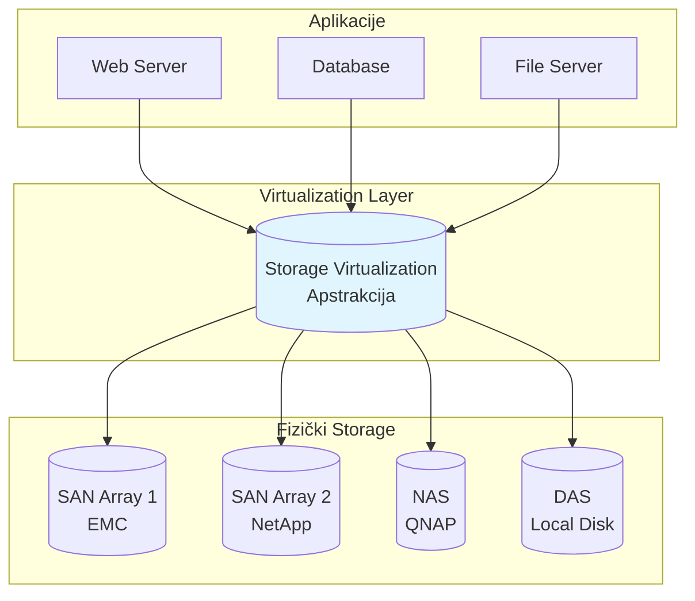

> **Objašnjenje dijagrama:**
>
> Dijagram prikazuje tri sloja storage virtualizacije:
> - **Gornji sloj (Aplikacije)** — Web server, baza podataka i file server — svi vide samo jedan "virtualni disk"
> - **Srednji sloj (Virtualization Layer)** — apstrakcija koja skriva kompleksnost
> - **Donji sloj (Fizički Storage)** — različiti uređaji od različitih proizvođača (EMC, NetApp, QNAP, lokalni diskovi)
>
> *Ključna poenta:* Aplikacije ne znaju (i ne moraju da znaju) da postoje četiri različita storage sistema ispod.

### Zašto Storage Virtualization?

| Problem bez virtualizacije | Rešenje sa virtualizacijom |
|---------------------------|---------------------------|
| Svaki storage array se upravlja posebno | Jedinstvena upravljačka konzola |
| Migracija podataka zahteva downtime | Live migration bez prekida |
| Kapacitet "zarobljen" u silosima | Pooling — svi resursi dostupni svima |
| Vendor lock-in | Heterogena podrška |
| Kompleksno kapacitet planiranje | Thin provisioning i auto-tiering |

### Osnovni koncepti

**1. Abstraction (Apstrakcija)**
Fizički storage se "sakriva" iza logičkog interfejsa. Aplikacija vidi samo LUN ili volume, ne zna da li je to SSD, HDD, SAN ili cloud.

**2. Pooling (Agregacija)**
Više fizičkih uređaja se kombinuje u jedan logički pool kapaciteta.

**3. Provisioning**
Iz pool-a se "secka" kapacitet prema potrebama — thin ili thick provisioning.

**4. Data Mobility**
Podaci se mogu pomerati između fizičkih uređaja bez uticaja na aplikacije.

---

## 2. Tipovi Storage Virtualizacije

Storage virtualizacija se može implementirati na različitim nivoima arhitekture. Svaki pristup ima svoje prednosti i mane.

### 2.1 Host-Based Virtualization

Virtualizacija se dešava na nivou servera (hosta) — operativni sistem ili hypervisor upravlja apstrakcijom.

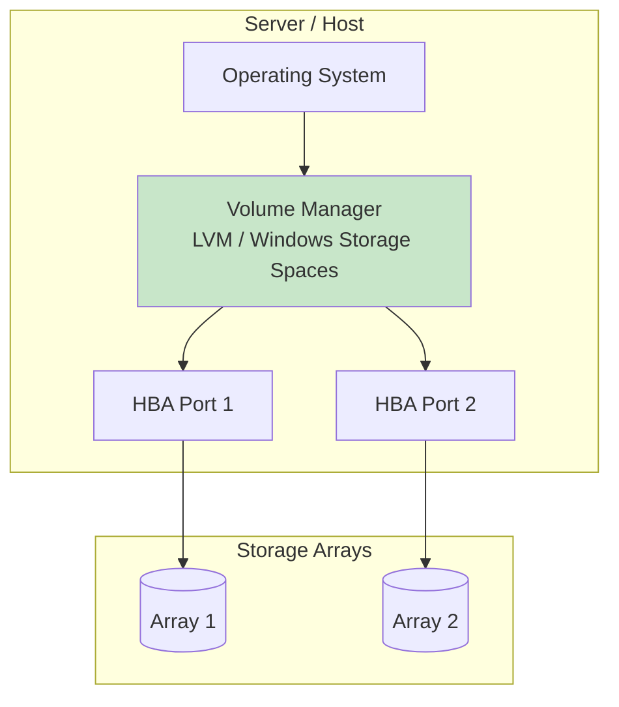

**Primeri:**
- **Linux LVM** (Logical Volume Manager)
- **Windows Storage Spaces**
- **VMware VMFS** (na ESXi hostu)
- **Veritas Volume Manager**

**Prednosti:**
- Nema dodatnog hardvera
- Jednostavna implementacija
- Dobra za manje sredine

**Mane:**
- Svaki host ima svoju "sliku" storage-a
- Nema centralizovanog upravljanja
- CPU overhead na hostu

---

### 2.2 Network-Based (In-Band) Virtualization

Virtualizacioni uređaj se nalazi "u putu" između hosta i storage-a. Sav I/O prolazi kroz njega.

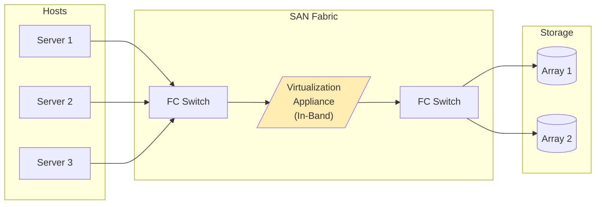

**Primeri:**
- **IBM SAN Volume Controller (SVC)**
- **EMC VPLEX**
- **DataCore SANsymphony**

**Prednosti:**
- Centralizovano upravljanje
- Transparentno za hostove
- Napredne funkcije (thin provisioning, snapshots, replication)

**Mane:**
- Potencijalni single point of failure
- Dodatna latencija
- Kompleksnost i cena

---

### 2.3 Array-Based (Out-of-Band) Virtualization

Virtualizacija je ugrađena u sam storage array. Metadata se čuva odvojeno od data path-a.

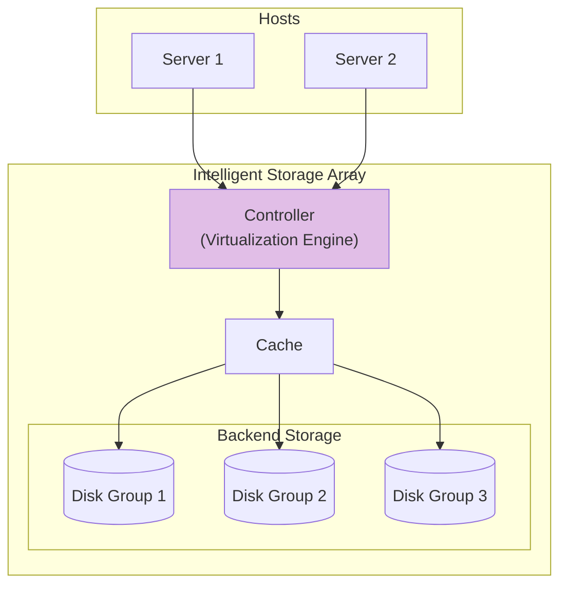

**Primeri:**
- **NetApp ONTAP** (FlexVol, FlexGroup)
- **Dell EMC PowerStore**
- **Pure Storage FlashArray**
- **HPE Nimble / Primera**

**Prednosti:**
- Optimizovano za performanse
- Nema dodatne komponente u data path-u
- Napredne array funkcije (dedupe, compression)

**Mane:**
- Vendor lock-in
- Virtualizacija ograničena na jedan array (ili familiju)

---

### 2.4 Cloud-Based Storage Virtualization

U cloud okruženju, storage virtualizacija je fundamentalni koncept. Cloud provider apstrahuje kompletan fizički sloj.

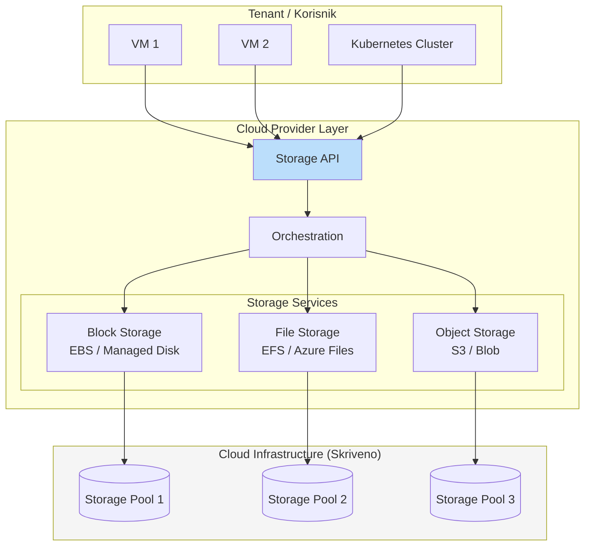

**Primeri:**
- **AWS:** EBS, EFS, S3
- **Azure:** Managed Disks, Azure Files, Blob Storage
- **Oracle Cloud:** Block Volume, File Storage, Object Storage
- **Google Cloud:** Persistent Disk, Filestore, Cloud Storage

**Prednosti:**
- Potpuna apstrakcija — korisnik ne zna ništa o fizičkom sloju
- Elastičnost — kapacitet na zahtev
- Pay-as-you-go model
- Globalna dostupnost i replikacija

**Mane:**
- Zavisnost od cloud providera
- Latencija za on-premises aplikacije
- Egress costs (cena za izlazni saobraćaj)

---

## 3. Arhitektura i Komponente

### 3.1 Ključne komponente Storage Virtualizacije

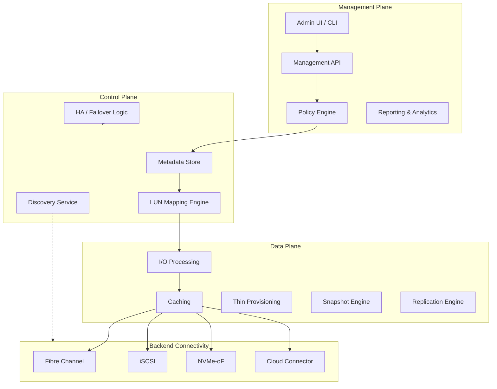

> **Objašnjenje komponenti:**
>
> **Management Plane** — interfejs za administratore:
> - *Admin UI/CLI* — grafički ili komandni interfejs
> - *Management API* — REST/SOAP API za automatizaciju
> - *Policy Engine* — definisanje pravila (tiering, retention)
> - *Reporting* — izveštaji o kapacitetu, performansama
>
> **Control Plane** — "mozak" sistema:
> - *Metadata Store* — gde se čuvaju informacije o mapiranju
> - *LUN Mapping Engine* — prevodi virtualne LUN-ove u fizičke
> - *Discovery Service* — otkriva nove storage uređaje
> - *HA/Failover* — osigurava visoku dostupnost
>
> **Data Plane** — obrada podataka:
> - *I/O Processing* — čitanje i pisanje
> - *Caching* — ubrzanje pristupa
> - *Thin Provisioning* — "lenja" alokacija
> - *Snapshot/Replication* — zaštita podataka
>
> **Backend Connectivity** — veza ka fizičkom storage-u

---

### 3.2 Metadata — Srce Virtualizacije

Metadata je ključna komponenta koja omogućava mapiranje između virtualnih i fizičkih resursa.

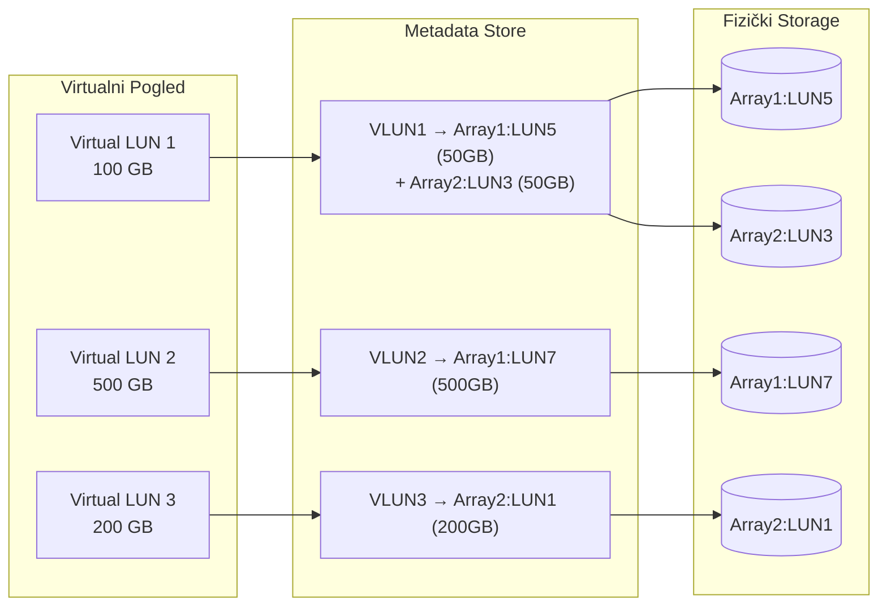

> **Objašnjenje:**
>
> - **VLUN1 (100 GB)** se sastoji od dva fizička LUN-a sa različitih array-a — ovo je **striping/spanning**
> - **VLUN2 (500 GB)** je mapiran 1:1 na jedan fizički LUN
> - **VLUN3 (200 GB)** je takođe 1:1 mapiranje
>
> Metadata čuva ove relacije i omogućava transparentnu migraciju, proširenje i zaštitu.

---

### 3.3 Thin Provisioning — Ključna Funkcija

Thin provisioning je jedna od najvažnijih funkcija storage virtualizacije.

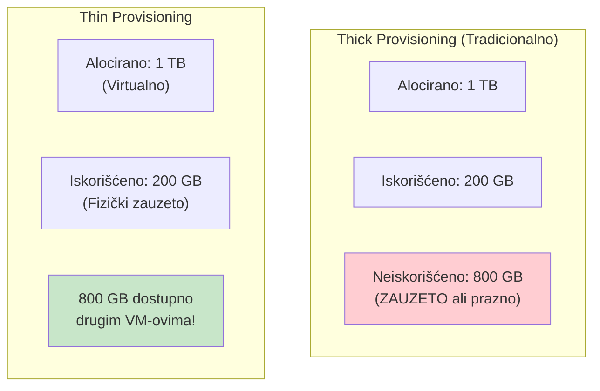

| Aspekt | Thick Provisioning | Thin Provisioning |
|--------|-------------------|-------------------|
| Alokacija | Unapred, ceo kapacitet | Po potrebi, inkrementalno |
| Iskorišćenje | Često < 50% | Može biti > 100% (overcommit) |
| Performanse | Konzistentne | Može varirati pri ekspanziji |
| Rizik | Nema rizika od prepunjavanja | Potreban monitoring |
| Use case | Kritične baze podataka | Opšta namena, dev/test |

---

## 4. Storage Virtualization vs SDS

Ovo je ključno poglavlje koje objašnjava razlike između **Storage Virtualization** i **Software-Defined Storage (SDS)**.

### 4.1 Fundamentalna Razlika

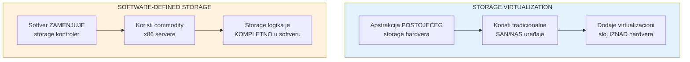

### 4.2 Detaljna Komparacija

| Kriterijum | Storage Virtualization | Software-Defined Storage |
|------------|----------------------|--------------------------|
| **Definicija** | Apstrakcija i agregacija postojećeg storage hardvera | Storage sistem gde softver kontroliše sve funkcije |
| **Hardver** | Koristi postojeće SAN/NAS array-e | Commodity x86 serveri, bilo koji diskovi |
| **Kontroler** | Fizički array kontroler + virtualizacioni sloj | Softverski kontroler (nema dedicirani hardver) |
| **Vendor Lock-in** | Srednji (virtualizacija može biti vendor-specific) | Nizak (softver radi na bilo kom hardveru) |
| **Skaliranje** | Ograničeno kapacitetom backend array-a | Horizontalno, dodavanjem čvorova |
| **Cena** | Visoka (enterprise array + virtualizacija) | Niža (commodity hardver + softver) |
| **Kompleksnost** | Srednja do visoka | Srednja (ali zahteva ekspertizu) |
| **Performanse** | Zavise od backend array-a | Zavise od softvera i hardvera |
| **Primeri** | IBM SVC, EMC VPLEX, VMware vVol | Ceph, vSAN, MinIO, GlusterFS |

---

### 4.3 Arhitekturna Razlika

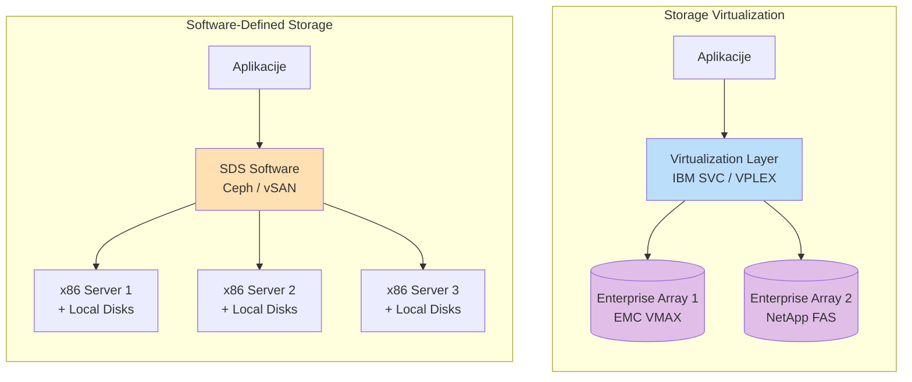

> **Objašnjenje razlike:**
>
> **Leva strana (Storage Virtualization):**
> - Virtualizacioni sloj (IBM SVC ili VPLEX) stoji IZMEĐU aplikacija i POSTOJEĆIH enterprise array-a
> - Array-i (EMC VMAX, NetApp) su i dalje "pametni" — imaju svoje kontrolere i softver
> - Virtualizacija AGREGIRA i APSTRAHUJE te uređaje
>
> **Desna strana (SDS):**
> - SDS softver (Ceph, vSAN) JE storage kontroler — nema "pametnog" array-a ispod
> - Serveri su obični x86 mašine sa lokalnim diskovima (JBOD)
> - SVA inteligencija je u softveru

---

### 4.4 Kada koristiti šta?

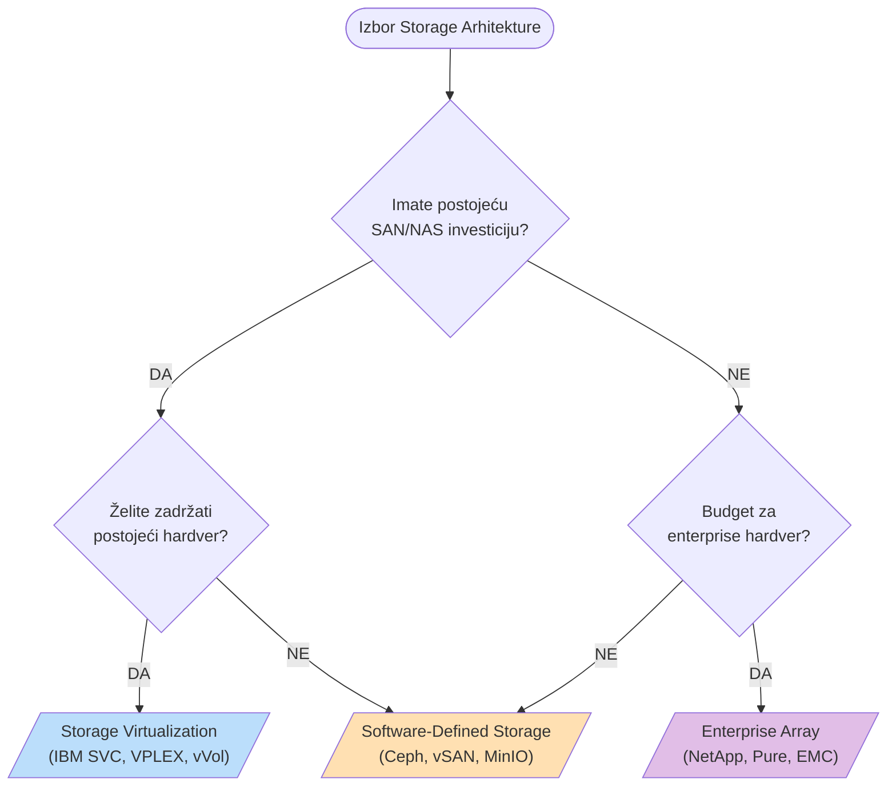

#### Preporuke:

**Izaberite Storage Virtualization kada:**
- Imate značajne investicije u postojeće SAN/NAS sisteme
- Trebate heterogenu podršku (više vendora)
- Želite live migration između array-a
- Imate tim obučen za tradicionalni SAN management
- Regulatorne zahteve rešavate enterprise support-om

**Izaberite SDS kada:**
- Gradite novu infrastrukturu "from scratch"
- Budget je ograničen (commodity hardver)
- Trebate masivno skaliranje (petabajti)
- Preferirate open-source ili cloud-native pristup
- Imate DevOps kulturu i automatizaciju

---

### 4.5 Hibridni Pristup

U praksi, mnoge organizacije koriste **kombinaciju** oba pristupa:

```mermaid
flowchart TB
    subgraph TIER1["Tier 1: Mission Critical"]
        MC_APP[SAP / Oracle DB]
        MC_VIRT[Storage Virtualization<br/>EMC VPLEX]
        MC_ARR[(Enterprise Flash Array)]
    end

    subgraph TIER2["Tier 2: Business Applications"]
        BA_APP[Web Apps / DevOps]
        BA_SDS[SDS Layer<br/>VMware vSAN]
        BA_HW[Commodity Servers]
    end

    subgraph TIER3["Tier 3: Archive / Backup"]
        AR_APP[Backup / Archive]
        AR_SDS[SDS Layer<br/>Ceph Object]
        AR_HW[High-Density JBOD]
    end

    MC_APP --> MC_VIRT --> MC_ARR
    BA_APP --> BA_SDS --> BA_HW
    AR_APP --> AR_SDS --> AR_HW

    style MC_VIRT fill:#bbdefb
    style BA_SDS fill:#ffe0b2
    style AR_SDS fill:#ffe0b2
```

> **Objašnjenje hibridnog modela:**
>
> - **Tier 1 (Mission Critical)** — SAP, Oracle — koristi Storage Virtualization sa enterprise flash array-ima za maksimalne performanse i podršku
> - **Tier 2 (Business Apps)** — Web aplikacije, DevOps — koristi SDS (vSAN) na commodity serverima za balans cene i performansi
> - **Tier 3 (Archive)** — Backup i arhiva — koristi SDS (Ceph Object) na JBOD-ovima za minimalne troškove po TB

---

## 5. Cloud Storage Virtualization u Praksi

### 5.1 Public Cloud Storage Virtualization

Svi veliki cloud provajderi implementiraju storage virtualizaciju "ispod haube":

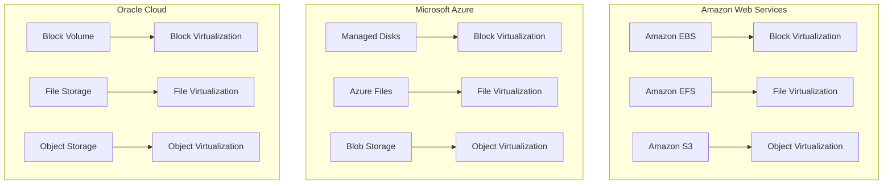

### 5.2 Storage Virtualization na DDC Kragujevac

U kontekstu Državnog Data Centra u Kragujevcu, storage virtualizacija igra ključnu ulogu:

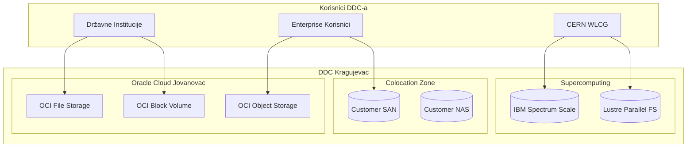

> **DDC Kragujevac kombinuje:**
> - **Oracle Cloud storage servise** — potpuno virtualizovani, managed servisi
> - **Colocation storage** — korisnici donose svoj hardver koji može koristiti virtualizaciju
> - **HPC storage** — specijalizovani parallel file sistemi za CERN workloads

---

### 5.3 Private Cloud — VMware vSphere + vSAN

Primer kako storage virtualizacija i SDS rade zajedno u VMware okruženju:

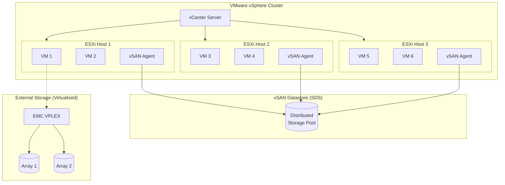

> **Ovaj dijagram prikazuje:**
> - **vSAN** kao SDS rešenje — lokalni diskovi u ESXi hostovima formiraju distribuirani datastore
> - **VPLEX** kao Storage Virtualization — agregira eksterne array-e i prezentuje ih VM-ovima
> - VM-ovi mogu koristiti OBA tipa storage-a istovremeno

---

## 6. Primeri i Tehnologije

### 6.1 Storage Virtualization Tehnologije

| Proizvod | Vendor | Tip | Opis |
|----------|--------|-----|------|
| **SAN Volume Controller (SVC)** | IBM | In-Band | Enterprise SAN virtualizacija |
| **VPLEX** | Dell EMC | In-Band | Active-active metro clustering |
| **SANsymphony** | DataCore | Software | x86-based SAN virtualizacija |
| **vVols** | VMware | Protocol | Per-VM storage management |
| **ONTAP** | NetApp | Array-based | FlexVol/FlexGroup virtualizacija |

### 6.2 SDS Tehnologije

| Proizvod | Vendor/Community | Model | Opis |
|----------|-----------------|-------|------|
| **Ceph** | Open Source | Block/File/Object | Distribuirani storage, CRUSH algorithm |
| **vSAN** | VMware | Block | HCI storage za vSphere |
| **MinIO** | Open Source | Object | S3-compatible, cloud-native |
| **GlusterFS** | Red Hat | File | Scale-out NAS |
| **Longhorn** | Rancher/SUSE | Block | Kubernetes-native storage |

### 6.3 Primer: IBM SVC Konfiguracija (Storage Virtualization)

```
# Kreiranje MDisk grupe (pool fizičkih diskova)
svctask mkmdsgrp -name pool_tier1 -ext 256

# Dodavanje eksternog storage-a u pool
svctask mkmdisk -mdiskgrp pool_tier1 -array "IBM_2145:mdisk0"
svctask mkmdisk -mdiskgrp pool_tier1 -array "NetApp_FAS:lun0"

# Kreiranje virtualnog volumea
svctask mkvdisk -name oracle_data -mdiskgrp pool_tier1 -size 500 -unit gb

# Mapiranje na host
svctask mkvdiskhostmap -host ora_server1 -vdisk oracle_data
```

### 6.4 Primer: Ceph Konfiguracija (SDS)

```bash
# Kreiranje Ceph clustera (SDS)
cephadm bootstrap --mon-ip 192.168.1.10

# Dodavanje OSD-ova (commodity serveri sa lokalnim diskovima)
ceph orch daemon add osd node1:/dev/sdb
ceph orch daemon add osd node2:/dev/sdb
ceph orch daemon add osd node3:/dev/sdb

# Kreiranje RBD pool-a (block storage)
ceph osd pool create rbd_pool 128

# Kreiranje block device-a
rbd create --size 500G rbd_pool/oracle_data
```

> **Uočite razliku:**
> - **SVC** agregira POSTOJEĆE storage (IBM_2145, NetApp_FAS)
> - **Ceph** koristi LOKALNE DISKOVE u serverima (/dev/sdb)

---

## 7. Zaključak i Best Practices

### 7.1 Ključne Razlike — Sažetak

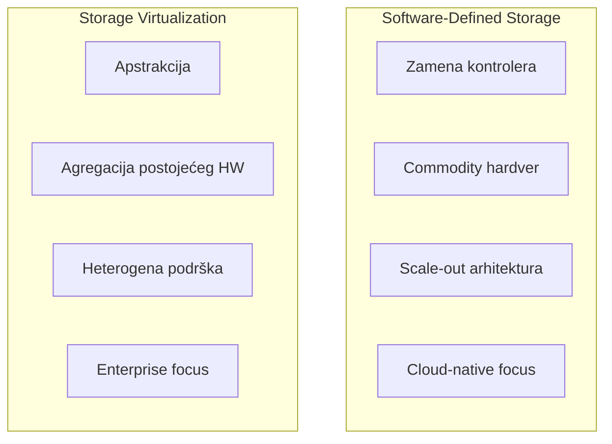

### 7.2 Best Practices

#### Za Storage Virtualization:

1. **Planirajte metadata replikaciju** — Metadata je kritičan; uvek imajte redundantan metadata store
2. **Testirajte failover scenarije** — Virtualizacioni sloj je SPOF (Single Point of Failure)
3. **Monitoring latencije** — In-band virtualizacija dodaje latenciju
4. **Firmware kompatibilnost** — Održavajte kompatibilnost između virtualizacionog sloja i backend array-a
5. **Capacity planning** — Pratite STVARNI (fizički) kapacitet, ne samo virtualni

#### Za SDS:

1. **Network je kritičan** — SDS zavisi od mreže; koristite 25/100 GbE ili RDMA
2. **Failure domains** — Distribuirajte podatke preko rack-ova, ne samo servera
3. **Izbegavajte overcommit** — Thin provisioning je koristan, ali monitoring je obavezan
4. **Hardware homogenost** — Mešanje različitog hardvera otežava troubleshooting
5. **Testirajte recovery** — SDS sistemi su kompleksni; redovno testirajte oporavak

### 7.3 Odluka: Virtuelizacija ili SDS?

| Ako vam je prioritet... | Preporuka |
|------------------------|-----------|
| Zaštita postojeće investicije | Storage Virtualization |
| Minimalna cena po TB | SDS |
| Enterprise podrška | Storage Virtualization (IBM, EMC) |
| Open source / flexibility | SDS (Ceph, MinIO) |
| Maksimalne performanse | Zavisi od workload-a |
| Kubernetes/Cloud-native | SDS |
| Metro clustering / DR | Storage Virtualization (VPLEX) |

---

### 7.4 Budućnost: Konvergencija

Granica između Storage Virtualization i SDS se sve više zamagljuje:

- **NetApp ONTAP** — počeo kao array, sada radi i na commodity hardveru (ONTAP Select)
- **VMware vSAN** — SDS koji se integriše sa storage virtualizacijom (vVols)
- **Pure Storage** — flash array sa SDS karakteristikama (Portworx akvizicija)

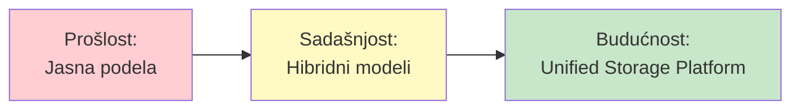

---

## Reference

1. IBM SAN Volume Controller Documentation
2. VMware vSAN Design Guide
3. Ceph Documentation — https://docs.ceph.com
4. Dell EMC VPLEX Architecture Guide
5. NetApp ONTAP 9 Documentation
6. "Software-Defined Storage for Dummies" — Wiley

---

**Kraj dokumenta**
