# Državni Data Centar Kragujevac

**Tehnička prezentacija infrastrukture**

---

## Sadržaj

1. [Uvod i osnovne karakteristike](#1-uvod-i-osnovne-karakteristike)
2. [Lokacija i izbor lokacije](#2-lokacija-i-izbor-lokacije)
3. [Fizička infrastruktura](#3-fizička-infrastruktura)
4. [Električna infrastruktura](#4-električna-infrastruktura)
5. [Sistem hlađenja](#5-sistem-hlađenja)
6. [Mrežna infrastruktura](#6-mrežna-infrastruktura)
7. [Oracle Cloud Region](#7-oracle-cloud-region)
8. [Superkompjuteri i AI platforma](#8-superkompjuteri-i-ai-platforma)
9. [CERN WLCG Tier 1](#9-cern-wlcg-tier-1)
10. [Bezbednost i sertifikacije](#10-bezbednost-i-sertifikacije)
11. [Komercijalni korisnici](#11-komercijalni-korisnici)

---

## 1. Uvod i osnovne karakteristike

### O Državnom Data Centru

**Državni Data Centar (DDC)** u Kragujevcu je najsavremeniji objekat za skladištenje i obradu podataka u Jugoistočnoj Evropi. Otvoren u decembru 2020. godine, predstavlja stratešku infrastrukturu Republike Srbije za digitalizaciju javne uprave, privrede i nauke.

DDC je **prvi data centar klase TIER 4** u Istočnoj i Jugoistočnoj Evropi, što ga svrstava u sam vrh svetskih standarda za pouzdanost i dostupnost.


*Link za sliku: https://www.dct.rs/sr/data-centar.html*

> **Objašnjenje slike — Pogled iz vazduha na DDC kompleks:**
>
> Slika prikazuje kompleks Državnog Data Centra koji se prostire na parceli od **4 hektara**. Vidljive su dve glavne zgrade koje čine srce infrastrukture:
> - **Zgrada 1 (veća)** — preko 8.000 m², sadrži glavne IT module sa 640 rack ormana
> - **Zgrada 2 (manja)** — preko 3.000 m², sadrži dodatnih 120 rack ormana i prateće sisteme
>
> Oko zgrada se vidi zelena zona koja služi kao tampon prema okolini, kao i pristupne saobraćajnice sa kontrolisanim pristupom.

### Ključne karakteristike

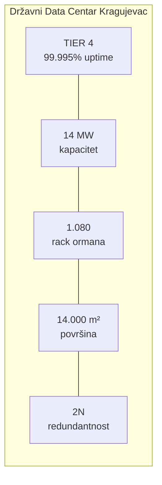

> **Objašnjenje dijagrama — Ključne karakteristike DDC-a:**
>
> Ovaj dijagram prikazuje pet ključnih parametara koji definišu kapacitet i pouzdanost DDC-a:
>
> - **TIER 4 / 99.995% uptime** — Najviši nivo pouzdanosti po Uptime Institute standardu. To znači maksimalno 26 minuta nedostupnosti godišnje. Za poređenje, TIER 3 dozvoljava do 1.6 sati, a TIER 2 do 22 sata godišnje.
>
> - **14 MW kapacitet** — Ukupna instalirana snaga za napajanje IT opreme i pratećih sistema. Za kontekst, 14 MW može napajati mali grad od ~10.000 domaćinstava.
>
> - **1.080 rack ormana** — Fizički kapacitet za smeštaj serverske opreme. Svaki rack može primiti 42U opreme (standardna visina). Ovo je 5x više od beogradskog data centra.
>
> - **14.000 m² površina** — Ukupna površina obe zgrade, uključujući IT hale, tehničke prostorije, i administrativni deo.
>
> - **2N redundantnost** — Svaki kritični sistem je udvostručen. "N" predstavlja minimalni kapacitet, "2N" znači dupli kapacitet — ako jedan sistem otkaže, drugi preuzima 100% opterećenja.

### Tabela specifikacija

| Parametar | Vrednost |
|-----------|----------|
| **Lokacija** | Kragujevac, Srbija |
| **Otvaranje** | Decembar 2020. |
| **Investicija** | 30 miliona EUR |
| **Površina parcele** | 4 hektara |
| **Površina objekata** | 14.000 m² |
| **Kapacitet rack-ova** | 1.080 (proširivo) |
| **Instalirana snaga** | 14 MW |
| **TIER nivo** | TIER 4 (EN 50600 Class 4) |
| **Redundantnost** | 2N |
| **Garantovana dostupnost** | 99.995% |
| **Operater** | Data Cloud Technology d.o.o. |

---

## 2. Lokacija i izbor lokacije

### Zašto Kragujevac?

Izbor lokacije za nacionalni data centar zahtevao je ispunjenje **strogih kriterijuma** koji garantuju dugoročnu sigurnost i operativnost.

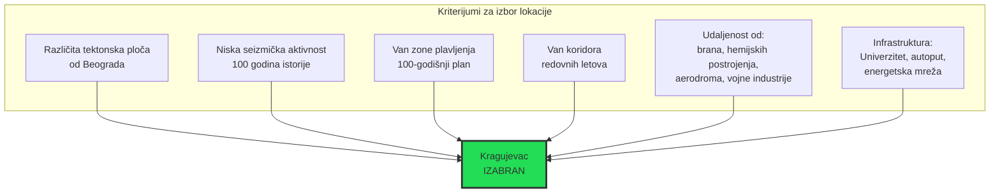

> **Objašnjenje dijagrama — Kriterijumi za izbor lokacije:**
>
> Dijagram prikazuje šest ključnih kriterijuma koji su morali biti ispunjeni za izbor lokacije DDC-a. Svaki kriterijum ima specifičan razlog:
>
> 1. **Različita tektonska ploča od Beograda**
>    - Ovo je kritično za disaster recovery strategiju
>    - Ako zemljotres pogodi Beograd, DDC u Kragujevcu ostaje siguran
>    - Kragujevac se nalazi na stabilnijoj Šumadijskoj platformi
>
> 2. **Niska seizmička aktivnost (100 godina)**
>    - Analizirana je istorija zemljotresa u regionu
>    - Kragujevac ima značajno nižu seizmičku aktivnost od Beograda
>    - Data centri su osetljivi na vibracije
>
> 3. **Van zone plavljenja**
>    - Proučen je 100-godišnji plan plavljenja
>    - Lokacija je na dovoljnoj nadmorskoj visini
>    - Nema rizika od poplava okolnih reka
>
> 4. **Van koridora redovnih letova**
>    - Avioni predstavljaju rizik (pad, gorivo)
>    - Izbegnuti su prilazni koridori aerodromima
>
> 5. **Bezbedna udaljenost**
>    - Od brana — rizik od pucanja
>    - Od hemijskih postrojenja — rizik od eksplozija/curenja
>    - Od aerodroma i vojne industrije — sigurnosni rizici
>
> 6. **Postojeća infrastruktura**
>    - Univerzitet u Kragujevcu — izvor kadrova
>    - Autoput — logistika i pristup
>    - Energetska mreža — dovoljni kapaciteti

### Geografski položaj


*Link za mapu: https://www.google.com/maps/place/Kragujevac*

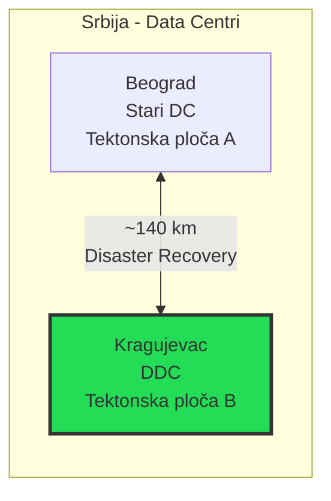

> **Objašnjenje dijagrama — Geografska separacija:**
>
> Dijagram ilustruje ključni princip **geografskog razdvajanja** za disaster recovery:
>
> - **Beograd** ima stariji data centar koji se nalazi na jednoj tektonskoj ploči
> - **Kragujevac** sa novim DDC-om se nalazi na drugoj tektonskoj ploči
> - Udaljenost od **~140 km** je optimalna:
>   - Dovoljno daleko da isti incident ne pogodi oba centra
>   - Dovoljno blizu za nisku latenciju sinhronizacije podataka
>
> Ova konfiguracija omogućava da se podaci čuvaju na obe lokacije, pa ako Beograd postane nedostupan, Kragujevac preuzima sve operacije — i obrnuto.

---

## 3. Fizička infrastruktura

### Struktura kompleksa

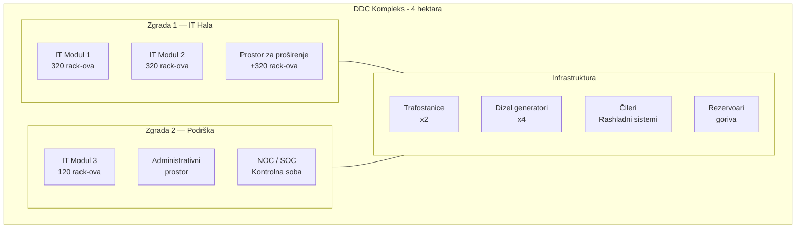

> **Objašnjenje dijagrama — Struktura DDC kompleksa:**
>
> Dijagram prikazuje prostornu organizaciju DDC kompleksa sa tri glavne zone:
>
> **Zgrada 1 — IT Hala (>8.000 m²):**
> - Glavni objekat za smeštaj IT opreme
> - **IT Modul 1 i 2** — svaki ima kapacitet za 320 rack ormana
> - **Prostor za proširenje** — predviđeno dodatnih 320 rack-ova
> - Ukupno: 640 aktivnih + 320 za ekspanziju = 960 rack-ova
>
> **Zgrada 2 — Podrška (>3.000 m²):**
> - **IT Modul 3** — dodatnih 120 rack-ova za specifične namene
> - **Administrativni prostor** — kancelarije, sale za sastanke
> - **NOC/SOC** — Network Operations Center i Security Operations Center
>   - NOC prati mrežu i sisteme 24/7
>   - SOC prati bezbednosne događaje
>
> **Infrastruktura (spoljašnje zone):**
> - **Trafostanice (x2)** — nezavisno napajanje iz mreže
> - **Dizel generatori (x4)** — rezervno napajanje
> - **Čileri** — rashladni sistemi
> - **Rezervoari goriva** — autonomija od 96 sati

### IT Moduli — Unutrašnja organizacija

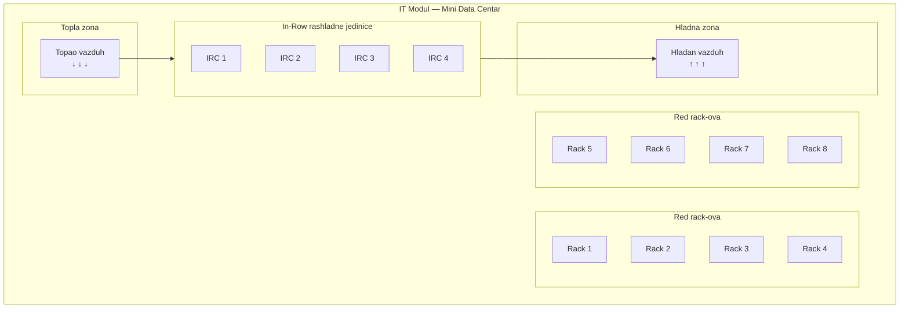

> **Objašnjenje dijagrama — IT Modul organizacija:**
>
> Dijagram prikazuje unutrašnju organizaciju jednog IT modula po principu **hot aisle / cold aisle containment**:
>
> **Redovi rack-ova:**
> - Rack ormani su postavljeni u redove, licem jedni prema drugima
> - Prednja strana rack-a (gde serveri "usisavaju" vazduh) gleda u HLADNU zonu
> - Zadnja strana rack-a (gde serveri "izbacuju" topao vazduh) gleda u TOPLU zonu
>
> **Hladna zona:**
> - Prostor između prednjih strana rack-ova
> - Hladan vazduh se upumpava odozdo kroz perforirani pod
> - Temperatura: tipično 18-22°C
>
> **Topla zona:**
> - Prostor između zadnjih strana rack-ova
> - Topao vazduh koji izlazi iz servera se sakuplja ovde
> - Temperatura: može dostići 35-40°C
>
> **In-Row rashladne jedinice (IRC):**
> - Postavljene između rack-ova
> - Usisavaju topao vazduh iz tople zone
> - Hlade ga i vraćaju u hladnu zonu
> - 8 jedinica po modulu, u 2 nezavisna rashladna kruga
>
> **Zašto ovakav dizajn?**
> - Sprečava mešanje toplog i hladnog vazduha
> - Povećava efikasnost hlađenja za 30-40%
> - Smanjuje potrošnju energije

---

## 4. Električna infrastruktura

### Pregled sistema napajanja

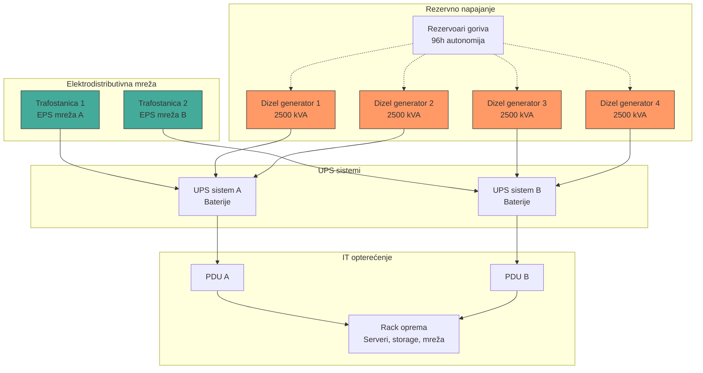

> **Objašnjenje dijagrama — Sistem napajanja:**
>
> Dijagram prikazuje kompletnu arhitekturu električnog napajanja DDC-a po **2N principu** — svaka komponenta je udvostručena.
>
> **Elektrodistributivna mreža (vrh):**
> - **Trafostanica 1 i 2** — povezane na RAZLIČITE delove EPS mreže
> - Ako jedna trafostanica otkaže, druga preuzima kompletno opterećenje
> - Fizički odvojeni kablovni vodovi do DDC-a
>
> **Rezervno napajanje (dizel generatori):**
> - **4 dizel generatora**, svaki kapaciteta 2500 kVA (2.5 MW)
> - Ukupno 10 MW backup kapaciteta
> - **Automatski start** — pokreću se u roku od 60 sekundi od nestanka struje
> - **Rezervoari goriva** — obezbeđuju 96 sati autonomije BEZ dopunjavanja
> - Sa dopunjavanjem — NEOGRANIČENA autonomija
>
> **UPS sistemi:**
> - **UPS A i B** — nezavisni sistemi sa baterijama
> - Obezbeđuju TRENUTNI prelaz na baterije (0 ms prekid)
> - Drže opterećenje dok se generatori ne pokrenu (~60 sek)
> - Tipična autonomija baterija: 10-15 minuta
>
> **PDU (Power Distribution Unit):**
> - Distribuira struju do rack-ova
> - Svaki rack ima DVA nezavisna PDU priključka (A i B)
> - Server koristi oba napajanja — ako jedno otkaže, drugo preuzima
>
> **Tok u slučaju nestanka struje:**
> ```
> t=0:     Nestanak struje iz mreže
> t=0ms:   UPS trenutno preuzima (baterije)
> t=60s:   Generatori dostižu punu snagu
> t=65s:   UPS prebacuje na generatore
> t+96h:   Gorivo pri kraju — vreme za dopunu
> ```

### 2N Redundantnost — Vizualizacija

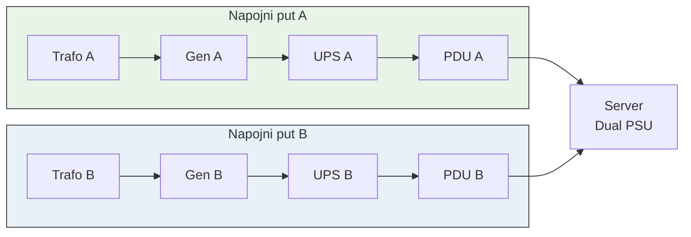

> **Objašnjenje dijagrama — 2N Redundantnost:**
>
> Dijagram jasno pokazuje zašto je DDC praktično **nemoguće ugasiti** usled kvara na napajanju:
>
> **Napojni put A (zeleno):**
> - Kompletno nezavisan lanac: Trafo A → Generator A → UPS A → PDU A
> - Može samostalno napajati celokupno IT opterećenje
>
> **Napojni put B (plavo):**
> - Identična konfiguracija, potpuno odvojena
> - Može samostalno napajati celokupno IT opterećenje
>
> **Server sa Dual PSU:**
> - Moderni serveri imaju 2 napajanja (Power Supply Unit)
> - PSU 1 povezan na PDU A (put A)
> - PSU 2 povezan na PDU B (put B)
> - Ako BILO KOJI element u putu A otkaže — put B preuzima
> - I obrnuto
>
> **Šta mora otkazati da server ostane bez struje?**
> - OBA puta moraju istovremeno otkazati
> - ILI oba PSU-a u serveru moraju istovremeno otkazati
> - Verovatnoća: praktično nula
>
> **Zato je TIER 4 = 99.995% uptime**

---

## 5. Sistem hlađenja

### Arhitektura hlađenja

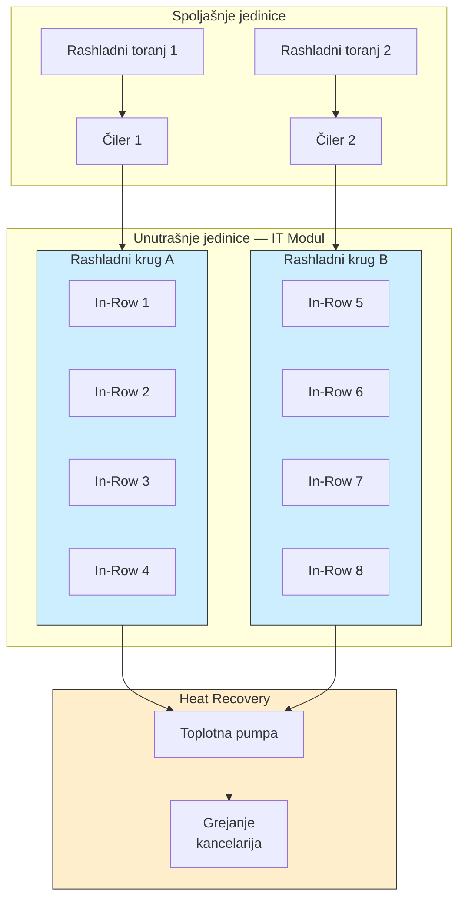

> **Objašnjenje dijagrama — Arhitektura hlađenja:**
>
> Dijagram prikazuje kompletan sistem hlađenja koji održava optimalnu temperaturu u IT halama i reciklira otpadnu toplotu.
>
> **Spoljašnje jedinice:**
>
> - **Čileri (Chiller 1 i 2):**
>   - Proizvode hladnu vodu (tipično 7-12°C)
>   - Rade kao "veliki frižideri" za data centar
>   - Svaki može samostalno hladiti ceo IT modul (redundantnost)
>
> - **Rashladni tornjevi (Cooling Tower):**
>   - Izbacuju toplotu iz čilera u atmosferu
>   - Koriste evaporativno hlađenje (efikasnije)
>
> **Unutrašnje jedinice — IT Modul:**
>
> - **8 In-Row jedinica** po IT modulu
> - Podeljene u **2 nezavisna rashladna kruga** (A i B)
> - Svaki krug ima 4 jedinice
> - Ako krug A otkaže, krug B preuzima 100% hlađenja
>
> **Princip rada In-Row jedinice:**
> ```
> 1. Usisava topao vazduh iz "tople zone" (35-40°C)
> 2. Propušta ga preko izmenjivača toplote sa hladnom vodom
> 3. Izbacuje ohlađen vazduh u "hladnu zonu" (18-22°C)
> 4. Zagrejana voda se vraća u čiler na ponovno hlađenje
> ```
>
> **Heat Recovery (inovacija):**
> - Toplota koju generiše IT oprema se NE baca
> - **Toplotna pumpa** izvlači toplotu iz rashladne vode
> - Ta toplota greje administrativne prostorije
> - Rezultat: **nula troškova za grejanje kancelarija**
> - Ovo je ekološki i ekonomski efikasno rešenje

### Hot Aisle / Cold Aisle Containment


*Link za sliku: https://en.wikipedia.org/wiki/Data_center#Cooling*

> **Objašnjenje slike — Hot/Cold Aisle Containment:**
>
> Slika ilustruje princip razdvajanja toplog i hladnog vazduha u data centru:
>
> **Hladna zona (Cold Aisle):**
> - Označena plavom bojom
> - Rack-ovi su okrenuti PREDNJOM stranom ka ovoj zoni
> - Perforirani pod kroz koji dolazi hladan vazduh
> - Zatvorena sa svih strana (containment) da hladan vazduh ne "beži"
>
> **Topla zona (Hot Aisle):**
> - Označena crvenom/narandžastom bojom
> - Rack-ovi su okrenuti ZADNJOM stranom ka ovoj zoni
> - Topao vazduh se diže prema plafonu
> - Usisavaju ga In-Row jedinice ili plafonski odvodi
>
> **Zašto je ovo važno?**
>
> | Bez containment-a | Sa containment-om |
> |-------------------|-------------------|
> | Topao i hladan vazduh se mešaju | Strogo razdvojeni tokovi |
> | Efikasnost hlađenja ~60% | Efikasnost hlađenja ~95% |
> | Veća potrošnja energije | Manja potrošnja energije |
> | "Hot spots" - pregrevanja | Uniformna temperatura |
>
> DDC koristi **full containment** — i hladna i topla zona su fizički zatvorene, što maksimizuje efikasnost.

### PUE — Power Usage Effectiveness

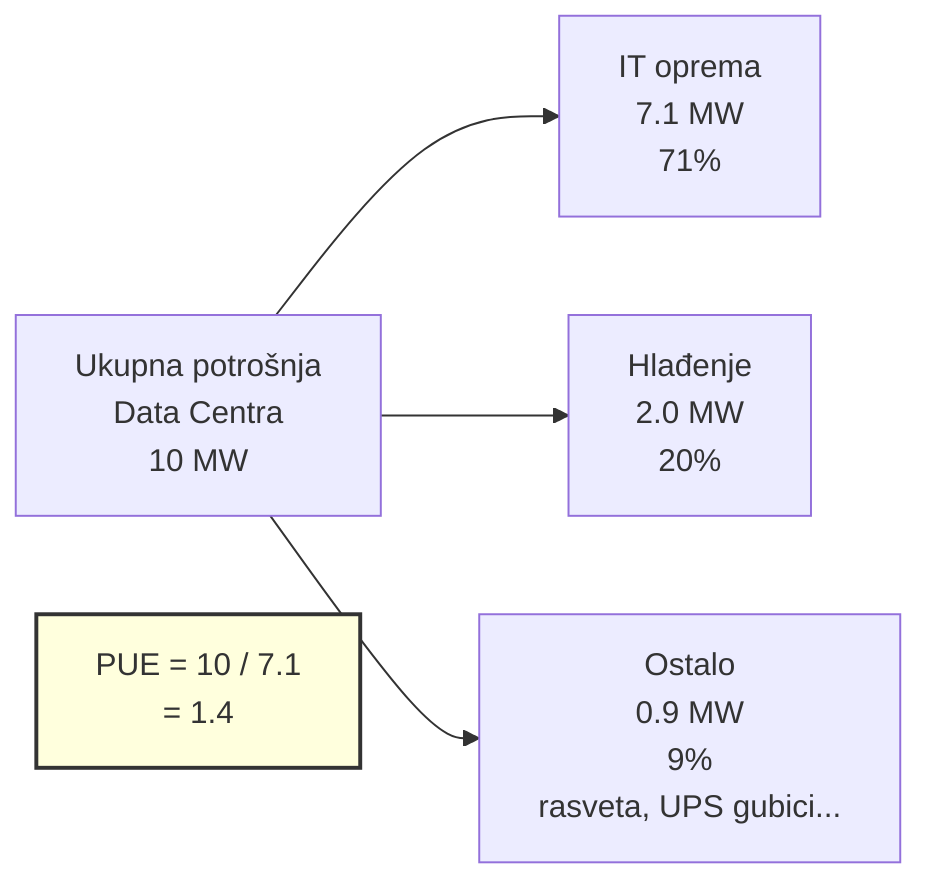

> **Objašnjenje dijagrama — PUE (Power Usage Effectiveness):**
>
> PUE je ključna metrika koja pokazuje koliko je data centar energetski efikasan.
>
> **Formula:**
> ```
> PUE = Ukupna potrošnja / IT potrošnja
> ```
>
> **Primer iz dijagrama:**
> - Ukupno: 10 MW
> - IT oprema: 7.1 MW
> - PUE = 10 / 7.1 = **1.4**
>
> **Šta znači PUE vrednost?**
>
> | PUE | Ocena | Opis |
> |-----|-------|------|
> | 2.0+ | Loše | Stariji data centri |
> | 1.6-2.0 | Prosečno | Tipični enterprise DC |
> | 1.4-1.6 | Dobro | Moderni data centri |
> | 1.2-1.4 | Odlično | Cutting-edge DC |
> | <1.2 | Izuzetno | Google, Facebook klasa |
>
> **DDC Kragujevac** sa heat recovery sistemom postiže PUE u opsegu **1.3-1.5**, što ga svrstava u energetski efikasne data centre.

---

## 6. Mrežna infrastruktura

### Carrier Neutral pristup

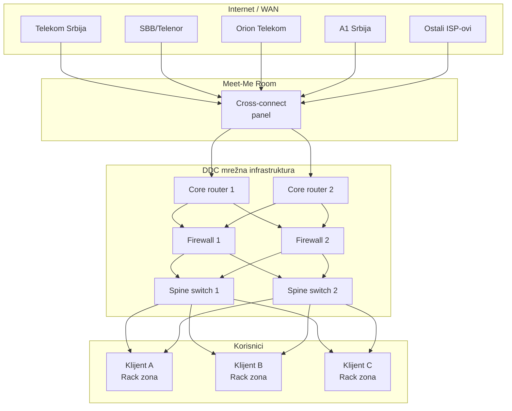

> **Objašnjenje dijagrama — Carrier Neutral arhitektura:**
>
> DDC je dizajniran kao **carrier neutral** objekat, što znači da nije vezan za jednog telekomunikacionog operatera.
>
> **Internet / WAN sloj:**
> - Svi veći ISP-ovi u Srbiji imaju prisustvo u DDC-u
> - Telekom Srbija, SBB/Telenor, Orion, A1 i drugi
> - Klijent može izabrati bilo kog provajdera (ili više njih)
>
> **Meet-Me Room (MMR):**
> - Specijalna prostorija gde se svi provajderi "sreću"
> - **Cross-connect panel** omogućava direktno povezivanje
> - Klijent može napraviti direktnu vezu sa provajderom
> - Ili direktnu vezu sa drugim klijentom u DDC-u (bez izlaska na internet)
>
> **DDC mrežna infrastruktura:**
> - **Core routeri (x2)** — glavni routeri za izlaz ka internetu, redundantni
> - **Firewall-i (x2)** — bezbednosna barijera, redundantni
> - **Spine switch-evi (x2)** — distribucija ka klijentima
> - Svaka komponenta je UDVOSTRUČENA (2N)
>
> **Prednosti carrier neutral pristupa:**
> 1. **Izbor** — klijent bira provajdera po ceni/kvalitetu
> 2. **Redundantnost** — može imati 2-3 provajdera za backup
> 3. **Niža cena** — konkurencija obara cene
> 4. **Fleksibilnost** — lako menjanje provajdera

### Mrežne brzine i kapaciteti

| Tip veze | Kapacitet | Namena |
|----------|-----------|--------|
| Uplink ka ISP-ovima | 100 Gbps | Internet/WAN |
| Core-to-Spine | 100 Gbps | Unutrašnji saobraćaj |
| Spine-to-Rack | 25/100 Gbps | Klijentski pristup |
| Rack-to-Server | 10/25 Gbps | Serverski priključak |

---

## 7. Oracle Cloud Region

### Oracle Cloud Infrastructure (OCI) u Srbiji

U maju 2023. Oracle je otvorio **Oracle Cloud Jovanovac Region** — prvi Oracle cloud region u Jugoistočnoj Evropi, smešten unutar DDC-a.

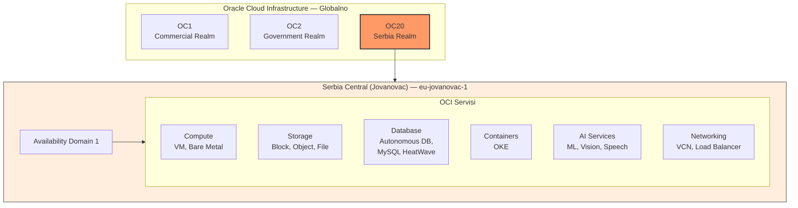

> **Objašnjenje dijagrama — Oracle Cloud Jovanovac Region:**
>
> Dijagram prikazuje poziciju Oracle Cloud regiona u Srbiji unutar globalne OCI infrastrukture.
>
> **Oracle Realms (Oblasti):**
> - **OC1** — Standardni komercijalni realm (većina svetskih regiona)
> - **OC2** — Vladini regioni (US Gov, UK Gov)
> - **OC20** — **Poseban realm za Srbiju**
>
> **Zašto poseban realm (OC20)?**
> - **Data Sovereignty** — podaci ne napuštaju Srbiju
> - **Compliance** — zadovoljava lokalne regulatorne zahteve
> - **Izolacija** — potpuno odvojen od drugih regiona
> - Ovo je važno za državne institucije i banke
>
> **Serbia Central (Jovanovac) — eu-jovanovac-1:**
> - Region identifier: `eu-jovanovac-1`
> - Region key: `BEG`
> - Console: `https://oc20.cloud.oracle.com/`
> - **Jedan Availability Domain** (AD1)
>
> **Dostupni OCI servisi (100+):**
> - **Compute** — Virtuelne mašine, Bare Metal serveri
> - **Storage** — Block, Object (S3-kompatibilan), File Storage
> - **Database** — Oracle Autonomous DB, MySQL HeatWave
> - **Containers** — Oracle Kubernetes Engine (OKE)
> - **AI/ML** — Vision, Speech, Language, Anomaly Detection
> - **Networking** — Virtual Cloud Network, Load Balanceri
>
> **Značaj za Srbiju:**
> - Jedini veliki cloud provajder sa regionom u Srbiji
> - Srpske firme mogu koristiti enterprise cloud bez slanja podataka van zemlje
> - Telekom Srbija je anchor tenant (prvi veliki korisnik)

### OCI Deployment u DDC-u

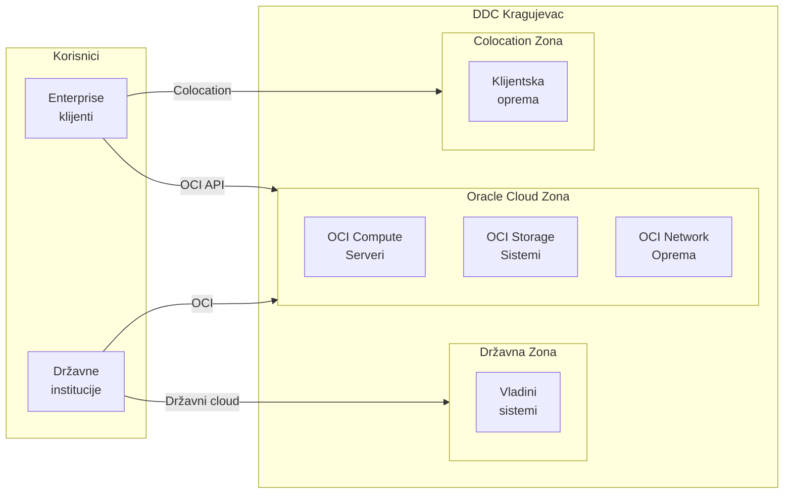

> **Objašnjenje dijagrama — OCI Deployment u DDC-u:**
>
> Dijagram prikazuje kako je Oracle Cloud fizički smešten unutar DDC-a, zajedno sa drugim zonama.
>
> **Oracle Cloud Zona:**
> - Dedicirani prostor unutar DDC-a
> - Oracle-ova oprema (compute, storage, network)
> - Upravljano od strane Oracle-a
> - Korisnici pristupaju kao cloud servis (IaaS/PaaS)
>
> **Colocation Zona:**
> - Prostor gde klijenti smeštaju SVOJU opremu
> - DDC pruža napajanje, hlađenje, mrežu
> - Klijent upravlja svojom opremom
> - Mogućnost direktne veze sa OCI zonom (low latency)
>
> **Državna Zona:**
> - Namenjena za vladine sisteme
> - Upravlja Kancelarija za IT i eUpravu
> - Može koristiti OCI servise po potrebi
>
> **Prednost ovog modela:**
> - Hibridni pristup — kombinacija cloud-a i on-premises
> - Ultra-niska latencija između zona (isti data centar)
> - Data sovereignty — sve ostaje u Srbiji

---

## 8. Superkompjuteri i AI platforma

### Nacionalna AI platforma

DDC je domaćin **Nacionalne platforme za veštačku inteligenciju** — superkompjuterske infrastrukture za AI/ML/HPC workload-e.

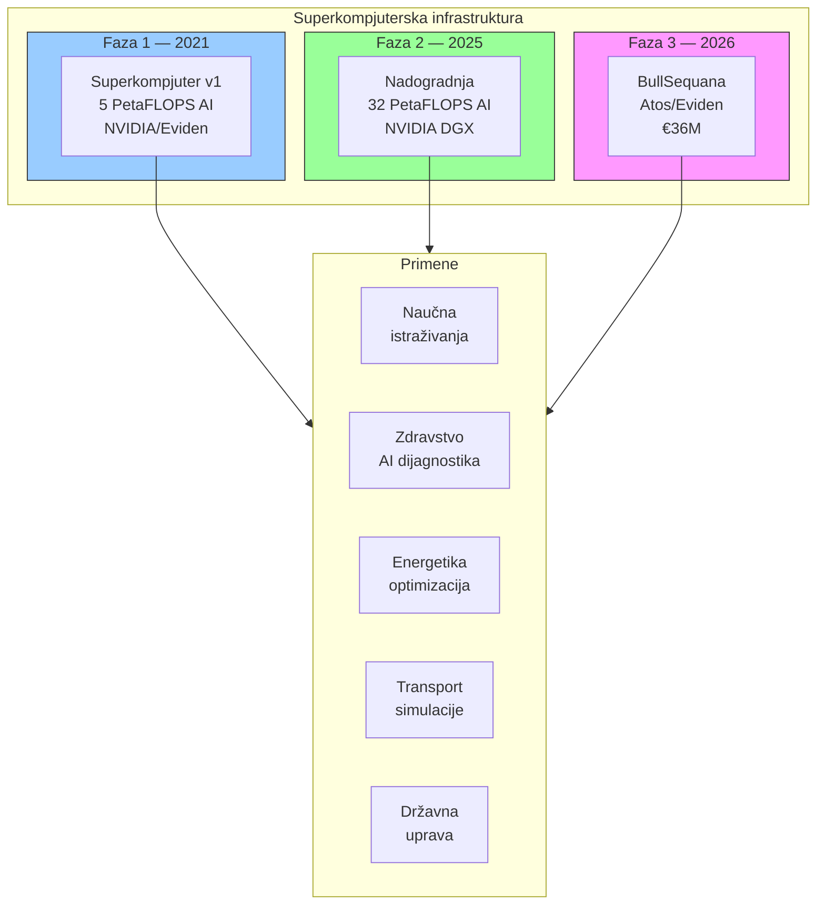

> **Objašnjenje dijagrama — Superkompjuterska infrastruktura:**
>
> Dijagram prikazuje evoluciju superkompjuterskih kapaciteta u DDC-u kroz tri faze:
>
> **Faza 1 — 2021 (aktivno):**
> - **Kapacitet:** 5 PetaFLOPS AI performanse
> - **Vrednost:** ~2 miliona EUR
> - **Proizvođači:** NVIDIA (GPU), Eviden/Atos (sistem)
> - **Status:** U produkciji
>
> **Faza 2 — 2025 (u toku):**
> - **Kapacitet:** 32 PetaFLOPS AI performanse
> - **Vrednost:** ~5 miliona EUR
> - **Tehnologija:** NVIDIA DGX sistemi
> - **Status:** Integracija do kraja 2025.
>
> **Faza 3 — 2026 (planirana):**
> - **Sistem:** BullSequana (Atos/Eviden)
> - **Vrednost:** 36 miliona EUR (deo ugovora od 50M EUR)
> - **Status:** Instalacija do kraja 2026.
>
> **Šta je PetaFLOPS?**
> - FLOPS = Floating Point Operations Per Second
> - 1 PetaFLOPS = 10^15 operacija u sekundi
> - Za poređenje: laptop ima ~0.0001 PetaFLOPS
> - Najjači superkompjuter (El Capitan) ima 1.742 PetaFLOPS
>
> **Primene:**
> - **Nauka** — simulacije, genomika, fizika
> - **Zdravstvo** — AI dijagnostika, analiza snimaka
> - **Energetika** — optimizacija mreže, predikcija potrošnje
> - **Transport** — saobraćajne simulacije
> - **Državna uprava** — big data analitika

### NVIDIA DGX Arhitektura

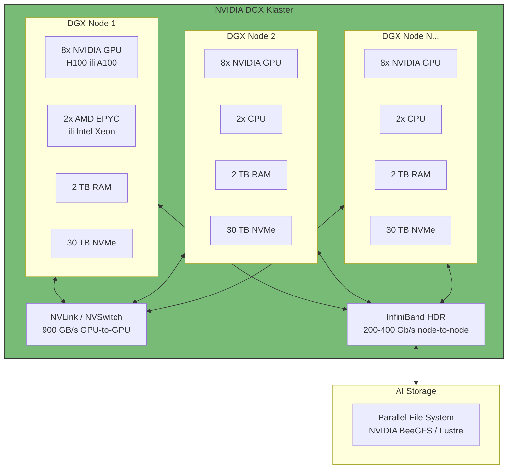

> **Objašnjenje dijagrama — NVIDIA DGX Arhitektura:**
>
> NVIDIA DGX sistemi su specijalizovani superkompjuteri za AI/ML obuku. Evo šta svaka komponenta radi:
>
> **DGX Node (jedan čvor):**
> - **8x NVIDIA GPU (H100 ili A100)**
>   - Srce AI moći
>   - Svaki GPU ima hiljade CUDA jezgara
>   - H100: ~2000 TFLOPS AI performanse
> - **2x CPU (AMD EPYC ili Intel Xeon)**
>   - Za upravljanje i ne-GPU zadatke
>   - 64-128 jezgara
> - **2 TB RAM**
>   - Za velike modele koji ne staju u GPU memoriju
> - **30 TB NVMe**
>   - Ultra-brzi lokalni storage za dataset-e
>
> **Međupovezivanje:**
> - **NVLink / NVSwitch**
>   - GPU-to-GPU komunikacija unutar čvora
>   - Brzina: 900 GB/s
>   - Omogućava da 8 GPU-ova radi kao jedan
> - **InfiniBand HDR**
>   - Node-to-node komunikacija
>   - Brzina: 200-400 Gb/s
>   - Ultra-niska latencija (<1 microsecond)
>
> **AI Storage:**
> - Parallel file system (BeeGFS, Lustre, GPFS)
> - Stotine TB do PB kapaciteta
> - Brzina: stotine GB/s read/write
> - Dataset-i za training moraju biti brzo dostupni

---

## 9. CERN WLCG Tier 1

### Srbija u svetskoj naučnoj mreži

U decembru 2023. potpisan je Memorandum o razumevanju između CERN-a i Srbije, čime je DDC postao deo **Worldwide LHC Computing Grid (WLCG)** — globalne mreže za obradu podataka sa Large Hadron Collidera.

DDC je dobio status **Tier 1** — jedan od samo **13 centara u svetu** sa ovim statusom!

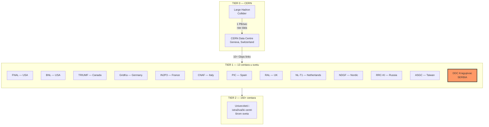

> **Objašnjenje dijagrama — WLCG Hijerarhija:**
>
> Dijagram prikazuje strukturu Worldwide LHC Computing Grid-a — najveće distribuirane računarske infrastrukture na svetu.
>
> **TIER 0 — CERN (Ženeva):**
> - Izvor svih podataka — Large Hadron Collider
> - Proizvodi ~1 PB (petabajt) podataka u sekundi
> - Inicijalna obrada i distribucija ka Tier 1 centrima
> - Povezan sa svim Tier 1 centrima brzim linkovima (10+ Gbps)
>
> **TIER 1 — 13 elitnih centara:**
> - Čuvaju **trajne kopije** svih LHC podataka
> - Obavljaju masivne rekonstrukcije događaja
> - Dostupni 24/7 sa visokom pouzdanošću
> - DDC Kragujevac je **13. Tier 1 centar** u svetu!
> - Ostali: FNAL i BNL (USA), TRIUMF (Kanada), GridKa (Nemačka), IN2P3 (Francuska)...
>
> **TIER 2 — 150+ centara:**
> - Univerziteti i istraživački centri
> - Obavljaju specifične analize
> - Koriste podatke od Tier 1 centara
>
> **Šta ovo znači za Srbiju:**
> - Pristup ekskluzivnim naučnim podacima
> - Učešće u najvažnijim fizičkim eksperimentima
> - Prestiž — samo 13 institucija u svetu ima ovaj status
> - Srbija dobija podatke od **CMS eksperimenta** (detektor na LHC)

### CMS Eksperiment i podaci

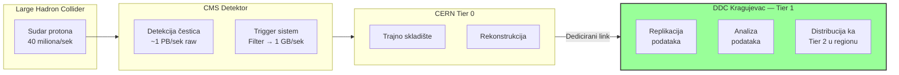

> **Objašnjenje dijagrama — Tok CMS podataka:**
>
> **Large Hadron Collider (LHC):**
> - Ubrzavač čestica u CERN-u, najmoćniji na svetu
> - **40 miliona sudara protona u sekundi**
> - Svaki sudar proizvodi podatke
>
> **CMS Detektor:**
> - Compact Muon Solenoid — jedan od 4 glavna detektora na LHC
> - Srbija je član CMS kolaboracije
> - Detektuje čestice nastale u sudarima
> - **Raw podaci:** ~1 PB/sek (preveliko za čuvanje)
> - **Trigger sistem:** filtrira "zanimljive" sudare
> - **Nakon filtriranja:** ~1 GB/sek čuva se trajno
>
> **CERN Tier 0:**
> - Prima sve filtrirane podatke
> - Vrši inicijalnu rekonstrukciju (pretvara raw u analizirane podatke)
> - Distribuira ka Tier 1 centrima
>
> **DDC Kragujevac (Tier 1):**
> - **Replikacija** — čuva kompletnu kopiju CMS podataka
> - **Analiza** — srpski fizičari rade na podacima lokalno
> - **Distribucija** — prosleđuje podatke Tier 2 centrima u regionu
>
> **Zahtevi za Tier 1:**
> - Stotine TB do PB storage-a
> - Hiljade CPU jezgara za obradu
> - 10+ Gbps link ka CERN-u
> - 99.9%+ dostupnost

---

## 10. Bezbednost i sertifikacije

### Fizička bezbednost

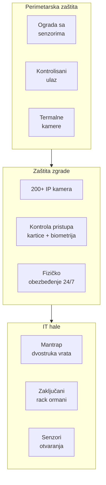

> **Objašnjenje dijagrama — Fizička bezbednost:**
>
> DDC implementira **defense in depth** strategiju — više slojeva zaštite:
>
> **Perimetarska zaštita (spoljašnji sloj):**
> - **Ograda sa senzorima** — detektuje pokušaj presecanja ili penjanja
> - **Kontrolisani ulaz** — rampe, kapije, verifikacija
> - **Termalne kamere** — detektuju prisustvo osoba noću (toplota tela)
>
> **Zaštita zgrade (srednji sloj):**
> - **200+ IP kamera** — pokrivaju sve prostorije i hodnike
> - **Kontrola pristupa** — kartice + PIN, ili biometrija
> - **Fizičko obezbeđenje** — čuvari 24/7/365
>
> **IT hale (unutrašnji sloj):**
> - **Mantrap (zamka)** — dvostruka vrata, samo jedna mogu biti otvorena
>   - Sprečava "tailgating" (ulazak za nekim)
> - **Zaključani rack ormani** — pristup samo ovlašćenom osoblju
> - **Senzori otvaranja** — beleži se ko je otvorio koji rack i kada

### Zaštita od požara

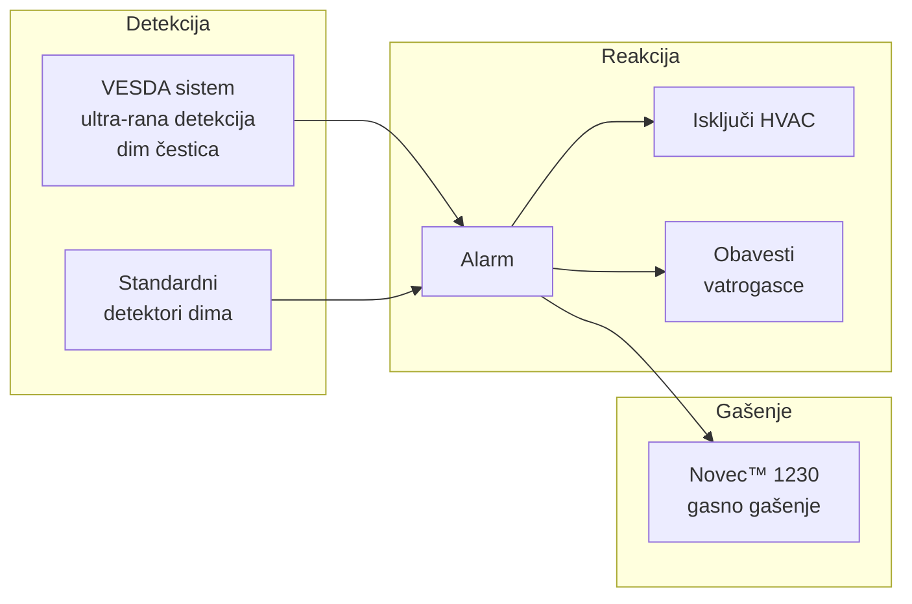

> **Objašnjenje dijagrama — Zaštita od požara:**
>
> **VESDA sistem (Very Early Smoke Detection Apparatus):**
> - Ultra-rana detekcija dima
> - Detektuje čestice dima pre nego što su vidljive oku
> - Koristi lasersku detekciju u mreži cevi koje "usisavaju" vazduh
> - Može detektovati požar 10-15 minuta pre standardnih detektora
>
> **Novec™ 1230:**
> - Gasno sredstvo za gašenje požara
> - **Bezbedno za ljude** — može se disati kratko vreme
> - **Bezbedno za opremu** — ne oštećuje elektroniku
> - **Ne ostavlja ostatke** — isparava bez traga
> - Zamenjuje halon (zabranjen zbog oštećenja ozonskog omotača)
> - Deluje za <10 sekundi
>
> **Reakcija na alarm:**
> 1. Aktivira se alarm (zvučni i vizuelni)
> 2. HVAC sistem se isključuje (da ne širi dim)
> 3. Novec se oslobađa u zahvaćenu zonu
> 4. Automatski se obaveštavaju vatrogasci

### Sertifikacije i standardi

| Standard | Opis | Status |
|----------|------|--------|
| **EN 50600 Class 4** | Najviši nivo za DC infrastrukturu | Ispunjen |
| **TIER 4** | Uptime Institute — 99.995% dostupnost | Ispunjen |
| **ISO 27001** | Upravljanje informacionom bezbednošću | Sertifikovan |
| **ISO 9001** | Sistem upravljanja kvalitetom | Sertifikovan |
| **ISO 20000** | Upravljanje IT servisima | Sertifikovan |

---

## 11. Komercijalni korisnici

### Anchor Tenants

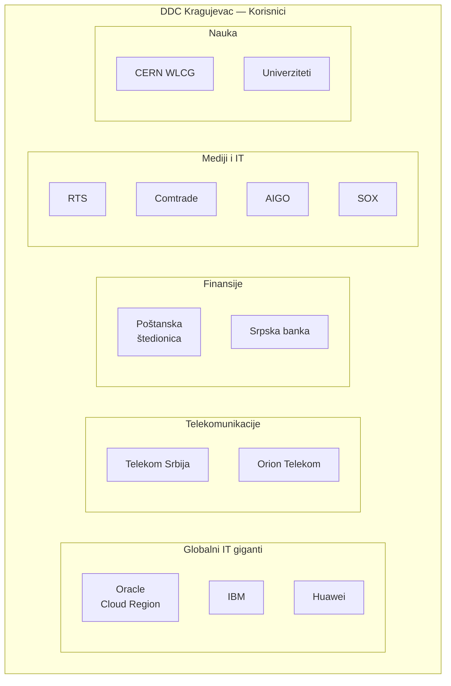

> **Objašnjenje dijagrama — Komercijalni korisnici:**
>
> DDC je privukao raznovrsne korisnike iz različitih sektora:
>
> **Globalni IT giganti:**
> - **Oracle** — kompletan Cloud Region (jedini u JI Evropi)
> - **IBM** — enterprise servisi i infrastruktura
> - **Huawei** — telco i cloud infrastruktura
>
> **Telekomunikacije:**
> - **Telekom Srbija** — nacionalni telco operater
> - **Orion Telekom** — alternativni operater
>
> **Finansije:**
> - **Poštanska štedionica** — državna banka
> - **Srpska banka** — komercijalna banka
> - Finansijski sektor zahteva najviše standarde bezbednosti
>
> **Mediji i IT:**
> - **RTS** — Radio-televizija Srbije
> - **Comtrade** — regionalni IT lider
> - **AIGO, SOX** — domaće IT kompanije
>
> **Nauka:**
> - **CERN WLCG** — Tier 1 za fiziku čestica
> - **Univerziteti** — istraživanja i edukacija
>
> **Zašto su ovi korisnici ovde?**
> 1. **Lokalni data sovereignty** — podaci ostaju u Srbiji
> 2. **TIER 4 pouzdanost** — kritični sistemi zahtevaju 99.995%
> 3. **Carrier neutral** — izbor provajdera
> 4. **Cena** — konkurentna u odnosu na zapadnu Evropu

### Data Cloud Technology (DCT)

**Data Cloud Technology d.o.o.** je kompanija u 100% vlasništvu Republike Srbije, osnovana za upravljanje komercijalnim delom DDC-a.

| Servis | Opis |
|--------|------|
| **Colocation** | Smeštaj klijentske opreme u rack-ove |
| **IaaS** | Infrastructure as a Service — virtuelni serveri |
| **Managed Services** | Upravljanje infrastrukturom za klijenta |
| **Connectivity** | Mrežne veze, cross-connect, internet |
| **Backup & DR** | Backup i disaster recovery rešenja |

---

## Zaključak

**Državni Data Centar u Kragujevcu** predstavlja infrastrukturni poduhvat koji pozicionira Srbiju kao regionalnog lidera u digitalnoj transformaciji:

- **TIER 4** pouzdanost — među najboljima u Evropi
- **Oracle Cloud Region** — jedini u Jugoistočnoj Evropi
- **CERN Tier 1** — jedan od 13 u svetu
- **Superkompjuteri** — nacionalna AI platforma
- **2N redundantnost** — praktično nezaustavljiv

Kombinacija državnog vlasništva, komercijalne eksploatacije i naučne namene čini DDC jedinstvenim modelom u regionu.

---

## Izvori

- [Data Cloud Technology — Zvanični sajt](https://dct.rs/sr/)
- [Kancelarija za IT i eUpravu — DDC](https://www.ite.gov.rs/tekst/sr/5273/drzavni-data-centar.php)
- [Oracle Cloud Jovanovac Region](https://www.oracle.com/news/announcement/oracle-opens-cloud-region-in-serbia-2023-05-12/)
- [CERN — Serbia joins WLCG](https://home.cern/news/news/computing/serbia-joins-worldwide-lhc-computing-grid)
- [PC Press — S lica mesta](https://pcpress.rs/s-lica-mesta-drzavni-data-centar-u-kragujevcu/)
- [Netokracija — Posetili smo DDC](https://www.netokracija.rs/data-centar-kragujevac-180295)

---

*Dokument pripremljen za predavanje na Računarskom fakultetu, Beograd*
