# Oracle FastConnect

**Dedicirana privatna konekcija ka Oracle Cloud Infrastructure**

---

## Sadržaj

1. [Uvod u FastConnect](#1-uvod-u-fastconnect)
2. [Zašto FastConnect umesto Interneta](#2-zašto-fastconnect-umesto-interneta)
3. [Arhitektura i komponente](#3-arhitektura-i-komponente)
4. [Tipovi povezivanja](#4-tipovi-povezivanja)
5. [Peering modeli](#5-peering-modeli)
6. [Port brzine i LAG](#6-port-brzine-i-lag)
7. [Redundantnost i visoka dostupnost](#7-redundantnost-i-visoka-dostupnost)
8. [BGP konfiguracija](#8-bgp-konfiguracija)
9. [FastConnect u DDC Kragujevac](#9-fastconnect-u-ddc-kragujevac)
10. [Use Cases i scenariji](#10-use-cases-i-scenariji)
11. [Pricing model](#11-pricing-model)

---

## 1. Uvod u FastConnect

### Šta je Oracle FastConnect?

**Oracle FastConnect** je mrežni servis koji omogućava uspostavljanje **dedicirane, privatne veze** između vaše on-premises infrastrukture (data centra, kancelarije) i Oracle Cloud Infrastructure (OCI).

Za razliku od VPN-a koji koristi javni internet, FastConnect pruža:
- **Izolovan mrežni put** — vaš saobraćaj ne ide preko javnog interneta
- **Predvidive performanse** — garantovani bandwidth i niska latencija
- **Veću bezbednost** — nema izloženosti javnoj mreži

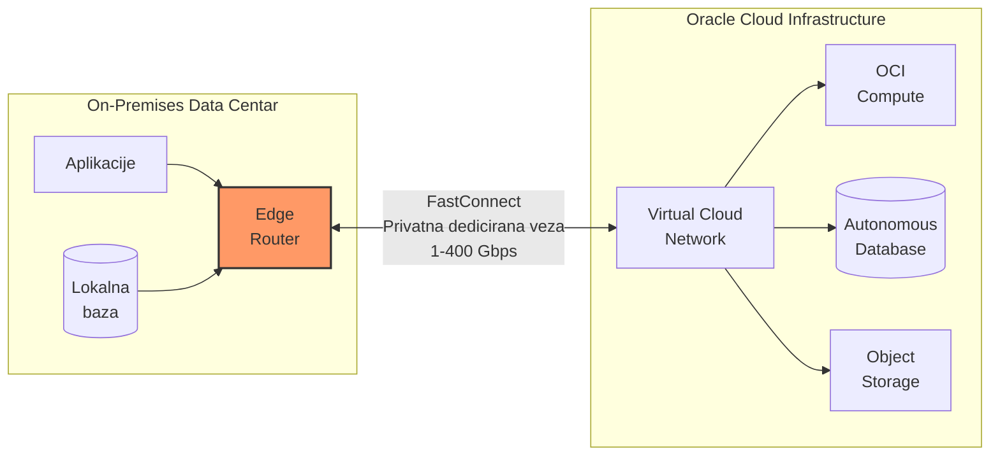

> **Objašnjenje dijagrama — FastConnect osnovna arhitektura:**
>
> Dijagram prikazuje kako FastConnect povezuje dva okruženja:
>
> **On-Premises Data Centar (levo):**
> - Vaše aplikacije i lokalne baze podataka
> - **Edge Router** — mrežni uređaj koji terminira FastConnect vezu
> - Router mora podržavati BGP protokol
>
> **Oracle Cloud Infrastructure (desno):**
> - **VCN (Virtual Cloud Network)** — vaša privatna mreža u OCI
> - Compute instance, baze podataka, storage
> - Svi resursi su dostupni preko privatnih IP adresa
>
> **FastConnect veza (sredina):**
> - Direktna fizička ili logička veza
> - Brzine od 1 Gbps do 400 Gbps
> - Saobraćaj NIKADA ne prolazi kroz javni internet
>
> **Rezultat:** Vaša on-premises infrastruktura i OCI cloud funkcionišu kao jedna proširena mreža.

### FastConnect vs VPN vs Internet

| Aspekt | Javni Internet | Site-to-Site VPN | FastConnect |
|--------|----------------|------------------|-------------|
| **Medijum** | Javna mreža | Javna mreža (enkriptovano) | Privatna dedicirana veza |
| **Latencija** | Nepredvidiva (20-200ms) | Nepredvidiva + overhead enkripcije | Niska i stabilna (<5ms) |
| **Bandwidth** | Best-effort, deljeni | Do ~1.25 Gbps po tunelu | Do 400 Gbps dedicirano |
| **Bezbednost** | Niska | Srednja (IPsec) | Visoka (izolacija) |
| **Pouzdanost** | Nema SLA | Zavisi od interneta | SLA garantovan |
| **Cena** | Po GB transfera | Niska fiksna | Viša fiksna (po portu) |
| **Setup vreme** | Minuti | Sati | Dani do nedelje |

---

## 2. Zašto FastConnect umesto Interneta

### Problem sa javnim internetom

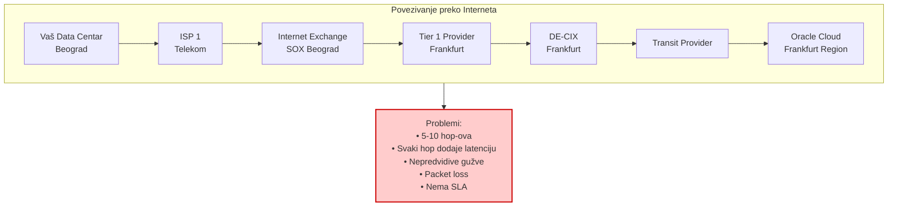

> **Objašnjenje dijagrama — Problemi sa Internet konekcijom:**
>
> Kada koristite javni internet za pristup cloud-u, vaš saobraćaj prolazi kroz MNOGO posrednika:
>
> 1. **Vaš ISP** (npr. Telekom Srbija)
> 2. **Lokalni Internet Exchange** (SOX Beograd)
> 3. **Tier 1 provajder** koji ima međunarodne linkove
> 4. **Strani Internet Exchange** (DE-CIX Frankfurt)
> 5. **Transit provajder** do Oracle-a
> 6. Konačno **Oracle Cloud**
>
> **Svaki "hop" donosi probleme:**
> - **Latencija** — svaki router dodaje 1-10ms
> - **Varijabilnost** — gužve u različito doba dana
> - **Packet loss** — preopterećeni linkovi gube pakete
> - **Nema garancije** — niko nije odgovoran za end-to-end kvalitet
>
> **Rezultat:** Aplikacije su spore, nestabilne, nepredvidive.

### Rešenje: FastConnect

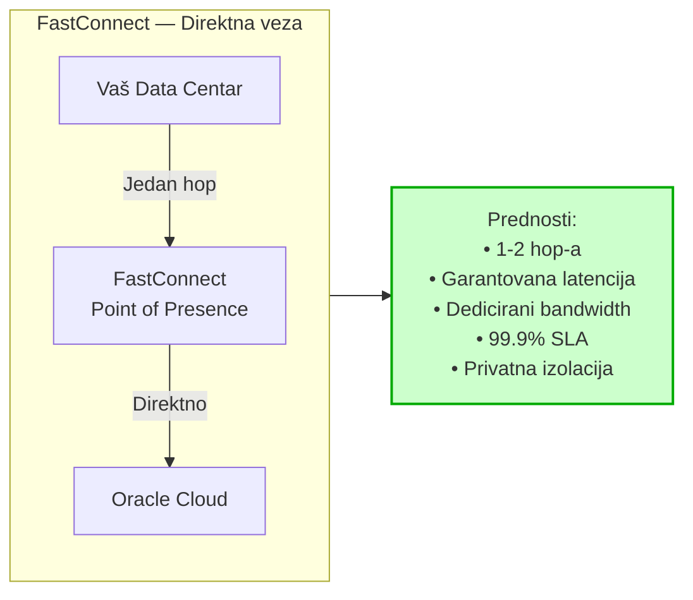

> **Objašnjenje dijagrama — FastConnect rešenje:**
>
> Sa FastConnect-om, putanja je dramatično pojednostavljena:
>
> 1. **Vaš Data Centar** → direktna veza do
> 2. **FastConnect PoP** (Point of Presence) → direktno u
> 3. **Oracle Cloud**
>
> **Samo 1-2 hop-a** umesto 5-10!
>
> **Prednosti:**
> - **Garantovana latencija** — tipično <5ms
> - **Dedicirani bandwidth** — niko drugi ne koristi vašu vezu
> - **SLA 99.9%** — Oracle garantuje dostupnost
> - **Privatna izolacija** — vaš saobraćaj je odvojen od svih drugih

### Kada koristiti šta?

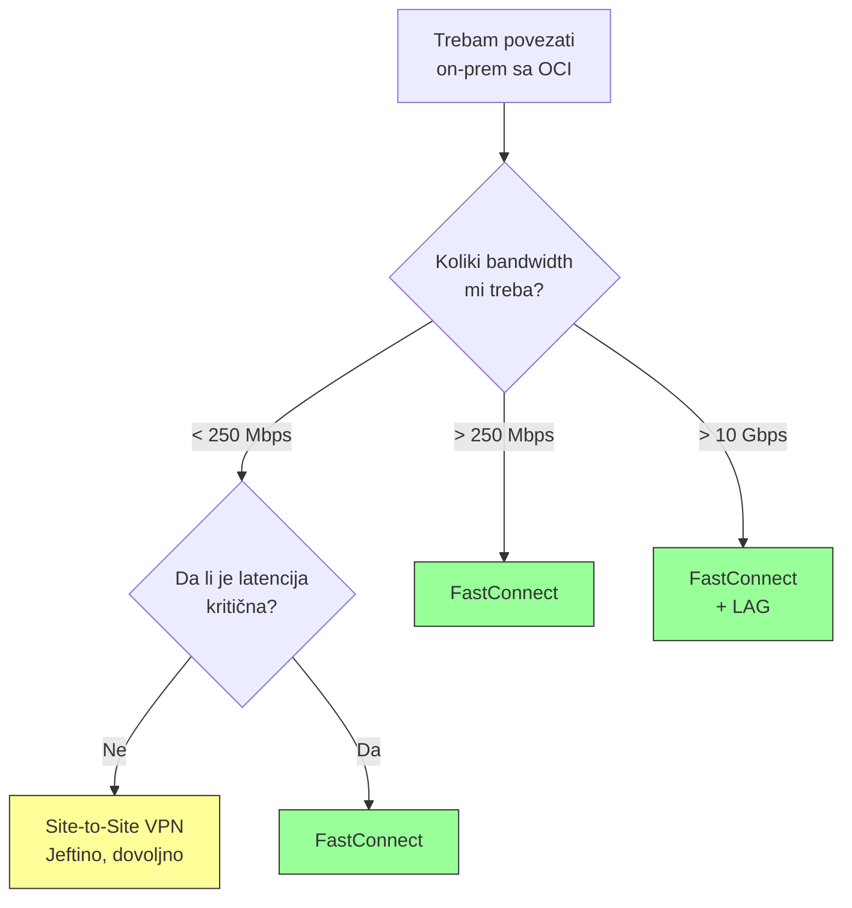

> **Objašnjenje dijagrama — Decision tree za izbor:**
>
> **Koristite Site-to-Site VPN kada:**
> - Bandwidth potrebe su male (<250 Mbps)
> - Latencija nije kritična (batch jobs, backup)
> - Budget je ograničen
> - Brzi setup je prioritet
>
> **Koristite FastConnect kada:**
> - Trebate veći bandwidth (>250 Mbps)
> - Latencija JE kritična (real-time aplikacije, baze)
> - Imate compliance zahteve (podaci ne smeju na internet)
> - Radite migraciju velikih količina podataka
> - Production workload zahteva SLA

---

## 3. Arhitektura i komponente

### Komponente FastConnect-a

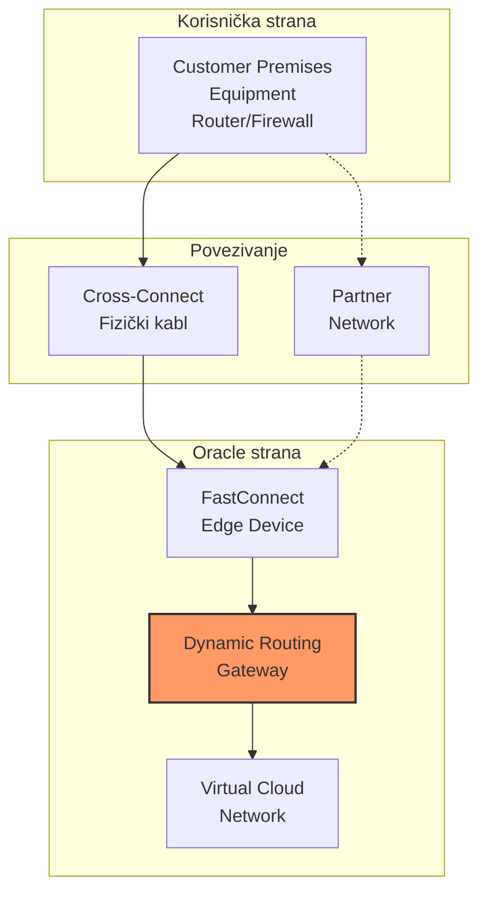

> **Objašnjenje dijagrama — FastConnect komponente:**
>
> **Korisnička strana:**
> - **CPE (Customer Premises Equipment)**
>   - Vaš router ili firewall
>   - Mora podržavati BGP
>   - Terminira FastConnect vezu na vašoj strani
>
> **Povezivanje (dva načina):**
> - **Cross-Connect** — fizički kabl u colocation objektu
>   - Vi ili provajder obezbeđujete kabl
>   - Direktna veza do Oracle opreme
> - **Partner Network** — preko Oracle partnera
>   - Partner već ima vezu sa Oracle-om
>   - Vi se povezujete na partnera
>
> **Oracle strana:**
> - **FastConnect Edge Device**
>   - Oracle-ova oprema koja terminira vašu vezu
>   - Nalazi se u FastConnect lokaciji (PoP)
> - **DRG (Dynamic Routing Gateway)**
>   - Virtuelni router u OCI
>   - "Ulazna tačka" u vašu VCN mrežu
>   - Razmenjuje rute preko BGP-a
> - **VCN (Virtual Cloud Network)**
>   - Vaša privatna mreža u OCI
>   - Sadrži subnet-e, compute instance, baze...

### Virtual Circuit — Logička veza

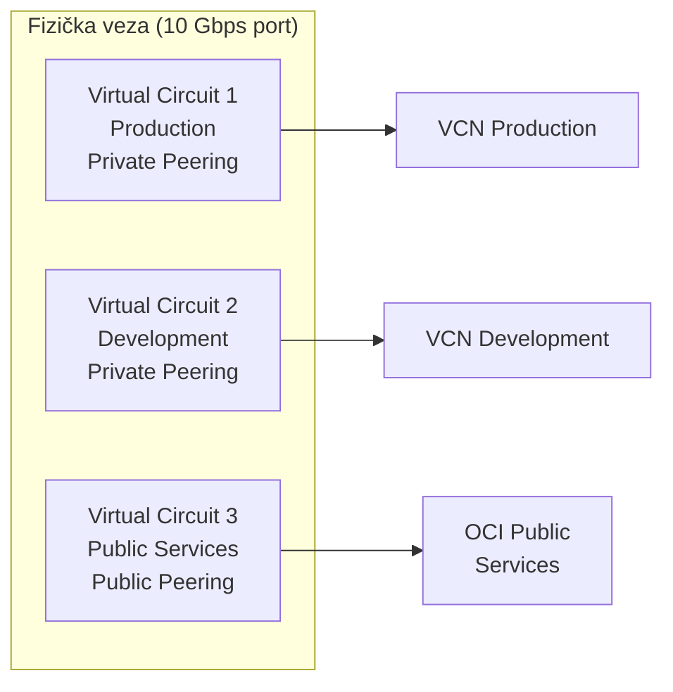

> **Objašnjenje dijagrama — Virtual Circuits:**
>
> **Virtual Circuit** je logička veza preko fizičkog FastConnect porta:
>
> - Jedan fizički port (npr. 10 Gbps) može imati **više Virtual Circuit-a**
> - Svaki VC je **izolovan** od drugih
> - Svaki VC može ići ka **različitoj destinaciji**
>
> **Primer iz dijagrama:**
> - **VC1** — za production environment, privatni peering
> - **VC2** — za development, odvojen od production-a
> - **VC3** — za pristup OCI public servisima (Object Storage, API)
>
> **Prednosti:**
> - Logička separacija saobraćaja
> - Različite QoS politike po VC-u
> - Jedan fizički port, više namena

---

## 4. Tipovi povezivanja

Oracle nudi tri načina za uspostavljanje FastConnect veze:

### 4.1 Colocation (Direct Connect)

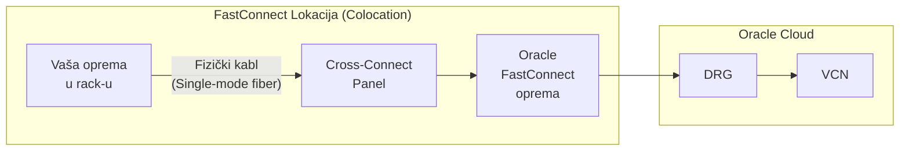

> **Objašnjenje dijagrama — Colocation model:**
>
> Ovaj model je za korisnike koji **već imaju opremu** u data centru gde se nalazi Oracle FastConnect Point of Presence.
>
> **Kako funkcioniše:**
> 1. Vaša oprema je u rack-u u istom objektu kao Oracle
> 2. Naručujete **cross-connect** (fizički kabl)
> 3. Kabl povezuje vaš router sa Oracle FastConnect opremom
> 4. Uspostavlja se BGP sesija
>
> **Tehnički detalji:**
> - Kabl: Single-mode fiber (SMF)
> - Konektori: LC (tipično)
> - Port brzine: 1G, 10G, 100G, 400G
> - Potreban: **LOA (Letter of Authorization)** od Oracle-a
>
> **Prednosti:**
> - Najniža moguća latencija
> - Potpuna kontrola
> - Najviše brzine (do 400 Gbps)
>
> **Mane:**
> - Morate imati opremu u FastConnect lokaciji
> - Vi ste odgovorni za cross-connect

### 4.2 Oracle Partner

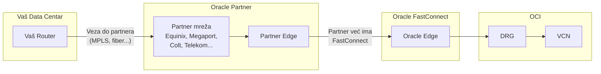

> **Objašnjenje dijagrama — Partner model:**
>
> Ovaj model koristi **Oracle partnera** kao posrednika.
>
> **Kako funkcioniše:**
> 1. Partner (Equinix, Megaport, Colt, Telekom...) već ima FastConnect vezu sa Oracle-om
> 2. Vi uspostavljate vezu do partnera (bilo kako — fiber, MPLS, čak i internet)
> 3. Partner "proširuje" svoju FastConnect vezu do vas
>
> **Prednosti:**
> - Ne morate imati opremu u FastConnect lokaciji
> - Brži setup (partner već ima infrastrukturu)
> - Partner može ponuditi dodatne servise
> - Manji CAPEX
>
> **Mane:**
> - Dodatni hop (partner mreža)
> - Malo veća latencija
> - Zavisnost od partnera
>
> **Oracle partneri u Evropi:**
> - Equinix Fabric
> - Megaport
> - Colt
> - Console Connect
> - BICS
> - I mnogi drugi...

### 4.3 Third-Party Provider

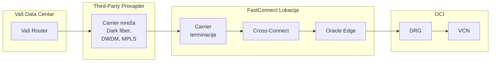

> **Objašnjenje dijagrama — Third-Party model:**
>
> Ovaj model koristi **bilo kog provajdera** koji može da obezbedi konekciju do FastConnect lokacije.
>
> **Kako funkcioniše:**
> 1. Angažujete carrier-a (telco, fiber provajder) da vas poveže
> 2. Carrier "donese" vašu vezu do FastConnect lokacije
> 3. U FastConnect lokaciji se uspostavlja cross-connect do Oracle-a
>
> **Kada koristiti:**
> - Kada Oracle partneri nisu dostupni u vašem regionu
> - Kada imate postojeću vezu sa carrier-om
> - Kada želite specifičnog provajdera
>
> **Potrebno:**
> - LOA od Oracle-a
> - Koordinacija sa carrier-om i FastConnect lokacijom
> - Vi upravljate cross-connect-om

### Poređenje modela

| Aspekt | Colocation | Partner | Third-Party |
|--------|------------|---------|-------------|
| **Vaša oprema u FC lokaciji** | Da | Ne | Ne |
| **LOA potreban** | Da | Ne | Da |
| **Setup vreme** | 1-2 nedelje | Sati do dani | 2-4 nedelje |
| **Max brzina** | 400 Gbps | Zavisi od partnera | 400 Gbps |
| **Latencija** | Najniža | Niska | Niska |
| **Kompleksnost** | Srednja | Niska | Visoka |
| **CAPEX** | Visok | Nizak | Srednji |
| **OPEX** | Nizak | Srednji | Srednji |

---

## 5. Peering modeli

FastConnect podržava dva tipa peering-a:

### 5.1 Private Peering

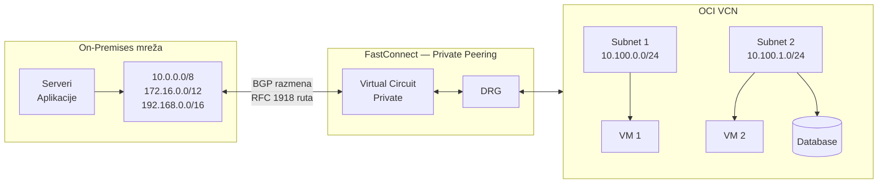

> **Objašnjenje dijagrama — Private Peering:**
>
> **Private Peering** povezuje vašu on-premises mrežu sa OCI VCN-om koristeći **privatne IP adrese**.
>
> **Karakteristike:**
> - Koriste se **RFC 1918** adrese (10.x, 172.16.x, 192.168.x)
> - Saobraćaj je potpuno **privatan** — nikada ne izlazi na internet
> - BGP razmenjuje rute između vaše mreže i VCN-a
>
> **Šta možete raditi:**
> - Pristupati VM-ovima u VCN-u po privatnoj IP adresi
> - Povezati on-prem bazu sa cloud bazom
> - Extend-ovati vašu mrežu u cloud (hybrid)
>
> **Tipični use case-ovi:**
> - **Hybrid cloud** — deo workload-a on-prem, deo u cloud-u
> - **Lift and shift** — migracija aplikacija u cloud
> - **Disaster recovery** — replikacija podataka
> - **Cloud bursting** — overflow kapaciteta u cloud

### 5.2 Public Peering

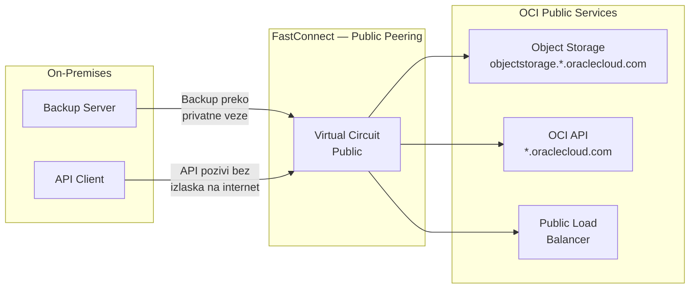

> **Objašnjenje dijagrama — Public Peering:**
>
> **Public Peering** omogućava pristup **OCI javnim servisima** bez korišćenja interneta.
>
> **Šta su OCI Public Services?**
> - **Object Storage** — S3-kompatibilni storage
> - **OCI API** — upravljanje cloud resursima
> - **Public Load Balancers** — load balanceri sa javnim IP
> - **Oracle Services Network** — Oracle SaaS servisi
>
> **Zašto Public Peering a ne internet?**
> - **Bezbednost** — saobraćaj ne ide preko javne mreže
> - **Performanse** — direktna veza, nema internet gužvi
> - **Compliance** — neke organizacije NE SMEJU slati podatke preko interneta
>
> **Primer: Backup na Object Storage**
> ```
> Bez FastConnect:
>   Backup server → Internet → Object Storage
>   Problem: sporo, nesigurno, plaćate internet transfer
>
> Sa FastConnect Public Peering:
>   Backup server → FastConnect → Object Storage
>   Prednost: brzo, sigurno, plaćate samo FC port
> ```

### Private vs Public Peering

| Aspekt | Private Peering | Public Peering |
|--------|-----------------|----------------|
| **Destinacija** | Vaša VCN | OCI Public Services |
| **IP adrese** | Privatne (RFC 1918) | Javne |
| **DRG potreban** | Da | Ne |
| **Use case** | Hybrid cloud, VM pristup | Object Storage, API, SaaS |
| **BGP rute** | Vaše VCN subnet-e | Oracle public prefixes |

### Kombinovanje oba peering-a

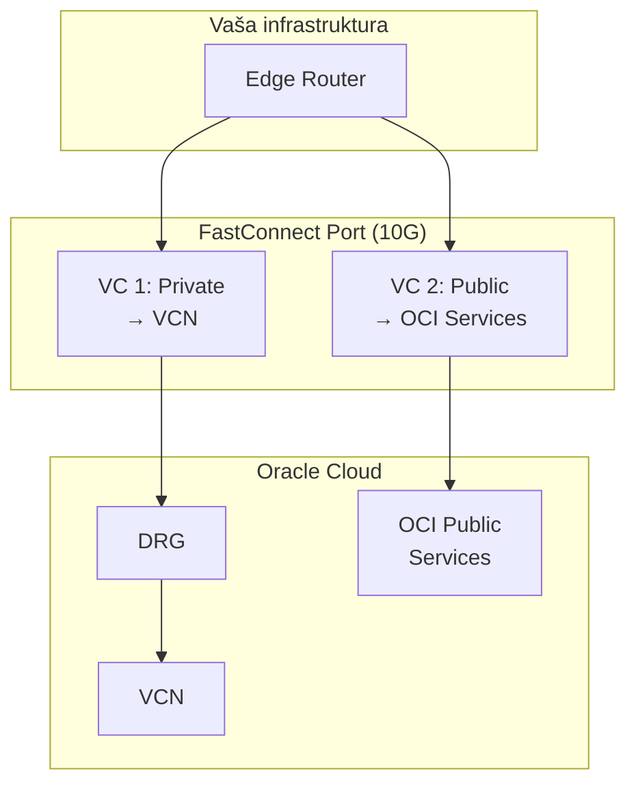

> **Objašnjenje dijagrama — Kombinacija peering-a:**
>
> Na jednom FastConnect portu možete imati **oba tipa** peering-a:
>
> - **VC 1 (Private)** — za pristup vašoj VCN
> - **VC 2 (Public)** — za pristup OCI javnim servisima
>
> **Zašto kombinovati?**
> - VM-ovi u VCN-u komuniciraju preko Private peering-a
> - Backup na Object Storage ide preko Public peering-a
> - Sve preko jednog fizičkog porta

---

## 6. Port brzine i LAG

### Dostupne port brzine

| Port | Tip konektora | Fiber | Use Case |
|------|---------------|-------|----------|
| **1 Gbps** | 1000BASE-LX SFP | SMF | Mali workload, test |
| **10 Gbps** | 10GBASE-LR SFP+ | SMF | Standard enterprise |
| **100 Gbps** | 100GBASE-LR4 QSFP28 | SMF | Veliki transfer, HPC |
| **400 Gbps** | 400GBASE-LR4 QSFP-DD | SMF | Hyperscale |

### LAG (Link Aggregation Group)

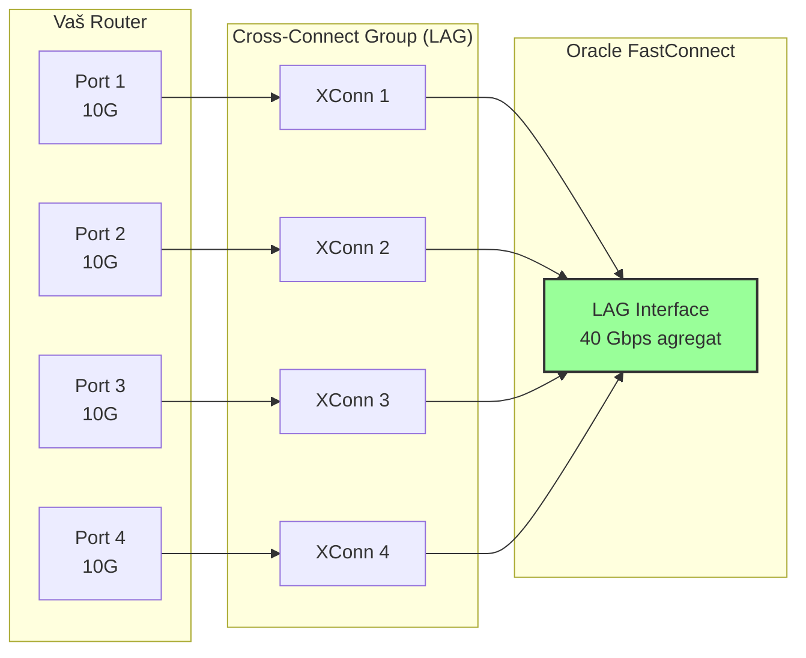

> **Objašnjenje dijagrama — LAG agregacija:**
>
> **LAG (Link Aggregation Group)** kombinuje više fizičkih veza u jednu logičku:
>
> **Primer iz dijagrama:**
> - 4 x 10 Gbps porta
> - Agregirano u 40 Gbps logičku vezu
>
> **Kako funkcioniše:**
> - Koristi se **LACP** (Link Aggregation Control Protocol)
> - Saobraćaj se distribuira preko svih aktivnih linkova
> - Ako jedan link otkaže, saobraćaj automatski ide preko preostalih
>
> **Prednosti LAG-a:**
>
> | Bez LAG | Sa LAG |
> |---------|--------|
> | 1 x 10G = 10 Gbps | 4 x 10G = 40 Gbps |
> | Ako link padne = 0 Gbps | Ako 1 link padne = 30 Gbps |
> | Single point of failure | Redundantnost |
>
> **Kada koristiti LAG:**
> - Potreban bandwidth > 10 Gbps, a nemate 100G opremu
> - Želite redundantnost na link nivou
> - Postepeno skaliranje (dodajete linkove po potrebi)

### Skaliranje sa LAG-om

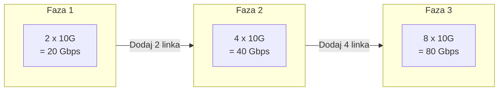

> **Objašnjenje dijagrama — Skaliranje bandwidth-a:**
>
> LAG omogućava **postepeno skaliranje** bez prekida:
>
> 1. **Faza 1:** Počinjete sa 2 x 10G = 20 Gbps
> 2. **Faza 2:** Biznis raste, dodajete još 2 linka = 40 Gbps
> 3. **Faza 3:** Dalje skaliranje = 80 Gbps
>
> **Ključno:** Dodavanje linkova se radi **bez downtime-a**!

---

## 7. Redundantnost i visoka dostupnost

### Single Point of Failure — Šta izbeći

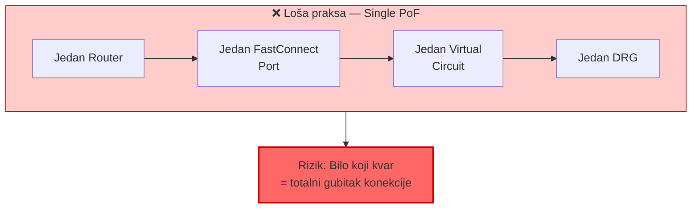

> **Objašnjenje dijagrama — Šta NE raditi:**
>
> Ako imate samo JEDNU od bilo čega:
> - Jedan router → ako router crkne, nema veze
> - Jedan FC port → ako port/kabl otkaže, nema veze
> - Jedan VC → ako VC ima problem, nema veze
>
> **Ovo NIJE prihvatljivo za produkciju!**

### Preporučena arhitektura — Puna redundantnost

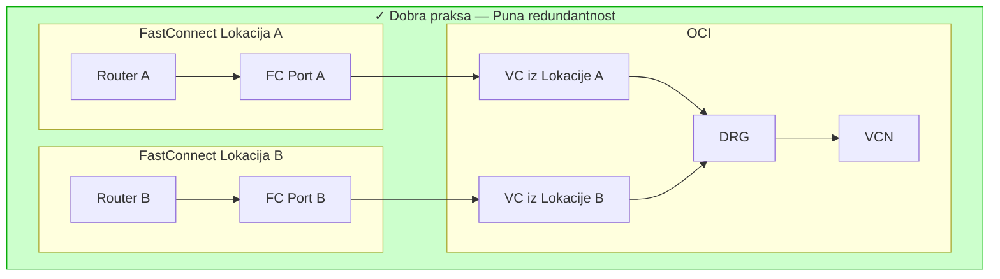

> **Objašnjenje dijagrama — Preporučena HA arhitektura:**
>
> Za pravu visoku dostupnost, potrebno je:
>
> **Dve FastConnect lokacije:**
> - Lokacija A i Lokacija B (različiti objekti)
> - Ako jedna lokacija ima problem (struja, fiber cut), druga radi
>
> **Dva nezavisna puta:**
> - Router A → FC Port A → VC A
> - Router B → FC Port B → VC B
>
> **Jedan DRG, dva VC-a:**
> - DRG prima veze iz oba VC-a
> - BGP automatski prebacuje saobraćaj ako jedan put otkaže
>
> **Rezultat:**
> - Nema single point of failure
> - Automatski failover (<1 sekunda sa BFD)
> - 99.99%+ dostupnost

### Disaster Recovery — Multi-Region

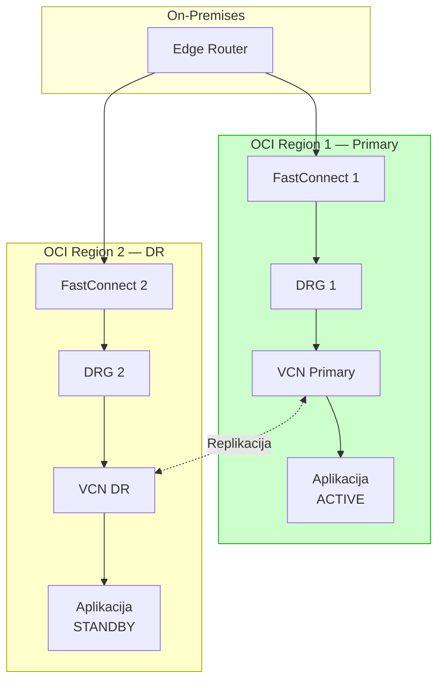

> **Objašnjenje dijagrama — Multi-Region DR:**
>
> Za disaster recovery na nivou regiona:
>
> **Primary Region (Region 1):**
> - Glavna aplikacija je ACTIVE
> - Prima sav produkcioni saobraćaj
>
> **DR Region (Region 2):**
> - Standby kopija aplikacije
> - Prima replicirane podatke
> - Preuzima ako Region 1 postane nedostupan
>
> **FastConnect do oba regiona:**
> - On-premises router ima veze ka oba
> - Može brzo preusmeriti saobraćaj na DR
>
> **RPO/RTO:**
> - RPO (koliko podataka gubite): zavisi od replikacije
> - RTO (koliko brzo se oporavite): minuti sa automatskim failover-om

---

## 8. BGP konfiguracija

### BGP osnove za FastConnect

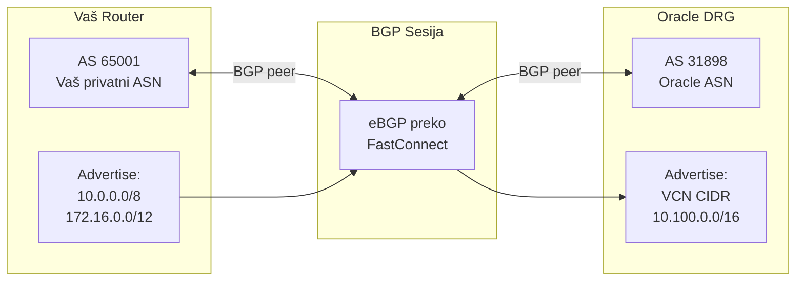

> **Objašnjenje dijagrama — BGP razmena ruta:**
>
> **BGP (Border Gateway Protocol)** je protokol koji se koristi za razmenu routing informacija između vaše mreže i Oracle-a.
>
> **Vaš Router:**
> - **AS 65001** — vaš Autonomous System Number (privatni ASN)
> - **Advertises** — oglašava vaše on-premises mreže ka Oracle-u
>
> **Oracle DRG:**
> - **AS 31898** — Oracle-ov javni ASN
> - **Advertises** — oglašava vaše VCN subnet-e ka vama
>
> **eBGP sesija:**
> - Uspostavlja se preko FastConnect veze
> - Razmenjuju se rute u oba smera
> - Omogućava dinamičko rutiranje (ako se mreža promeni, BGP propagira)

### BGP parametri za FastConnect

| Parametar | Vrednost | Napomena |
|-----------|----------|----------|
| **Oracle ASN** | 31898 | Fiksno, ne može se menjati |
| **Vaš ASN** | Privatni (64512-65534) ili javni | Vi birate |
| **BGP MD5 Auth** | Opciono | Preporučeno za bezbednost |
| **BFD** | Opciono | Za brži failover (<1s) |
| **Max prefixes** | 2000 | Limit ruta koje možete oglasiti |

### Primer BGP konfiguracije (Cisco IOS)

```
! FastConnect BGP konfiguracija

router bgp 65001
 bgp router-id 10.0.0.1
 neighbor 169.254.100.1 remote-as 31898
 neighbor 169.254.100.1 description Oracle-FastConnect-Primary
 neighbor 169.254.100.1 password <MD5-secret>
 neighbor 169.254.100.1 ebgp-multihop 2
 !
 address-family ipv4
  network 10.0.0.0 mask 255.0.0.0
  network 172.16.0.0 mask 255.240.0.0
  neighbor 169.254.100.1 activate
  neighbor 169.254.100.1 soft-reconfiguration inbound
 exit-address-family
!
! BFD za brži failover
interface GigabitEthernet0/0
 bfd interval 300 min_rx 300 multiplier 3
!
router bgp 65001
 neighbor 169.254.100.1 fall-over bfd
```

> **Objašnjenje konfiguracije:**
>
> - **router bgp 65001** — vaš BGP proces sa ASN 65001
> - **neighbor 169.254.100.1** — Oracle-ova BGP peer adresa (link-local)
> - **remote-as 31898** — Oracle-ov ASN
> - **password** — MD5 autentifikacija (opciono ali preporučeno)
> - **network** — mreže koje oglašavate ka Oracle-u
> - **bfd** — Bidirectional Forwarding Detection za brzi failover

---

## 9. FastConnect u DDC Kragujevac

### Jedinstvena prednost DDC lokacije

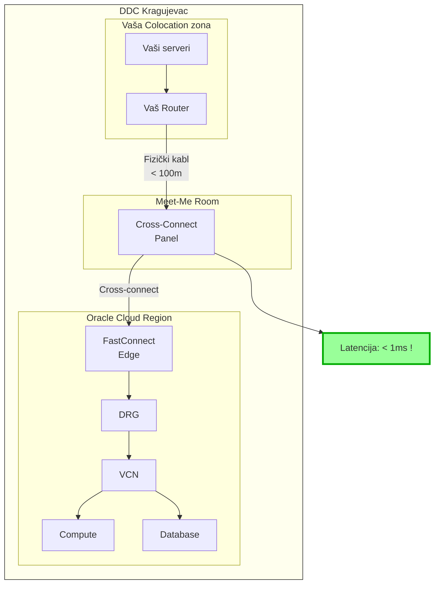

> **Objašnjenje dijagrama — FastConnect u DDC Kragujevac:**
>
> DDC Kragujevac ima **jedinstvenu prednost**: Oracle Cloud Region je **fizički u istoj zgradi**!
>
> **Šta to znači za FastConnect:**
>
> 1. **Vaša oprema** je u colocation zoni DDC-a
> 2. **Cross-connect** je bukvalno kabl od <100 metara
> 3. **Oracle FastConnect Edge** je u istom objektu
> 4. **Latencija: < 1 milisekunda** (sub-millisecond!)
>
> **Poređenje:**
>
> | Scenario | Latencija |
> |----------|-----------|
> | DDC → OCI Jovanovac (ista zgrada) | < 1 ms |
> | Beograd → OCI Frankfurt (FastConnect) | ~15-20 ms |
> | Beograd → OCI Frankfurt (Internet) | ~30-50 ms |
>
> **Use case-ovi koji ovo omogućava:**
> - **Real-time baze podataka** — aplikacija on-prem, baza u OCI
> - **Hybrid AI/ML** — preprocessing on-prem, training u OCI
> - **Burst computing** — overflow kapaciteta u cloud bez latency penala
> - **Disaster Recovery** — sinhronizovana replikacija

### Hybrid Cloud u DDC-u

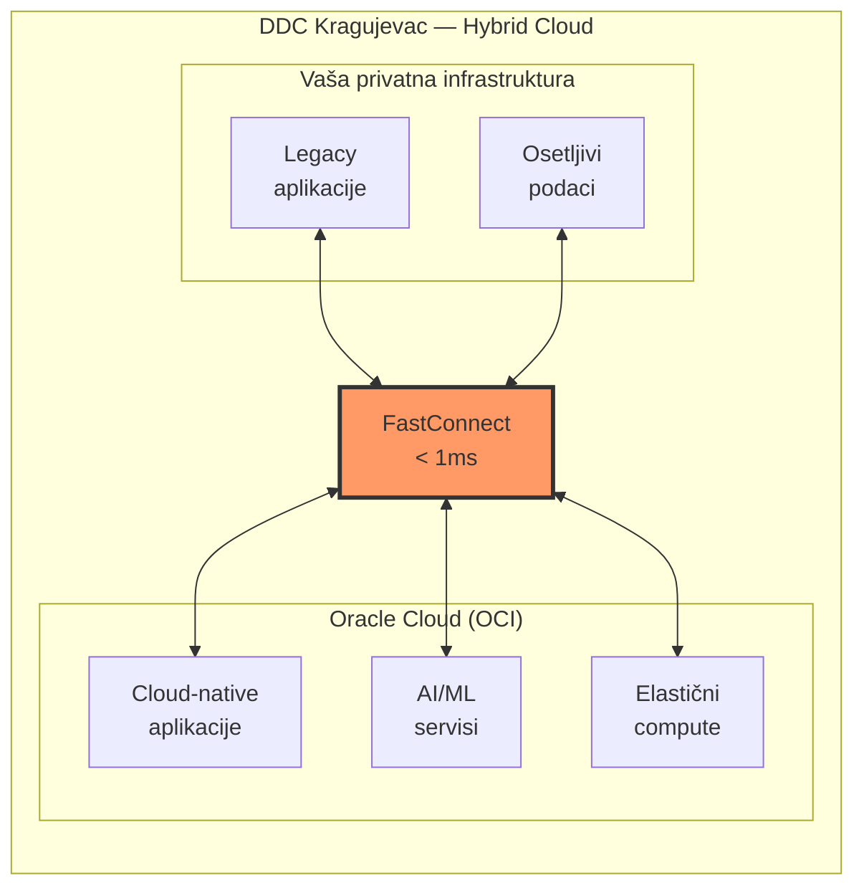

> **Objašnjenje dijagrama — Hybrid Cloud scenario:**
>
> Sa FastConnect-om u DDC-u možete imati pravi **Hybrid Cloud**:
>
> **Vaša privatna infrastruktura (levo):**
> - **Legacy aplikacije** — stare aplikacije koje ne mogu u cloud
> - **Osetljivi podaci** — regulatorni zahtevi da ostanu on-prem
>
> **Oracle Cloud (desno):**
> - **Cloud-native aplikacije** — nove aplikacije dizajnirane za cloud
> - **AI/ML servisi** — Oracle AI servisi, GPU compute
> - **Elastični compute** — skaliranje po potrebi
>
> **FastConnect u sredini:**
> - Povezuje oba sveta
> - Latencija <1ms znači da deluju kao JEDNA infrastruktura
> - Aplikacija može imati frontend on-prem, backend u cloud-u

---

## 10. Use Cases i scenariji

### Use Case 1: Migracija u Cloud (Lift & Shift)

```mermaid
flowchart LR
    subgraph BEFORE["Pre migracije"]
        OLD_DC[Stari Data Centar]
        OLD_APP[Aplikacija]
        OLD_DB[(Baza)]
    end

    subgraph MIGRATION["Migracija"]
        FC_MIG[FastConnect<br/>High bandwidth]
    end

    subgraph AFTER["Posle migracije"]
        OCI_APP[OCI Compute]
        OCI_DB[(OCI Database)]
    end

    OLD_DC --> FC_MIG
    FC_MIG -->|"Bulk data<br/>transfer"| AFTER

    style FC_MIG fill:#f96,stroke:#333,stroke-width:2px
```

> **Objašnjenje:**
> - Koristite FastConnect za brzi transfer velikih količina podataka
> - 10 Gbps = ~100 TB dnevno teoretski
> - Mnogo brže nego preko interneta

### Use Case 2: Hybrid Database

```mermaid
flowchart LR
    subgraph ONPREM_APP["On-Premises"]
        APP[Aplikacija<br/>Java/.NET]
    end

    subgraph FC_DB["FastConnect"]
        CONN[Private<br/>Peering]
    end

    subgraph OCI_DB["OCI"]
        ATP[(Autonomous<br/>Database)]
    end

    APP -->|"JDBC/ODBC<br/>Low latency"| CONN
    CONN --> ATP

    style CONN fill:#9f9,stroke:#333
```

> **Objašnjenje:**
> - Aplikacija ostaje on-premises
> - Baza migrira u OCI Autonomous Database
> - FastConnect obezbeđuje nisku latenciju za DB upite
> - Prednosti: managed database, automatic patching, scaling

### Use Case 3: Disaster Recovery

```mermaid
flowchart TD
    subgraph PRIMARY["Primary Site — On-Premises"]
        PROD_APP[Production<br/>Aplikacija]
        PROD_DB[(Production<br/>Database)]
    end

    subgraph FC_DR["FastConnect"]
        REPL[Async/Sync<br/>Replication]
    end

    subgraph DR_SITE["DR Site — OCI"]
        DR_APP[Standby<br/>Aplikacija]
        DR_DB[(Standby<br/>Database)]
    end

    PROD_DB -->|"Data Guard /<br/>GoldenGate"| REPL
    REPL --> DR_DB

    PROD_APP -.->|"DNS failover"| DR_APP
```

> **Objašnjenje:**
> - Production radi on-premises
> - DR kopija u OCI
> - FastConnect za replikaciju podataka
> - Ako primary padne, DNS prebacuje na OCI

### Use Case 4: Cloud Bursting

```mermaid
flowchart LR
    subgraph NORMAL["Normalno opterećenje"]
        ONPREM_COMPUTE[On-Prem<br/>10 servera]
    end

    subgraph PEAK["Peak opterećenje"]
        BURST_COMPUTE[OCI<br/>+50 servera]
    end

    FC_BURST[FastConnect]

    ONPREM_COMPUTE --> FC_BURST
    FC_BURST -->|"Auto-scale<br/>po potrebi"| BURST_COMPUTE
```

> **Objašnjenje:**
> - Normalno: koristite on-prem kapacitet
> - Peak (Black Friday, kraj kvartala...): burst u OCI
> - FastConnect omogućava nisku latenciju za distribuiranu aplikaciju
> - Plaćate OCI samo kad vam treba

---

## 11. Pricing model

### Struktura cena

```mermaid
flowchart TD
    subgraph COSTS["FastConnect troškovi"]
        PORT[Port Fee<br/>$/sat po portu]
        XCONN[Cross-Connect Fee<br/>Jednokratno + mesečno]
        PARTNER[Partner Fee<br/>Ako koristite partnera]
    end

    subgraph NO_COST["BEZ dodatnih troškova"]
        INGRESS[Ingress Data<br/>$0]
        EGRESS_FC[Egress preko FC<br/>$0 za Private Peering]
    end

    COSTS --> TOTAL[Ukupni mesečni<br/>trošak]
    NO_COST --> TOTAL
```

> **Objašnjenje dijagrama — Pricing:**
>
> **Šta plaćate:**
> 1. **Port Fee** — po satu, zavisi od brzine porta
> 2. **Cross-Connect Fee** — plaćate data centru (ne Oracle-u)
> 3. **Partner Fee** — ako koristite Oracle partnera
>
> **Šta NE plaćate:**
> - **Ingress** (ulazni saobraćaj) — besplatno
> - **Egress preko Private Peering** — besplatno!
>
> Ovo je velika prednost: egress preko interneta je skup, preko FastConnect-a je besplatan.

### Okvirne cene (2024/2025)

| Port | Cena/sat | ~Mesečno |
|------|----------|----------|
| 1 Gbps | ~$0.30 | ~$220 |
| 10 Gbps | ~$1.00 | ~$730 |
| 100 Gbps | ~$5.00 | ~$3,650 |

*Cene su okvirne i variraju po regionu. Proverite Oracle cenovnik za tačne cene.*

### ROI kalkulacija

```
Scenario: 50 TB mesečnog transfera

Preko Interneta:
- Egress: 50 TB × $0.05/GB = $2,500/mesec
- Nepredvidiva latencija
- Bezbednosni rizici

Preko FastConnect (10G):
- Port: ~$730/mesec
- Egress: $0
- Niska latencija, visoka bezbednost

Ušteda: $2,500 - $730 = $1,770/mesec
```

---

## Zaključak

**Oracle FastConnect** je ključna komponenta za enterprise hybrid cloud strategiju:

- **Performanse** — dedicirani bandwidth, niska latencija
- **Bezbednost** — izolovan saobraćaj, bez izloženosti internetu
- **Pouzdanost** — SLA, redundantnost, BGP failover
- **Ekonomičnost** — besplatan egress, predvidivi troškovi

Za korisnike **DDC Kragujevac**, FastConnect nudi dodatnu prednost — Oracle Cloud Region je u istoj zgradi, što omogućava **sub-millisecond latenciju** i pravi hybrid cloud bez kompromisa.

---

## Izvori

- [Oracle FastConnect Documentation](https://docs.oracle.com/en-us/iaas/Content/Network/Concepts/fastconnect.htm)
- [FastConnect Overview](https://docs.oracle.com/en-us/iaas/Content/Network/Concepts/fastconnectoverview.htm)
- [Oracle FastConnect FAQ](https://www.oracle.com/cloud/networking/fastconnect/faq/)
- [Oracle Cloud Networking](https://www.oracle.com/cloud/networking/)

---

*Dokument pripremljen za predavanje na Računarskom fakultetu, Beograd*
