# Software-Defined Storage (SDS) u Cloud Infrastrukturi

**Autor:** Računarski fakultet, Beograd
**Verzija:** 1.0

---

## Sadržaj

1. [Uvod u SDS](#1-uvod-u-sds)
2. [SDS Storage Modeli](#2-sds-storage-modeli)
3. [Ceph - Open Source SDS](#3-ceph---open-source-sds)
4. [VMware vSAN - Enterprise SDS](#4-vmware-vsan---enterprise-sds)
5. [Ceph vs vSAN Poređenje](#5-ceph-vs-vsan-poređenje)
6. [SDS u Cloud Infrastrukturi](#6-sds-u-cloud-infrastrukturi)
7. [Sizing i Best Practices](#7-sizing-i-best-practices)

---

## 1. Uvod u SDS

### Šta je Software-Defined Storage?

**Software-Defined Storage (SDS)** je arhitektura skladištenja podataka u kojoj softver, a ne hardver, upravlja svim funkcijama storage sistema — uključujući provisioning, replikaciju, deduplication, snapshot-e i disaster recovery.

Tradicionalni storage sistemi (SAN/NAS) koriste specijalizovani hardver sa ugrađenim kontrolerima. SDS taj pristup transformiše:

| Aspekt | Tradicionalni Storage | SDS |
|--------|----------------------|-----|
| Hardver | Specijalizovani uređaji | Commodity x86 serveri |
| Upravljanje | Hardverski kontroler | Softverski sloj |
| Skaliranje | Scale-up (veći uređaj) | Scale-out (više čvorova) |
| Vendor lock-in | Visok | Nizak |
| Cena | Visoka (CAPEX) | Niža, fleksibilnija |

### Zašto SDS u Cloud okruženju?

SDS je prirodan izbor za cloud infrastrukturu jer omogućava:

- **Elastičnost** — dodavanje kapaciteta bez downtime-a
- **Automatizaciju** — API-driven provisioning
- **Multi-tenancy** — izolacija podataka između korisnika
- **Hardware independence** — izbor vendor-a po potrebi

### Control Plane vs Data Plane

Ključni arhitekturni koncept u SDS sistemima je razdvajanje **Control Plane** i **Data Plane**.

> **Objašnjenje dijagrama — Control Plane vs Data Plane:**
>
> Ovaj dijagram prikazuje fundamentalnu podelu SDS sistema na dva logička sloja koji imaju potpuno različite uloge:
>
> **Gornji deo (Control Plane)** — predstavlja "mozak" storage sistema. Ovde se ne čuvaju podaci, već se donose odluke:
> - *Cluster Manager* — prati koji su serveri u klasteru i da li su dostupni
> - *Metadata Service* — čuva informacije O podacima (ne same podatke) — npr. "fajl X ima 3 replike"
> - *Health Monitoring* — neprestano proverava da li su svi diskovi i serveri zdravi
> - *Policy Engine* — primenjuje pravila (npr. "uvek čuvaj 3 kopije podataka")
>
> **Srednji deo (Data Plane)** — predstavlja "ruke" sistema koje zapravo rade sa podacima:
> - *Storage Daemon 1/2/3* — softverski procesi koji primaju zahteve za čitanje/pisanje i izvršavaju ih
> - Svaki daemon upravlja jednim ili više fizičkih diskova
>
> **Donji deo (Physical Storage)** — stvarni fizički diskovi (SSD, HDD, NVMe) gde se podaci čuvaju
>
> **Strelice pokazuju:**
> - Pune linije (→) — Cluster Manager šalje komande Storage Daemon-ima
> - Isprekidane linije (-.→) — Health Monitoring prati stanje svakog daemon-a
> - Daemon-i direktno pristupaju fizičkim diskovima
>
> *Zašto je ova podela važna?* Ako Control Plane otkaže, podaci su i dalje sigurni na diskovima. Ako jedan Storage Daemon otkaže, Control Plane to detektuje i pokreće oporavak.


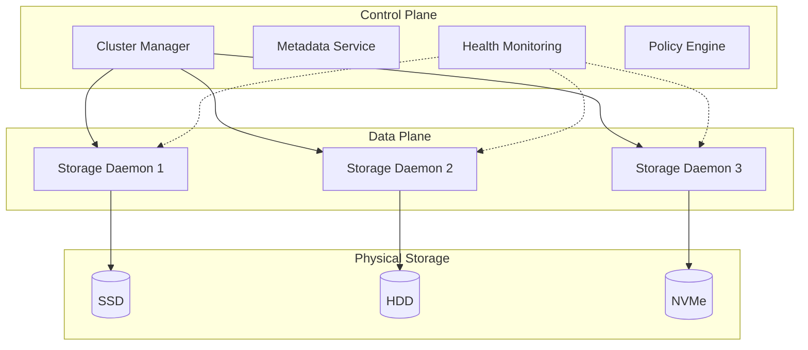

**Control Plane** je odgovoran za:
- Cluster membership i quorum
- Metadata management
- Placement decisions (gde idu podaci)
- Health monitoring i alerting

**Data Plane** obavlja:
- Read/Write operacije
- Replication između čvorova
- Erasure coding
- Data recovery

### SDS Slojevita Arhitektura

> **Objašnjenje dijagrama — SDS Slojevita Arhitektura:**
>
> Ovaj dijagram prikazuje kako su komponente SDS sistema organizovane u pet horizontalnih slojeva, gde svaki sloj ima jasnu odgovornost. Čitamo ga od vrha ka dnu:
>
> **1. Applications / Clients (vrh)** — korisnici storage sistema:
> - *Virtual Machines* — virtuelne mašine koje trebaju disk prostor
> - *Kubernetes* — kontejnerske aplikacije koje zahtevaju persistent storage
> - *Databases* — baze podataka (MySQL, PostgreSQL) koje čuvaju podatke
> - Ovi "klijenti" ne znaju gde su fizički diskovi — oni samo traže prostor
>
> **2. Storage Interface Layer** — sloj koji "prevodi" zahteve u odgovarajući protokol:
> - *Block API* — kada VM treba "sirov disk" koristi iSCSI ili NVMe-oF protokole
> - *File API* — kada aplikacija treba folder strukturu koristi NFS ili SMB
> - *Object API* — kada aplikacija čuva fajlove preko HTTP-a koristi S3 API
> - Ovaj sloj omogućava da isti fizički storage služi različitim potrebama
>
> **3. Control Plane** — sloj za donošenje odluka:
> - *Cluster Manager* — ko je u klasteru, ko je "živ"
> - *Placement Algorithm* — gde fizički smestiti podatke (npr. CRUSH u Ceph-u)
> - *Health Monitor* — praćenje zdravlja sistema
>
> **4. Data Plane** — sloj koji zapravo manipuliše podacima:
> - *Replication Engine* — kopira podatke na više lokacija
> - *Erasure Coding* — napredna zaštita podataka (alternativa RAID-u)
> - *Caching Layer* — ubrzava pristup često korišćenim podacima
>
> **5. Physical Infrastructure (dno)** — stvarni hardver:
> - *Node 1/2/3* — fizički serveri sa CPU, RAM i mrežnim karticama
> - Svaki node ima lokalne diskove kojima upravlja
>
> **Tok podataka (strelice nadole):** Kada VM zatraži prostor za čuvanje → zahtev prolazi kroz sve slojeve → na kraju se podaci fizicki upisuju na diskove.

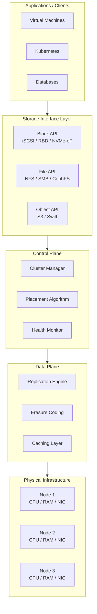

---

## 2. SDS Storage Modeli

SDS sistemi mogu da izlože storage na tri načina iz istog fizičkog pool-a.

> **Objašnjenje dijagrama — Storage Modeli:**
>
> Ovaj dijagram ilustruje jednu od najvažnijih prednosti SDS-a: **iz istog fizičkog storage pool-a možemo kreirati tri potpuno različita tipa storage servisa**. Dijagram se čita s leva na desno:
>
> **Leva strana — Storage Pool:**
> - Prikazuje grupu fizičkih diskova (2x SSD i 2x HDD) koji su spojeni u jedan logički "bazen" kapaciteta
> - Ovi diskovi mogu biti raspoređeni na različitim serverima
> - SDS softver ih vidi kao jednu celinu
>
> **Sredina — Tri storage interfejsa (grane):**
>
> 1. **Block Storage (/dev/rbd0)**
>    - Klijent vidi storage kao "sirov disk" — kao da je direktno priključen
>    - Primer: `/dev/rbd0` je uređaj koji Linux vidi kao lokalni disk
>    - Klijent sam formatira disk i pravi filesystem
>
> 2. **File Storage (/mnt/cephfs)**
>    - Klijent vidi storage kao mrežni folder sa fajlovima i folderima
>    - Primer: mount point `/mnt/cephfs` gde možete direktno kreirati fajlove
>    - Filesystem upravlja SDS sistem
>
> 3. **Object Storage (s3://bucket)**
>    - Klijent pristupa storage-u preko HTTP API-ja (PUT/GET zahtevi)
>    - Primer: `s3://bucket` — pristup kao kod Amazon S3
>    - Idealno za web aplikacije i backup
>
> **Desna strana — Konkretne primene:**
> - Block → VM diskovi, baze podataka (niska latencija)
> - File → deljeni folderi, home direktorijumi (poznata struktura)
> - Object → backup, arhiva (ogromna skalabilnost)
>
> **Ključna poruka:** Jedan SDS sistem može istovremeno služiti sve tri namene, bez potrebe za odvojenim hardverom za svaki tip storage-a.

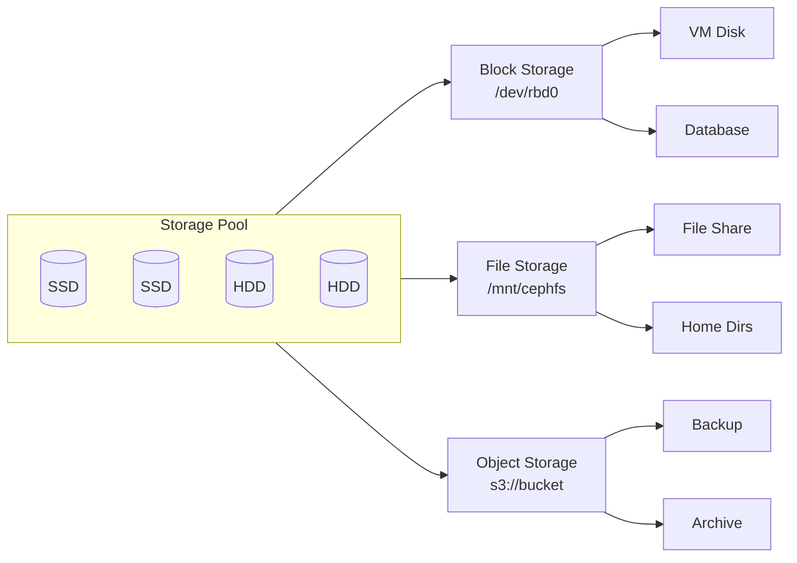

### Block Storage

Block storage prezentuje storage kao raw disk device. Host vidi LUN/volume kao lokalni disk.

**Protokoli:** iSCSI, Fibre Channel, NVMe-oF, RBD (Ceph)

**Use cases:**
- Virtual Machine disks
- Databases (MySQL, PostgreSQL, Oracle)
- Transakcioni sistemi

**Karakteristike:**
- Niska latencija
- Visok IOPS
- Host upravlja filesystem-om

### File Storage

File storage izlaže hijerarhijski filesystem preko mreže.

**Protokoli:** NFS, SMB/CIFS, CephFS

**Use cases:**
- Shared home directories
- Kolaboracija na dokumentima
- Application data

**Karakteristike:**
- Poznata struktura (folderi/fajlovi)
- File locking podrška
- Lako deljenje

### Object Storage

Object storage čuva podatke kao objekte sa metadata i unique ID-em.

**Protokoli:** S3 API, Swift API, REST/HTTP

**Use cases:**
- Backup i arhiviranje
- Big Data / Analytics
- Cloud-native aplikacije
- Media storage

**Karakteristike:**
- Ogromna skalabilnost (petabytes+)
- Rich metadata
- Eventual consistency (tipično)
- HTTP pristup

---

## 3. Ceph - Open Source SDS

**Ceph** je open-source, distribuirani storage sistem koji implementira Block, File i Object storage u jednoj platformi. Koriste ga CERN, Deutsche Telekom, Bloomberg i mnogi cloud provajderi.

### 3.1 Ceph Arhitektura

> **Objašnjenje dijagrama — Ceph Arhitektura:**
>
> Ovaj dijagram prikazuje kompletnu arhitekturu Ceph storage klastera sa svim komponentama i njihovim međusobnim vezama. Čita se od vrha ka dnu:
>
> **1. CLIENTS (vrh) — Ko koristi Ceph:**
> - *RBD Client* — aplikacije koje trebaju block storage (VM-ovi, baze)
> - *CephFS Client* — aplikacije koje trebaju filesystem (deljeni folderi)
> - *RGW Client* — aplikacije koje koriste S3/Swift API (web aplikacije, backup)
> - Svaki tip klijenta koristi odgovarajući Ceph interfejs
>
> **2. CONTROL PLANE — "Mozak" klastera:**
> - *MON 1, MON 2, MON 3* — Monitor servisi (uvek neparan broj za quorum)
>   - Čuvaju mapu klastera — ko je u klasteru, šta je gde
>   - Ako jedan MON otkaže, preostala dva nastavljaju rad
> - *MGR (Manager)* — pruža dashboard, metriku i alerting
>   - Nije kritičan za rad, ali olakšava upravljanje
>
> **3. METADATA LAYER — Samo za CephFS:**
> - *MDS 1, MDS 2* — Metadata Server-i
> - Čuvaju strukturu direktorijuma i fajlova
> - Potrebni SAMO ako koristite CephFS (file storage)
> - Za block i object storage nisu potrebni
>
> **4. DATA PLANE — Gde se čuvaju podaci:**
> - Tri fizička servera (Node 1, 2, 3)
> - Svaki server ima više OSD procesa (OSD.0 do OSD.8)
> - Svaki OSD upravlja jednim fizičkim diskom
> - U ovom primeru: 9 diskova ukupno (3 po serveru)
>
> **Strelice pokazuju tok podataka:**
> - Klijenti komuniciraju sa MON-ovima da dobiju mapu klastera
> - CephFS klijenti dodatno komuniciraju sa MDS-om
> - Svi podaci na kraju idu na OSD-ove
>
> **Zašto ovakva arhitektura?** Nema single point of failure — ako bilo koji pojedinačni element otkaže, sistem nastavlja rad.

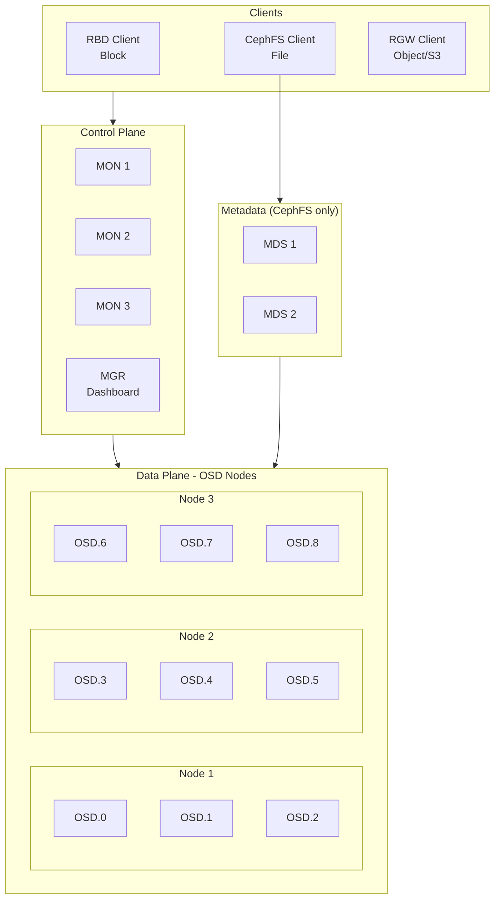

#### Ceph Servisi

| Servis | Funkcija | Minimum |
|--------|----------|---------|
| **MON** (Monitor) | Cluster state, quorum, CRUSH map | 3 (odd number) |
| **MGR** (Manager) | Monitoring, dashboard, alerts | 2 (HA) |
| **OSD** (Object Storage Daemon) | Čuva podatke, replication | 3+ |
| **MDS** (Metadata Server) | Metadata za CephFS | 2 (ako koristiš CephFS) |
| **RGW** (RADOS Gateway) | S3/Swift API | 2+ (load balanced) |

#### OSD - Srce Ceph sistema

Svaki disk u Ceph clusteru ima svoj OSD daemon:

```
Node 1
├── OSD.0 ← SSD 1
├── OSD.1 ← SSD 2
└── OSD.2 ← HDD 1

Node 2
├── OSD.3 ← SSD 1
├── OSD.4 ← HDD 1
└── OSD.5 ← HDD 2
```

OSD je odgovoran za:
- Čuvanje objekata (data + metadata)
- Replication ka drugim OSD-ovima
- Recovery kada OSD otkaže
- Scrubbing (provera integriteta)

### 3.2 CRUSH Algoritam

**CRUSH** (Controlled Replication Under Scalable Hashing) je algoritam koji određuje gde se podaci fizički čuvaju — bez centralnog metadata servera.

#### Zašto je CRUSH revolucionaran?

Tradicionalni pristup:
```
File → Metadata Server → "File je na Disk 47"
```
Problem: Metadata server je bottleneck i single point of failure.

CRUSH pristup:
```
File → hash(file_id) + CRUSH rules → Izračunaj lokaciju
```
Svaki klijent može izračunati gde su podaci!

> **Objašnjenje dijagrama — CRUSH Algoritam (Sequence Diagram):**
>
> Ovaj dijagram prikazuje **tačan redosled koraka** kada klijent želi da upiše fajl u Ceph. Čita se od vrha ka dnu, prateći vremensku liniju:
>
> **Učesnici (kolone):**
> - *Client* — aplikacija koja želi da sačuva "photo.jpg"
> - *CRUSH Algorithm* — matematički algoritam koji radi lokalno na klijentu
> - *Monitor* — Ceph servis koji čuva mapu klastera
> - *OSD.3 (Primary)* — disk koji će biti "glavni" za ovaj fajl
> - *OSD.7 i OSD.11 (Replica)* — diskovi koji čuvaju kopije
>
> **Koraci (čitamo od vrha):**
>
> 1. **Client → MON: "Get CRUSH Map"**
>    - Klijent traži trenutnu mapu klastera od Monitor-a
>    - Ovo se radi samo povremeno, mapa se kešira
>
> 2. **MON → Client: "CRUSH Map + Cluster State"**
>    - Monitor vraća mapu koja opisuje sve OSD-ove i njihovu topologiju
>
> 3. **Client → CRUSH: hash("photo.jpg")**
>    - Klijent LOKALNO izračunava hash vrednost imena fajla
>    - Ne pita nikoga — računa sam!
>
> 4. **CRUSH → Client: "PG 2.4a → OSD.3, OSD.7, OSD.11"**
>    - Algoritam vraća tačnu lokaciju: Placement Group 2.4a
>    - I konkretne OSD-ove gde idu podaci i replike
>
> 5. **Client → OSD.3: "Write photo.jpg"**
>    - Klijent direktno šalje podatke na Primary OSD
>
> 6. **OSD.3 → OSD.7, OSD.11: "Replicate"**
>    - Primary OSD prosleđuje podatke na replica OSD-ove
>
> 7. **OSD.7, OSD.11 → OSD.3: "ACK"**
>    - Replike potvrđuju da su sačuvale podatke
>
> 8. **OSD.3 → Client: "Write Complete"**
>    - Tek kada sve replike potvrde, klijent dobija potvrdu
>
> **Ključna revolucija:** Klijent sam računa gde su podaci — nema centralnog servera koji bi bio bottleneck!

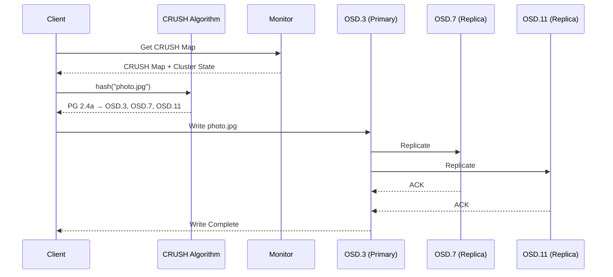

#### CRUSH Hijerarhija (Failure Domains)

CRUSH koristi hijerarhijsku mapu klastera za pametno raspoređivanje replika:

> **Objašnjenje dijagrama — CRUSH Hijerarhija:**
>
> Ovaj dijagram prikazuje kako Ceph "vidi" fizičku infrastrukturu kao stablo (hijerarhiju). Ovo je ključno za **inteligentno raspoređivanje replika** tako da kvar jednog elementa ne ugrozi podatke.
>
> **Struktura stabla (od vrha ka dnu):**
>
> 1. **Root: default** — koren stabla, predstavlja ceo klaster
>
> 2. **Datacenters (DC1, DC2)** — fizičke lokacije
>    - Mogu biti u različitim zgradama ili čak gradovima
>    - Ako DC1 izgubi struju, DC2 nastavlja rad
>
> 3. **Racks (rack1, rack2, rack3, rack4)** — fizički ormari sa serverima
>    - Svaki rack ima svoje napajanje i mrežni switch
>    - Ako rack1 switch otkaže, rack2 serveri nastavljaju rad
>
> 4. **Hosts (node01, node02, node03, node04)** — fizički serveri
>    - Svaki server može otkazati nezavisno
>
> 5. **OSDs (OSD.0, OSD.1, OSD.2, OSD.3)** — pojedinačni diskovi
>    - Najniži nivo — jedan disk = jedan OSD
>
> **Zašto je ovo važno?**
>
> CRUSH pravilo može reći: *"Replike moraju biti na različitim RACK-ovima"*
>
> Rezultat za fajl sa 3 replike:
> - Replica 1 → rack1 → node01 → OSD.0
> - Replica 2 → rack2 → node03 → OSD.4
> - Replica 3 → rack3 → node05 → OSD.8
>
> Sada, čak i ako **ceo rack1 izgori** (struja, požar, poplava), podaci su sigurni jer postoje kopije na rack2 i rack3!
>
> **Failure Domain** = nivo na kom garantujemo da replike neće biti na istom mestu. Može biti: host, rack, datacenter — vi birate.

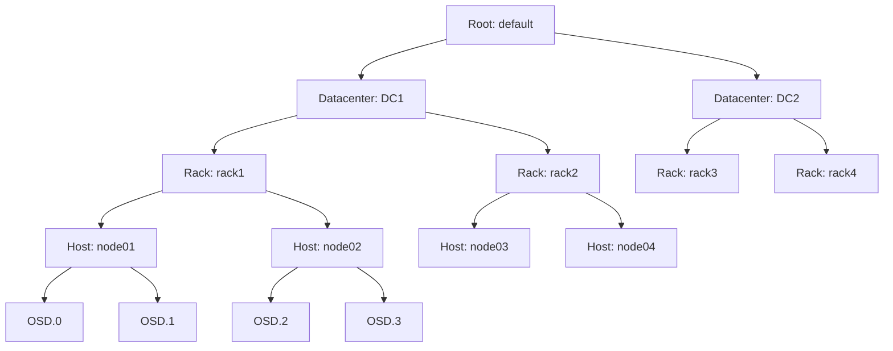

**CRUSH rule primer:**
```
Replike moraju biti na različitim RACK-ovima
```
Rezultat:
- Replica 1 → rack1/node01/OSD.0
- Replica 2 → rack2/node03/OSD.4
- Replica 3 → rack3/node05/OSD.8

Ako ceo rack izgubi struju — podaci su i dalje dostupni!

### 3.3 Data Protection

#### Replication

Najjednostavniji način zaštite podataka.

```
replication_factor = 3
```

> **Objašnjenje dijagrama — Replication (Write Operacija):**
>
> Ovaj sequence dijagram prikazuje šta se dešava "iza scene" kada aplikacija upisuje podatke u Ceph sa replication factor = 3. To znači da će svaki podatak postojati u **3 kopije** na različitim diskovima.
>
> **Učesnici:**
> - *Client* — aplikacija koja želi da sačuva Block X
> - *Primary OSD* — "glavni" disk odgovoran za ovaj blok podataka
> - *Replica OSD 1 i 2* — diskovi koji čuvaju kopije
>
> **Tok operacije:**
>
> 1. **Client → Primary: "Write Block X"**
>    - Klijent šalje podatke SAMO na Primary OSD
>    - Ne zna za replike — to je posao Primary-ja
>
> 2. **Primary → Replica 1 i 2: "Replicate Block X" (PARALELNO)**
>    - Primary istovremeno šalje kopije na oba replica OSD-a
>    - Oznaka "par" pokazuje da se ovo dešava u paraleli
>    - Ovo ubrzava proces — ne čeka se jedan pa drugi
>
> 3. **Replica 1 → Primary: "ACK"**
>    - Prva replika potvrđuje da je sačuvala podatke
>
> 4. **Replica 2 → Primary: "ACK"**
>    - Druga replika potvrđuje
>
> 5. **Primary → Client: "Write Success"**
>    - TEK KADA SVE REPLIKE POTVRDE, klijent dobija "uspešno"
>    - Ovo garantuje da su podaci sigurni na 3 mesta
>
> **Zašto je ovo važno?**
> - Ako Primary OSD eksplodira odmah nakon što klijent dobije "Success" — podaci su sigurni na replikama
> - Cena: 3x više prostora (100GB podataka = 300GB na diskovima)
> - Prednost: Jednostavno i brzo za recovery

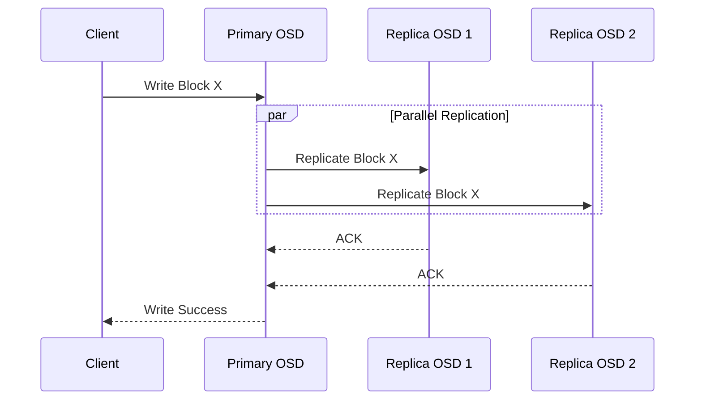

**Karakteristike:**
- Overhead: 3x storage za replication=3
- Performanse: Brži recovery
- Jednostavnost: Lako razumljiv

#### Erasure Coding

Napredniji način koji koristi manje prostora.

```
k = 4 (data chunks)
m = 2 (parity chunks)
```

```
Original: [D1] [D2] [D3] [D4]
Encoded:  [D1] [D2] [D3] [D4] [P1] [P2]
```

Može izgubiti bilo koja 2 chunk-a i rekonstruisati podatke.

**Karakteristike:**
- Overhead: 1.5x storage za k=4, m=2
- Performanse: Sporiji recovery (računanje)
- Kompleksnost: CPU intensive

| Metoda | Overhead | Recovery Speed | CPU Usage |
|--------|----------|----------------|-----------|
| Replication (3x) | 200% | Brz | Nizak |
| EC (4+2) | 50% | Srednji | Visok |
| EC (8+3) | 37.5% | Spor | Vrlo visok |

### 3.4 Failure Handling

> **Objašnjenje dijagrama — Failure Handling (Automatski Oporavak):**
>
> Ovaj dijagram prikazuje šta se automatski dešava kada disk (OSD) otkaže u Ceph klasteru. Ovo je **potpuno automatski proces** — administrator ne mora ništa da radi.
>
> **Tok događaja (čitamo od vrha ka dnu):**
>
> 1. **OSD.5 Failure Detected** — početna tačka
>    - Disk OSD.5 je prestao da odgovara (kvar, kablovi, struja...)
>
> 2. **MON detektuje timeout**
>    - Monitor servis primećuje da OSD.5 ne šalje "heartbeat" signale
>    - Tipično čeka 20-30 sekundi pre nego što proglasi kvar
>
> 3. **Mark OSD.5 as DOWN**
>    - Monitor zvanično označava OSD.5 kao nedostupan
>    - Ova informacija se širi svim klijentima
>
> 4. **Update CRUSH Map**
>    - CRUSH mapa se ažurira — OSD.5 više nije validna destinacija
>    - Novi podaci neće ići na OSD.5
>
> 5. **Affected PGs?** (Decision point — romb)
>    - Sistem proverava: da li je OSD.5 čuvao neke Placement Group-e?
>    - Ako NE → ništa dalje nije potrebno
>    - Ako DA → prelazi se na recovery
>
> 6. **Start Recovery**
>    - Pokreće se proces oporavka podataka
>
> 7. **Find replica on OSD.2**
>    - Sistem pronalazi gde postoji KOPIJA podataka koji su bili na OSD.5
>    - Sreća: imamo replication=3, znači postoje još 2 kopije
>
> 8. **Create new replica on OSD.9**
>    - Podaci se kopiraju sa OSD.2 na OSD.9
>    - OSD.9 postaje nova replika umesto pokvarenog OSD.5
>
> 9. **Rebalance complete → Cluster HEALTH_OK**
>    - Kada se sve kopije restauriraju, klaster je ponovo zdrav
>    - Sada opet imamo 3 kopije svakog podatka
>
> **Ključna poruka:** Sve ovo se dešava AUTOMATSKI, bez intervencije administratora. Klaster se "sam leči".

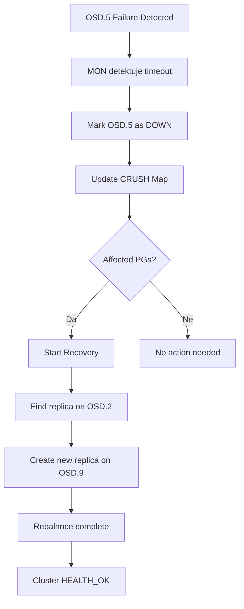

**Recovery proces:**

1. MON detektuje da OSD ne odgovara (timeout)
2. OSD se markira kao `DOWN`
3. CRUSH mapa se ažurira
4. Podaci koji su bili na tom OSD-u se rekonstruišu
5. Nove replike se kreiraju na drugim OSD-ovima

### 3.5 Ceph Praktični Primeri

#### Cluster Status

```bash
# Provera zdravlja klastera
ceph status

# Primer output-a
  cluster:
    id:     a1b2c3d4-5678-90ab-cdef-1234567890ab
    health: HEALTH_OK
  services:
    mon: 3 daemons, quorum node1,node2,node3
    mgr: node1(active), standbys: node2
    osd: 12 osds: 12 up, 12 in
  data:
    pools:   3 pools, 256 pgs
    objects: 10.5k objects, 40 GiB
    usage:   120 GiB used, 1.8 TiB avail
```

#### OSD Tree

```bash
# Prikaz OSD hijerarhije
ceph osd tree

# Output
ID  CLASS  WEIGHT   TYPE NAME        STATUS
-1         12.00000 root default
-3          4.00000     host node1
 0    ssd   1.00000         osd.0       up
 1    ssd   1.00000         osd.1       up
 2    hdd   2.00000         osd.2       up
-5          4.00000     host node2
 3    ssd   1.00000         osd.3       up
 4    hdd   2.00000         osd.4       up
 5    hdd   1.00000         osd.5       up
```

#### Pool Management

```bash
# Kreiranje pool-a sa replication=3
ceph osd pool create mypool 128 128 replicated
ceph osd pool set mypool size 3
ceph osd pool set mypool min_size 2

# Kreiranje EC pool-a
ceph osd pool create ec-pool 128 128 erasure

# Prikaz pool-ova
ceph osd pool ls detail
```

#### RBD (Block Storage)

```bash
# Kreiranje RBD image-a
rbd create mypool/myvolume --size 100G

# Mapiranje na host
rbd map mypool/myvolume
# Output: /dev/rbd0

# Formatiranje i mount
mkfs.xfs /dev/rbd0
mount /dev/rbd0 /mnt/ceph-block

# Snapshot
rbd snap create mypool/myvolume@snapshot1
rbd snap ls mypool/myvolume
```

#### CephFS (File Storage)

```bash
# Mount CephFS
mount -t ceph mon1,mon2,mon3:/ /mnt/cephfs \
  -o name=admin,secret=AQBxxxxxx

# Ili korišćenjem ceph-fuse
ceph-fuse /mnt/cephfs
```

#### S3 API (Object Storage)

```bash
# Kreiranje S3 korisnika
radosgw-admin user create --uid=myuser --display-name="My User"

# AWS CLI sa Ceph RGW
aws --endpoint-url=http://rgw.example.com:7480 \
    s3 mb s3://mybucket

aws --endpoint-url=http://rgw.example.com:7480 \
    s3 cp myfile.txt s3://mybucket/
```

---

## 4. VMware vSAN - Enterprise SDS

**VMware vSAN** je enterprise SDS rešenje integrisano sa vSphere platformom. Koristi lokalne diskove ESXi hostova za kreiranje distribuiranog storage-a.

### 4.1 vSAN Arhitektura

> **Objašnjenje dijagrama — vSAN Arhitektura:**
>
> Ovaj dijagram prikazuje kako VMware vSAN organizuje storage koristeći lokalne diskove ESXi hostova. Za razliku od Ceph-a koji je standalone sistem, vSAN je **duboko integrisan sa VMware vSphere platformom**.
>
> **Gornji deo — vCenter Server (upravljanje):**
> - *Storage Policy Based Management (SPBM)* — sistem za definisanje "pravila" storage-a
>   - Primer: "VM mora preživeti 1 host failure"
> - *vSAN Service* — komponenta u vCenter-u koja upravlja vSAN klasterom
> - Ovo je centralizovano upravljanje — jedna tačka za sve
>
> **Srednji deo — vSAN Cluster (3 ESXi hosta):**
>
> Svaki **ESXi Host** ima:
> - *VM-ove* — virtuelne mašine koje koriste vSAN storage
> - *vSAN Agent* — softverski proces koji upravlja lokalnim diskovima
> - *Disk Group* — logička grupa diskova
>
> **Disk Group struktura (ključni koncept):**
> - Svaka Disk Group ima TAČNO JEDAN **Cache disk** (brzi SSD/NVMe)
>   - Služi za ubrzanje: 70% read cache, 30% write buffer
> - I VIŠE **Capacity diskova** (SSD ili HDD)
>   - Ovde se trajno čuvaju podaci
> - Host može imati više Disk Group-a (do 5)
>
> **Donji deo — vSAN Network:**
> - *vmknic vSAN* — dedicirana mrežna kartica za vSAN saobraćaj
> - Svi hostovi komuniciraju preko ove mreže (10/25/100 GbE)
> - NIKADA ne deliti sa drugim saobraćajem (vMotion, management)
>
> **Strelice pokazuju:**
> - vCenter upravlja celim klasterom
> - Hostovi međusobno komuniciraju preko vSAN mreže
> - Podaci se distribuiraju između hostova automatski
>
> **Rezultat:** Svi hostovi zajedno formiraju jedan **vSAN Datastore** koji VM-ovi vide kao zajednički storage.

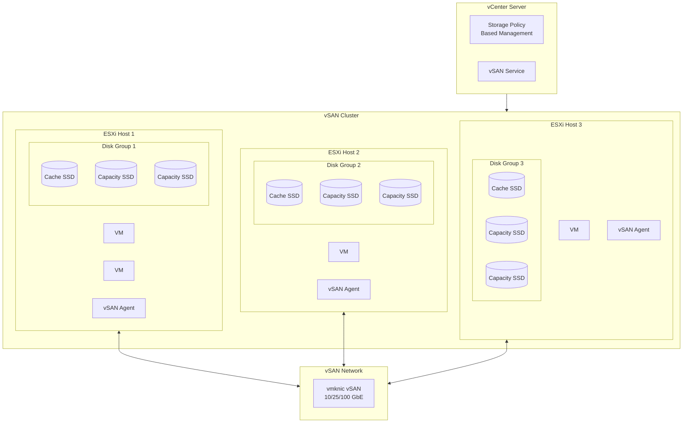

#### vSAN Komponente

| Komponenta | Opis |
|------------|------|
| **vSAN Cluster** | Grupa ESXi hostova koji dele storage |
| **Disk Group** | Cache disk + Capacity diskovi na jednom hostu |
| **vSAN Datastore** | Distribuirani datastore vidljiv svim hostovima |
| **vSAN Agent** | Proces na svakom ESXi koji upravlja lokalnim diskovima |
| **CLOM** (Cluster Level Object Manager) | Upravlja placement-om i health-om objekata |

#### Disk Groups

```
ESXi Host
├── Disk Group 1
│   ├── Cache Tier: 1x NVMe SSD (400GB)
│   └── Capacity Tier: 4x SSD (1.92TB each)
│
└── Disk Group 2
    ├── Cache Tier: 1x NVMe SSD (400GB)
    └── Capacity Tier: 4x SSD (1.92TB each)
```

**Cache Tier:**
- 70% za Read Cache
- 30% za Write Buffer
- Mora biti flash (SSD/NVMe)

**Capacity Tier:**
- Gde se podaci trajno čuvaju
- Može biti SSD ili HDD (all-flash vs hybrid)

### 4.2 Storage Policy Based Management (SPBM)

vSAN koristi polise za definisanje storage karakteristika.

> **Objašnjenje dijagrama — Storage Policy Based Management:**
>
> Ovaj dijagram prikazuje kako vSAN koristi **polise (policies)** za automatsko upravljanje storage-om. Umesto da administrator ručno konfiguriše gde idu podaci, on definiše PRAVILA, a vSAN ih automatski primenjuje.
>
> **Tok s leva na desno:**
>
> 1. **Virtual Machine** — VM koji treba storage
>    - Administrator kreira VM i dodeljuje mu Storage Policy
>
> 2. **Storage Policy** — skup pravila koji definiše zahteve
>    - "Ova VM mora preživeti 1 failure"
>    - "Koristi RAID-1 mirroring"
>    - Policy je kao "ugovor" između VM-a i storage-a
>
> 3. **vSAN Datastore** — distribuirani storage koji ispunjava policy
>    - vSAN automatski raspoređuje podatke da zadovolji pravila
>
> **Policy Rules (pravila u policy-ju):**
>
> - **Failures to Tolerate = 1**
>   - VM može da preživi otkaz 1 hosta ili diska
>   - To znači da će postojati 2 kopije podataka
>
> - **RAID Type = RAID-1**
>   - Koristi mirroring (kopiranje) za zaštitu
>   - Alternativa bi bila RAID-5/6 (erasure coding)
>
> - **Stripe Width = 1**
>   - Podaci se ne dele na više diskova
>   - Veća vrednost = bolje performanse, ali kompleksnije
>
> **Zašto je ovo revolucionarno?**
>
> Tradicionalni pristup:
> ```
> Admin: "Stavi VM na datastore X, konfiguriši RAID, podesi replikaciju..."
> ```
>
> SPBM pristup:
> ```
> Admin: "Ova VM je kritična, mora preživeti 1 failure"
> vSAN: "Razumem, ja ću se pobrinuti za sve detalje"
> ```
>
> Administrator definiše ŠTA želi, vSAN odlučuje KAKO da to postigne.

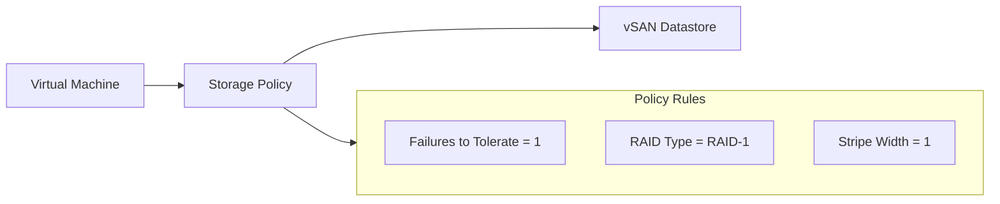

#### Ključni Policy Parametri

| Parametar | Opis | Vrednosti |
|-----------|------|-----------|
| **FTT** (Failures to Tolerate) | Koliko host/disk failure-a može preživeti | 0, 1, 2, 3 |
| **RAID Type** | Metoda zaštite | RAID-1 (mirror), RAID-5, RAID-6 |
| **Stripe Width** | Broj capacity diskova za striping | 1-12 |
| **Object Space Reservation** | Thin vs Thick provisioning | 0-100% |
| **Force Provisioning** | Ignoriši ako nema resursa | Yes/No |

#### FTT i Kapacitet

| FTT | RAID Type | Hosts Required | Capacity Overhead |
|-----|-----------|----------------|-------------------|
| 1 | RAID-1 | 3 | 2x |
| 1 | RAID-5 | 4 | 1.33x |
| 2 | RAID-1 | 5 | 3x |
| 2 | RAID-6 | 6 | 1.5x |

### 4.3 vSAN Object Structure

VM u vSAN-u se sastoji od više objekata:

> **Objašnjenje dijagrama — vSAN Object Structure:**
>
> Ovaj dijagram prikazuje kako vSAN interno "vidi" jednu virtuelnu mašinu. Za vSAN, VM nije jedan fajl — to je **kolekcija objekata** koji se nezavisno distribuiraju po klasteru.
>
> **Gornji deo — Virtual Machine:**
> - Ono što korisnik vidi kao "jednu VM" je zapravo više delova
>
> **Objekti koji čine VM (srednji nivo):**
>
> 1. **VM Home Object**
>    - Sadrži: VMX (konfiguracioni fajl), log fajlove, snapshot metadata
>    - Mali objekat, ali kritičan za rad VM-a
>
> 2. **VMDK Object 1 (OS Disk)**
>    - Virtuelni disk gde je instaliran operativni sistem
>    - Ovo je glavni disk VM-a
>
> 3. **VMDK Object 2 (Data Disk)**
>    - Dodatni disk za podatke (ako postoji)
>    - VM može imati više VMDK objekata
>
> 4. **Swap Object**
>    - vSphere swap fajl za VM
>    - Koristi se ako VM-u ponestane RAM-a
>
> **Donji deo — Struktura jednog VMDK objekta (sa FTT=1, RAID-1):**
>
> Svaki VMDK objekat se dalje deli na **komponente**:
>
> - **Component (Host 1)** — kopija podataka na prvom hostu
> - **Component (Host 2)** — kopija podataka na drugom hostu (mirror)
> - **Witness (Host 3)** — mali metadata objekat za "glasanje"
>
> **Šta je Witness?**
> - Witness NE čuva podatke — samo metadata
> - Služi za quorum (glasanje) kada treba odlučiti ko ima "pravu" kopiju
> - Primer: Ako Host 1 i Host 2 izgube međusobnu vezu, Witness odlučuje ko nastavlja rad
>
> **Zašto ovakva struktura?**
> - Svaki objekat može imati RAZLIČITU policy
>   - OS disk: FTT=1 (kritičan)
>   - Swap: FTT=0 (nije važan, može se regenerisati)
> - Fleksibilnost u zaštiti i performansama

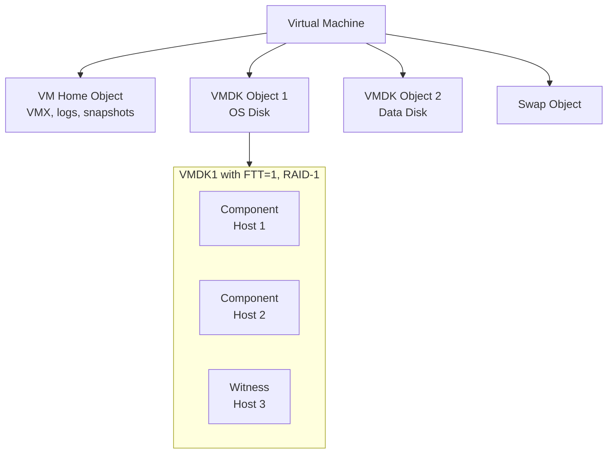

#### Components i Witnesses

- **Component** — deo objekta koji čuva podatke
- **Witness** — mali metadata objekt za quorum (ne čuva podatke)

Za FTT=1 sa RAID-1:
- 2 data componenta (mirrored)
- 1 witness (za tie-breaking)

### 4.4 vSAN ESA vs OSA

VMware je uveo novu arhitekturu optimizovanu za NVMe:

> **Objašnjenje dijagrama — ESA vs OSA (Dve generacije vSAN-a):**
>
> Ovaj dijagram uporedno prikazuje dve arhitekture vSAN-a. VMware je 2022. uveo novu arhitekturu (ESA) optimizovanu za moderne NVMe diskove.
>
> **Leva strana — Original Storage Architecture (OSA):**
>
> Ovo je "klasična" vSAN arhitektura koja postoji od početka:
>
> - **Disk Group** — logička celina koja grupiše diskove
> - **Cache SSD** — OBAVEZAN jedan brzi disk za cache
>   - 70% kapaciteta za read cache (ubrzava čitanje)
>   - 30% za write buffer (prima upisane podatke pre nego što odu na capacity)
> - **Capacity diskovi** — gde se podaci trajno čuvaju (mogu biti HDD ili SSD)
>
> Problem sa OSA:
> - Cache disk je "usko grlo" — svi I/O prolaze kroz njega
> - Ako cache disk otkaže, cela Disk Group je nedostupna
> - Komplikovana konfiguracija (koliko cache-a za koliko capacity-ja?)
>
> **Desna strana — Express Storage Architecture (ESA):**
>
> Nova arhitektura dizajnirana za all-NVMe okruženja:
>
> - **Storage Pool** — svi diskovi su ravnopravni, nema Disk Group-a
> - **NVMe 1, 2, 3...** — svi diskovi su isti tip (NVMe)
> - NEMA dedicated cache diska — cache je u RAM-u i distribuiran
>
> Prednosti ESA:
> - Jednostavnije: nema podele cache/capacity
> - Brže: NVMe diskovi su ionako brzi, cache nije potreban
> - Otpornije: nema single point of failure (cache disk)
> - Efikasnije: bolja kompresija i deduplikacija
>
> **Kada koristiti koju arhitekturu?**
>
> | Situacija | Preporuka |
> |-----------|-----------|
> | Novi deployment, all-NVMe | ESA |
> | Postojeći klaster sa HDD | OSA |
> | Mešoviti SSD + HDD | OSA |
> | Maksimalne performanse | ESA |

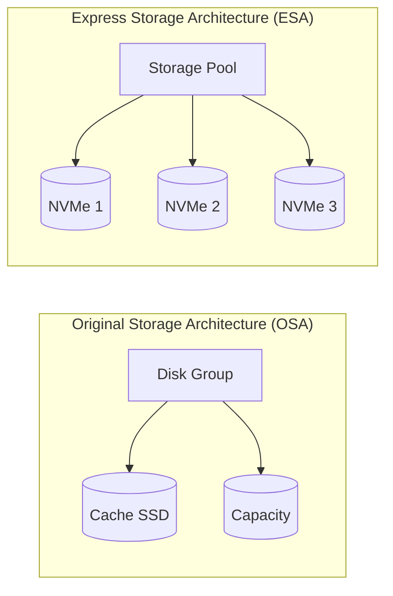

| Aspekt | OSA | ESA |
|--------|-----|-----|
| Disk Groups | Da (Cache + Capacity) | Ne (single tier) |
| Cache | Dedicated SSD | Softverski (RAM + NVMe) |
| Compression | Per-cluster | Per-object, real-time |
| RAID-5/6 | Standardno | Poboljšano (nested) |
| Minimum hosts | 3 | 3 |
| Diskovi | SSD + HDD ili All-Flash | NVMe only |

**ESA prednosti:**
- Jednostavnija arhitektura
- Bolje performanse sa NVMe
- Efikasnija kompresija
- Manji CPU overhead

### 4.5 vSAN Stretched Cluster

Za disaster recovery, vSAN podržava stretched cluster preko dva sajta:

> **Objašnjenje dijagrama — vSAN Stretched Cluster:**
>
> Ovaj dijagram prikazuje kako vSAN može da se "rastegne" preko dve fizičke lokacije radi **disaster recovery** — zaštite od katastrofa kao što su požar, poplava ili ispad struje u celom data centru.
>
> **Tri lokacije u dijagramu:**
>
> 1. **Site 1 — Primary (levo)**
>    - Glavni data centar sa 2 ESXi hosta (Host 1 i Host 2)
>    - Ovde rade VM-ovi u normalnim uslovima
>    - Čuva jednu kopiju podataka
>
> 2. **Site 2 — Secondary (desno)**
>    - Rezervni data centar sa 2 ESXi hosta (Host 3 i Host 4)
>    - Čuva drugu kopiju podataka (sinhronizovano)
>    - Može preuzeti rad ako Site 1 otkaže
>
> 3. **Witness Site (dole)**
>    - Treća lokacija sa samo jednim malim hostom
>    - NE čuva podatke — samo "glasa"
>    - Služi za tie-breaking: ako Site 1 i Site 2 izgube vezu, Witness odlučuje ko nastavlja
>
> **Strelice i veze:**
>
> - **Site 1 ↔ Site 2: "< 5ms RTT"**
>   - Sinhronizovana replikacija između sajtova
>   - RTT (Round Trip Time) mora biti ispod 5 milisekundi
>   - Ovo ograničava udaljenost na ~100-150 km
>
> - **Oba sajta ↔ Witness**
>   - Witness mora imati vezu sa oba sajta
>   - Može biti na cloud-u (AWS, Azure) — ne treba mu puno resursa
>
> **Scenario otkaza:**
>
> 1. Site 1 izgubi struju → Site 2 nastavlja rad sa istim podacima
> 2. Veza Site 1 ↔ Site 2 pukne → Witness odlučuje ko je "živ"
> 3. VM-ovi se automatski restartuju na preživelom sajtu
>
> **Zahtevi za stretched cluster:**
> - Latencija < 5ms između sajtova
> - Dovoljan bandwidth za replikaciju
> - Simetrična konfiguracija (isti broj hostova)
> - Witness na trećoj lokaciji

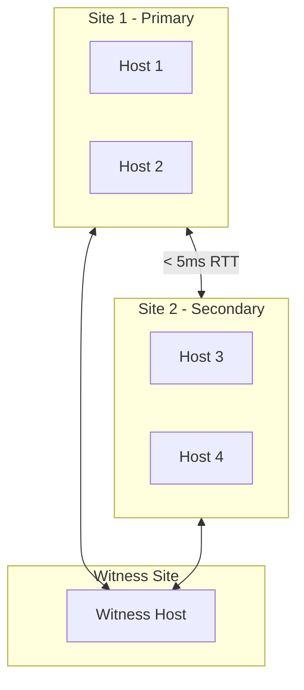

**Zahtevi:**
- Latencija između sajtova: < 5ms RTT
- Witness host na trećoj lokaciji
- Simetrična konfiguracija

### 4.6 vSAN Praktični Primeri

#### PowerCLI - Cluster Info

```powershell
# Povezivanje na vCenter
Connect-VIServer -Server vcenter.example.com

# vSAN Cluster konfiguracija
Get-Cluster "Production-Cluster" | Get-VsanClusterConfiguration

# Output:
# Cluster                  : Production-Cluster
# VsanEnabled              : True
# VsanDiskClaimMode        : Manual
# StretchedClusterEnabled  : False
# SpaceEfficiencyEnabled   : True
```

#### Disk Management

```powershell
# Prikaz vSAN diskova
Get-Cluster "Production-Cluster" | Get-VsanDisk

# Prikaz disk grupa
Get-Cluster "Production-Cluster" | Get-VsanDiskGroup

# Output:
# Name           DiskGroupType  Host          CacheDisk     CapacityDisks
# ----           -------------  ----          ---------     -------------
# DiskGroup-1    AllFlash       esxi-01       NVMe-Cache    {SSD1, SSD2}
# DiskGroup-2    AllFlash       esxi-01       NVMe-Cache    {SSD3, SSD4}
```

#### Storage Policy

```powershell
# Kreiranje storage polise
New-SpbmStoragePolicy -Name "FTT2-RAID1" -Description "2 failures, mirroring" `
  -AnyOfRuleSets (
    New-SpbmRuleSet -AllOfRules @(
      New-SpbmRule -Capability (Get-SpbmCapability -Name "VSAN.hostFailuresToTolerate") -Value 2,
      New-SpbmRule -Capability (Get-SpbmCapability -Name "VSAN.replicaPreference") -Value "RAID-1 (Mirroring)"
    )
  )

# Primena polise na VM
Get-VM "ImportantVM" | Set-SpbmEntityConfiguration -StoragePolicy "FTT2-RAID1"
```

#### Health Check

```powershell
# vSAN Health status
Get-VsanHealthSummary -Cluster "Production-Cluster"

# Detaljni health check
Get-VsanHealthTest -Cluster "Production-Cluster" |
    Where-Object { $_.TestHealth -ne "green" }
```

#### Capacity Monitoring

```powershell
# Kapacitet klastera
Get-VsanSpaceUsage -Cluster "Production-Cluster"

# Output:
# Cluster            : Production-Cluster
# TotalCapacityGB    : 15360
# FreeCapacityGB     : 8542
# UsedCapacityGB     : 6818
# DedupRatio         : 1.8
# CompressionRatio   : 2.1
```

#### esxcli komande (na ESXi hostu)

```bash
# vSAN status
esxcli vsan cluster get

# vSAN network info
esxcli vsan network list

# Disk info
esxcli vsan storage list
```

---

## 5. Ceph vs vSAN Poređenje

### Tabela Poređenja

| Aspekt | Ceph | vSAN |
|--------|------|------|
| **Licenca** | Open-source (LGPL) | Komercijalna (per-CPU) |
| **Vendor** | Community + Red Hat | VMware (Broadcom) |
| **Storage Types** | Block + File + Object | Block (+ vSAN File Services) |
| **Hypervisor** | Bilo koji (KVM, Xen, VMware) | Samo VMware ESXi |
| **Minimum Nodes** | 3 | 3 |
| **Max Nodes** | 1000+ | 64 |
| **Placement Algorithm** | CRUSH | CLOM |
| **Kubernetes Native** | Da (Rook-Ceph) | Kroz CSI driver |
| **Management** | CLI + Dashboard | vCenter GUI |
| **Learning Curve** | Strma | Umerena |
| **Support** | Community / Red Hat | VMware |

### Decision Tree

> **Objašnjenje dijagrama — Decision Tree (Stablo Odlučivanja):**
>
> Ovaj dijagram je **praktični vodič za izbor SDS platforme**. Umesto da čitate dugačke tabele, pratite strelice i odgovarate na pitanja da biste došli do preporuke.
>
> **Kako koristiti dijagram:**
>
> Počnite od vrha ("Izbor SDS Platforme") i pratite strelice odgovarajući na pitanja:
>
> **Pitanje 1: "Koristiš VMware vSphere?"**
> - Ako DA → idete desno, razmatra se vSAN
> - Ako NE → idete levo, razmatra se open-source
>
> **Grana za VMware korisnike (desno):**
>
> **Pitanje 2: "Budget za licenciranje?"**
> - Ako DA (imate budget) → **vSAN** je preporuka
>   - Use case: VM storage, VDI, Enterprise apps
> - Ako NE (nema budgeta) → prelazi se na pitanje o platformi
>
> **Pitanje 3: "OpenStack ili Kubernetes?"**
> - Ako OpenStack → **Ceph** (standardna kombinacija)
> - Ako Kubernetes → **Ceph** (Rook-Ceph operator)
>
> **Grana za non-VMware korisnike (levo):**
>
> **Pitanje 4: "Potreban Object Storage (S3)?"**
> - Ako DA → **Ceph** (ima ugrađen S3 gateway)
> - Ako NE → sledeće pitanje
>
> **Pitanje 5: "Enterprise support?"**
> - Ako DA → **Red Hat Ceph Storage** (plaćeni support)
> - Ako NE → **Ceph** (community verzija)
>
> **Krajnje preporuke (listovi stabla):**
>
> | Platforma | Tipični Use Case |
> |-----------|------------------|
> | vSAN | VM storage, VDI, Enterprise aplikacije |
> | Ceph | Cloud infrastruktura, Kubernetes PV, Object storage |
> | Red Hat Ceph | Enterprise Ceph sa 24/7 supportom |
>
> **Ključna poruka:** Ne postoji "najbolji" SDS — postoji najbolji SDS ZA VAŠU SITUACIJU.

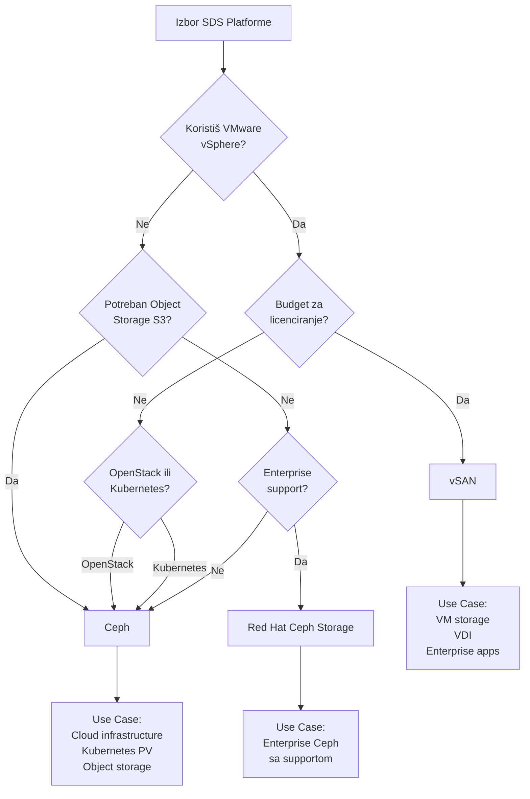

### Kada koristiti koji sistem?

#### Izaberi Ceph kada:
- Gradiš OpenStack ili Kubernetes infrastrukturu
- Treba ti S3-compatible object storage
- Želiš izbjeći vendor lock-in
- Imaš Linux expertise u timu
- Budget je ograničen
- Trebaš > 64 čvora

#### Izaberi vSAN kada:
- Već koristiš VMware vSphere
- Želiš integrisan management (vCenter)
- Prioritet je jednostavnost
- Imaš VMware licensing agreement
- Fokus je na VM workloads
- Potreban ti je enterprise support

---

## 6. SDS u Cloud Infrastrukturi

### 6.1 Private Cloud Deployment

#### OpenStack + Ceph

> **Objašnjenje dijagrama — OpenStack + Ceph Integracija:**
>
> Ovaj dijagram prikazuje kako se Ceph integriše sa **OpenStack-om** — najpopularnijom open-source cloud platformom. Ovo je "zlatni standard" za private cloud deployment.
>
> **Gornji deo — OpenStack servisi:**
>
> OpenStack se sastoji od mnogo servisa, svaki za svoju namenu:
>
> - **Nova (Compute)** — upravlja virtuelnim mašinama
>   - Treba mu storage za VM diskove
> - **Cinder (Block Storage)** — pruža persistent volumes
>   - Kao "virtuelni SAN" za OpenStack
> - **Glance (Images)** — čuva VM image-e (šablone)
>   - Ubuntu image, Windows image, itd.
> - **Manila (File Shares)** — pruža deljene foldere
>   - NFS/SMB share-ovi za VM-ove
> - **Swift API (Object)** — S3-kompatibilni object storage
>   - Za backup, static content, itd.
>
> **Donji deo — Ceph Cluster:**
>
> Ceph pruža SVE storage potrebe OpenStack-a:
>
> - **RBD Pools** — block storage za Cinder i Nova
> - **CephFS** — filesystem za Manila
> - **RADOS GW** — S3/Swift API za object storage
> - **RADOS** — osnovni sloj gde se sve čuva
>
> **Strelice pokazuju integraciju:**
>
> | OpenStack servis | Koristi Ceph | Za šta |
> |------------------|--------------|--------|
> | Nova | RBD | Ephemeral diskovi VM-a |
> | Cinder | RBD | Persistent volumes |
> | Glance | RBD | VM images |
> | Manila | CephFS | File shares |
> | Swift API | RADOS GW | Object storage |
>
> **Zašto je ova kombinacija popularna?**
>
> 1. Oba su open-source — nema vendor lock-in
> 2. Ceph rešava SVE storage potrebe jednim sistemom
> 3. Dokazana kombinacija — koriste je telco kompanije, univerziteti, banke
> 4. Skalira od malog lab-a do ogromnih deployment-a (CERN ima petabajte)

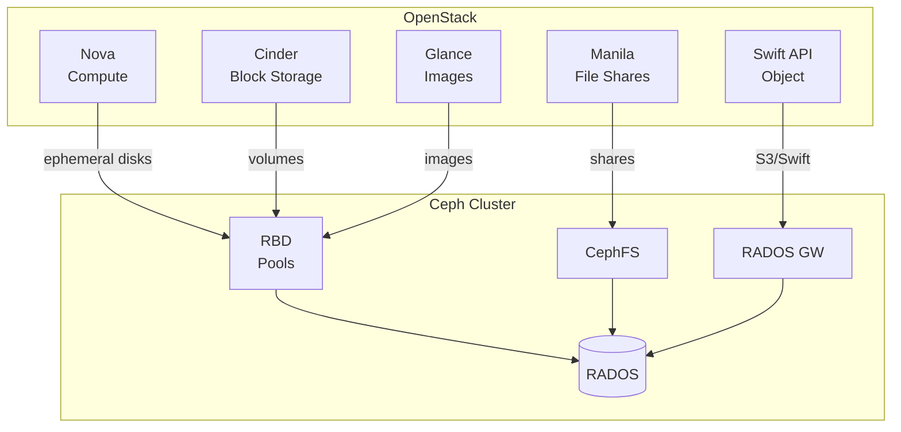

**Integracija:**

```ini
# /etc/cinder/cinder.conf
[DEFAULT]
enabled_backends = ceph

[ceph]
volume_driver = cinder.volume.drivers.rbd.RBDDriver
rbd_pool = volumes
rbd_ceph_conf = /etc/ceph/ceph.conf
rbd_user = cinder
```

#### VMware Cloud Foundation + vSAN

> **Objašnjenje dijagrama — VMware Cloud Foundation + vSAN:**
>
> Ovaj dijagram prikazuje kako se vSAN koristi u **VMware Cloud Foundation (VCF)** — VMware-ovom kompletnom rešenju za private/hybrid cloud. VCF je "sve u jednom" paket koji uključuje compute, storage, networking i management.
>
> **Gornji deo — VMware Cloud Foundation komponente:**
>
> - **SDDC Manager** — "mozak" VCF-a koji automatizuje deployment i lifecycle
> - **vCenter** — upravljanje virtuelizacijom (VM-ovi, storage, mreža)
> - **NSX-T** — software-defined networking (virtuelne mreže, firewall)
> - **Aria Suite** — monitoring, automatizacija, cost management
>
> **Srednji deo — Workload Domains:**
>
> VCF organizuje resurse u **domene**:
>
> - **Management Domain** — gde žive upravljački servisi (vCenter, NSX, itd.)
>   - Kritičan, uvek mora raditi
>   - Ima sopstveni vSAN cluster
>
> - **Workload Domain 1, 2...** — gde žive korisnički VM-ovi
>   - Možete imati više domena za različite namene
>   - Svaki može imati različitu konfiguraciju
>
> **Donji deo — vSAN Layer:**
>
> - **vSAN Cluster 1** — storage za Management Domain i Workload Domain 1
> - **vSAN Cluster 2** — storage za Workload Domain 2
>
> **Strelice pokazuju:**
> - VCF upravlja svim domenima
> - Domeni koriste odgovarajuće vSAN clustere
>
> **Zašto VCF + vSAN?**
>
> 1. **Turnkey rešenje** — sve je integrisano i testirano zajedno
> 2. **Automatizacija** — SDDC Manager automatski deploy-uje i upgrade-uje
> 3. **Standardizacija** — VMware definiše best practices
> 4. **Support** — jedan vendor za ceo stack
>
> Ovo je izbor za enterprise kompanije koje žele "VMware način" cloud-a.

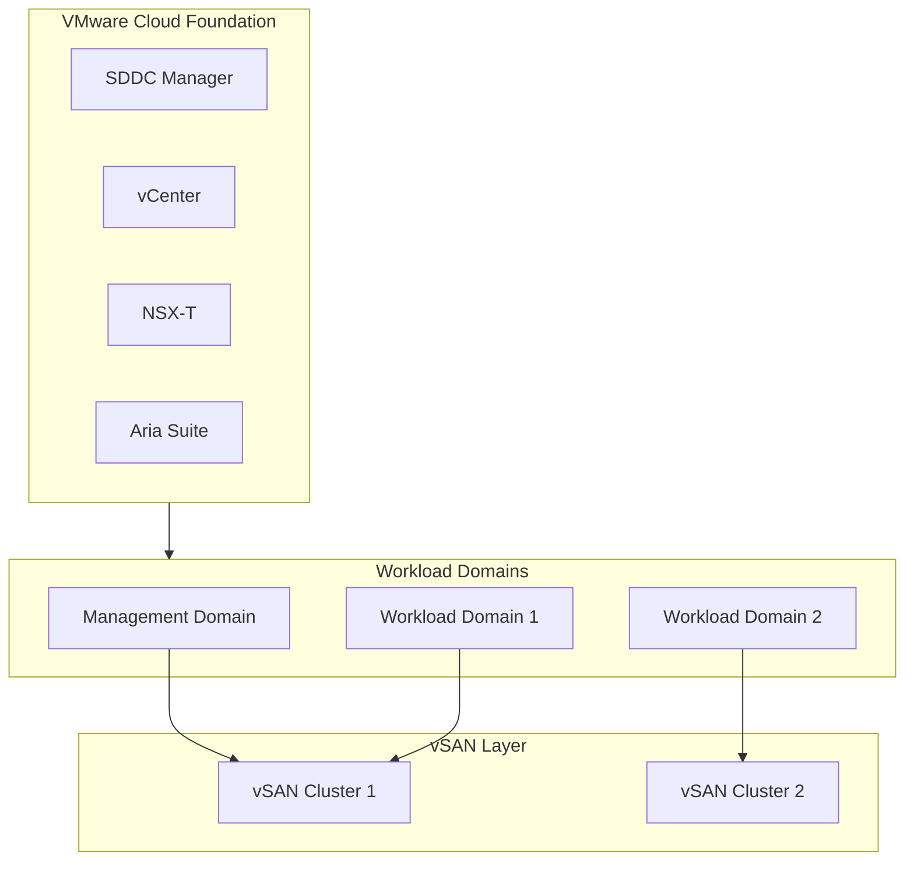

### 6.2 Kubernetes Integracija

> **Objašnjenje dijagrama — Kubernetes + SDS Integracija:**
>
> Ovaj dijagram prikazuje kako Kubernetes aplikacije dobijaju **persistent storage** iz SDS sistema (Ceph ili vSAN). Ovo je ključno jer kontejneri su po prirodi "prolazni" — kada se restartuju, gube podatke. Persistent storage rešava taj problem.
>
> **Leva strana — Kubernetes Cluster (kako K8s vidi storage):**
>
> Kubernetes ima svoju terminologiju za storage:
>
> 1. **Pod** — kontejner(i) koji treba(ju) storage
>    - Primer: MySQL baza koja mora sačuvati podatke
>
> 2. **PersistentVolumeClaim (PVC)** — "zahtev" za storage
>    - Pod kaže: "Treba mi 50GB diska"
>    - PVC je kao "narudžbenica" za storage
>
> 3. **PersistentVolume (PV)** — konkretan "komad" storage-a
>    - Kubernetes kreira PV da zadovolji PVC
>    - PV je "isporučena roba" po narudžbenici
>
> 4. **StorageClass** — "šablon" koji definiše TIP storage-a
>    - Primer: "fast-ssd" ili "cheap-hdd"
>    - Definiše koji backend i koje parametre koristiti
>
> 5. **CSI Driver** — softverski adapter za storage backend
>    - CSI = Container Storage Interface (standardni API)
>    - Svaki SDS ima svoj CSI driver
>
> **Desna strana — SDS Backend (stvarni storage):**
>
> - **Ceph RBD** — Ceph block storage
> - **vSAN Datastore** — VMware vSAN storage
>
> **Strelice pokazuju tok:**
>
> ```
> Pod treba disk
>   ↓
> Kreira PVC ("treba mi 50GB")
>   ↓
> StorageClass definiše backend
>   ↓
> CSI Driver komunicira sa SDS-om
>   ↓
> SDS kreira volume i vraća ga
>   ↓
> PV se kreira i "bind-uje" na PVC
>   ↓
> Pod dobija disk
> ```
>
> **Dva CSI drivera u primeru:**
> - `rook-ceph` → komunicira sa Ceph-om
> - `vsphere-csi` → komunicira sa vSAN-om
>
> **Zašto je ovo važno?**
> Kubernetes ne zna ništa o Ceph-u ili vSAN-u — on samo zna za PVC/PV. CSI driver "prevodi" između Kubernetes sveta i storage sveta.

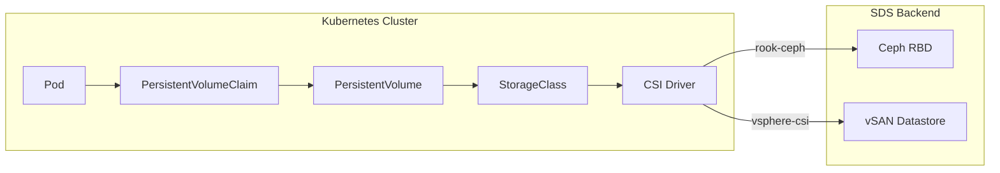

#### Rook-Ceph Operator

Rook je Kubernetes operator koji automatizuje deployment Ceph-a:

```yaml
# StorageClass za Ceph RBD
apiVersion: storage.k8s.io/v1
kind: StorageClass
metadata:
  name: rook-ceph-block
provisioner: rook-ceph.rbd.csi.ceph.com
parameters:
  clusterID: rook-ceph
  pool: replicapool
  imageFormat: "2"
  imageFeatures: layering
reclaimPolicy: Delete
allowVolumeExpansion: true
```

```yaml
# PVC primer
apiVersion: v1
kind: PersistentVolumeClaim
metadata:
  name: mysql-pvc
spec:
  accessModes:
    - ReadWriteOnce
  storageClassName: rook-ceph-block
  resources:
    requests:
      storage: 50Gi
```

#### vSphere CSI Driver

```yaml
# StorageClass za vSAN
apiVersion: storage.k8s.io/v1
kind: StorageClass
metadata:
  name: vsan-default
provisioner: csi.vsphere.vmware.com
parameters:
  storagepolicyname: "vSAN Default Storage Policy"
  datastoreurl: "ds:///vmfs/volumes/vsan:xxxxx/"
reclaimPolicy: Delete
allowVolumeExpansion: true
```

### 6.3 Hybrid / Multi-Cloud

#### Stretched Ceph Cluster

> **Objašnjenje dijagrama — Stretched Ceph Cluster:**
>
> Ovaj dijagram prikazuje kako Ceph može da se "rastegne" preko dve geografske lokacije, slično vSAN stretched cluster-u. Ovo omogućava **disaster recovery** — ako ceo data centar izgori, podaci su sigurni na drugoj lokaciji.
>
> **Tri lokacije u dijagramu:**
>
> **1. Site A — Primary (levo-gore)**
> - Jedan MON servis
> - Tri OSD-a (OSD_A1, OSD_A2, OSD_A3)
> - Ovde su "primarne" kopije podataka
>
> **2. Site B — Secondary (desno-gore)**
> - Jedan MON servis
> - Tri OSD-a (OSD_B1, OSD_B2, OSD_B3)
> - Ovde su "sekundarne" kopije podataka
>
> **3. Arbiter Site (dole)**
> - SAMO jedan MON servis — nema OSD-ova!
> - Ne čuva podatke — samo učestvuje u quorum-u
> - Može biti na cloud-u (minimalni resursi)
>
> **Veze između sajtova:**
>
> - **Site A ↔ Site B: "Sync Replication"**
>   - Sinhronizovana replikacija — write nije "gotov" dok oba sajta ne potvrde
>   - Garantuje RPO = 0 (nema izgubljenih podataka)
>
> - **Oba sajta ↔ Arbiter**
>   - MON-ovi komuniciraju za quorum
>   - Ako Site A i Site B izgube međusobnu vezu, Arbiter odlučuje ko je "živ"
>
> **Zašto 3 MON-a na 3 lokacije?**
>
> Za quorum (većina glasova):
> - 3 MON-a → potrebna 2 za quorum
> - Ako Site A "padne" → MON na Site B + Arbiter MON = 2 → quorum OK
> - Ako samo Arbiter "padne" → MON A + MON B = 2 → quorum OK
>
> **CRUSH pravilo za stretch cluster:**
>
> Replike se distribuiraju tako da:
> - 2 replike idu na Site A
> - 2 replike idu na Site B
> - Ukupno 4 replike (može preživeti gubitak celog sajta)
>
> **Ograničenje:** Latencija između sajtova mora biti niska (< 10ms) za sinhronizovanu replikaciju.

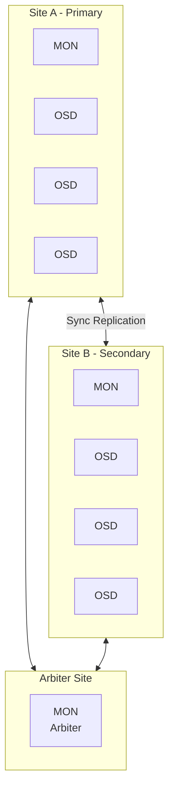

**CRUSH rule za stretch cluster:**

```
rule stretch_rule {
    id 1
    type replicated
    min_size 2
    max_size 4
    step take site_a
    step chooseleaf firstn 2 type host
    step emit
    step take site_b
    step chooseleaf firstn 2 type host
    step emit
}
```

---

## 7. Sizing i Best Practices

### 7.1 Kapacitet Kalkulacija

#### Raw vs Usable Capacity

```
Raw Capacity = Broj diskova × Kapacitet diska

Usable Capacity = Raw Capacity / Protection Overhead
```

**Primer za Ceph (replication=3):**
```
12 nodes × 10 disks × 4TB = 480TB raw
480TB / 3 = 160TB usable
```

**Primer za vSAN (FTT=1, RAID-1):**
```
8 hosts × 6 disks × 1.92TB = 92TB raw
92TB / 2 = 46TB usable
```

#### Ceph Sizing Formula

```
Usable = Raw × (1 - system_overhead) / replication_factor

system_overhead ≈ 0.1 (10% za metadata, journals, etc.)
```

Za erasure coding (k+m):
```
Usable = Raw × (1 - overhead) × k / (k + m)

Primer EC 4+2:
Usable = 480TB × 0.9 × 4/6 = 288TB
```

### 7.2 Network Requirements

| Workload | Minimum | Recommended |
|----------|---------|-------------|
| Small cluster (< 10 nodes) | 10 GbE | 25 GbE |
| Medium cluster (10-50) | 25 GbE | 100 GbE |
| Large cluster (50+) | 100 GbE | 100 GbE + RDMA |

**Dual network setup:**

```
Client Network:  Za frontend (VM, aplikacije)
Cluster Network: Za backend (replication, recovery)
```

> **Objašnjenje dijagrama — Dual Network Setup:**
>
> Ovaj dijagram prikazuje zašto SDS sistemi koriste **dve odvojene mreže** i kako saobraćaj teče kroz svaku od njih. Ovo je best practice za produkcijske deployment-e.
>
> **Storage Node (sredina dijagrama):**
>
> Svaki storage server ima:
> - **NIC 1 (Client Network)** — mrežna kartica za klijentski saobraćaj
>   - IP adresa: 10.0.1.x
>   - Služi za: read/write zahteve od VM-ova i aplikacija
>
> - **NIC 2 (Cluster Network)** — mrežna kartica za interni saobraćaj
>   - IP adresa: 10.0.2.x
>   - Služi za: replikaciju, recovery, heartbeat između OSD-ova
>
> - **OSD Daemons** — procesi koji upravljaju diskovima
>
> **Tok saobraćaja:**
>
> **Client VMs → NIC 1 → OSD:**
> - VM šalje read/write zahtev
> - Zahtev dolazi preko Client mreže
> - OSD prima i obrađuje zahtev
>
> **OSD → NIC 2 → Other OSDs:**
> - OSD treba da replicira podatke
> - Šalje kopiju preko Cluster mreže
> - Drugi OSD-ovi primaju i čuvaju
>
> **Zašto dve mreže?**
>
> | Aspekt | Jedna mreža | Dve mreže |
> |--------|-------------|-----------|
> | Performanse | Replikacija usporava klijente | Izolovani saobraćaj |
> | Sigurnost | OSD komunikacija izložena | Cluster mreža može biti privatna |
> | Troubleshooting | Teško razlikovati saobraćaj | Jasna podela |
> | Recovery | Usporava klijente | Ne utiče na klijente |
>
> **Praktični primer:**
>
> Kada disk otkaže i počne recovery (kopiranje terabajta podataka):
> - SA jednom mrežom: klijenti primećuju usporenje
> - SA dve mreže: recovery ide preko Cluster mreže, klijenti ne primećuju ništa
>
> **Preporuka:** Cluster mreža treba biti brža ili jednaka Client mreži (npr. obe 25GbE, ili Cluster 100GbE).

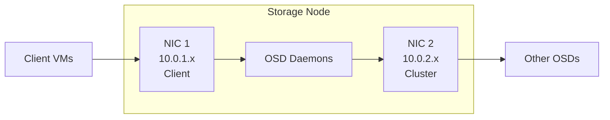

### 7.3 Minimum Node Count

| Scenario | Ceph | vSAN |
|----------|------|------|
| Lab/Test | 1 (single-node) | 1 (vSAN Express) |
| Minimum Production | 3 | 3 |
| Recommended Production | 5+ | 4+ |
| Stretched Cluster | 5 (2+2+1 arbiter) | 5 (2+2+1 witness) |

### 7.4 Best Practices

#### Ceph

1. **Koristi odvojene mreže** za client i cluster traffic
2. **SSD za journals/WAL/DB** ako koristiš HDD za capacity
3. **Minimum 3 MON-a** u produkciji (odd number za quorum)
4. **Planiraj za recovery** — ostavi 10-20% kapaciteta slobodno
5. **CRUSH rules** — postavi failure domains (rack awareness)
6. **Monitoring** — koristi Prometheus + Grafana

```bash
# Provera zdravlja pre maintenance-a
ceph health detail
ceph osd df tree
ceph pg stat
```

#### vSAN

1. **All-Flash za produkciju** — hybrid samo za test
2. **vSAN Network** — dedicated vmknic, nikad shared sa vMotion
3. **Disk Groups** — max 5 po hostu, 7 capacity diskova po grupi
4. **FTT=1 minimum** za produkciju
5. **Slack Space** — ostavi 25-30% slobodno za rebalancing
6. **Health Checks** — redovno proveravaj

```powershell
# Weekly health check
Get-VsanHealthSummary -Cluster "Prod" | Format-List
Test-VsanClusterHealth -Cluster "Prod"
```

### 7.5 Monitoring Checklist

| Metrika | Warning | Critical |
|---------|---------|----------|
| Capacity Used | > 70% | > 85% |
| OSD/Host Down | 1 | 2+ |
| Latency (read) | > 10ms | > 50ms |
| Latency (write) | > 20ms | > 100ms |
| Recovery Speed | < 100 MB/s | < 50 MB/s |
| Network Errors | > 0.1% | > 1% |

---

## Zaključak

**Software-Defined Storage** je fundamentalna tehnologija za moderne cloud infrastrukture. Bilo da birate **Ceph** za open-source fleksibilnost ili **vSAN** za VMware integraciju, ključni koncepti ostaju isti:

1. **Razdvajanje Control i Data Plane** omogućava skalabilnost
2. **Distributed placement algoritmi** (CRUSH, CLOM) eliminišu single points of failure
3. **Policy-based management** pojednostavljuje operacije
4. **Erasure coding** optimizuje iskorišćenje kapaciteta

Izbor platforme zavisi od vaših specifičnih potreba — postojeće infrastrukture, budgeta, tima i workload-a.

---

*Dokument pripremljen za predavanje na Računarskom fakultetu, Beograd*
