# Software-Defined Storage (SDS) u Cloud Infrastrukturi

**Autor:** Računarski fakultet, Beograd
**Verzija:** 1.0

---

## Sadržaj

1. [Uvod u SDS](#1-uvod-u-sds)
2. [SDS Storage Modeli](#2-sds-storage-modeli)
3. [Ceph - Open Source SDS](#3-ceph---open-source-sds)
4. [VMware vSAN - Enterprise SDS](#4-vmware-vsan---enterprise-sds)
5. [Ceph vs vSAN Poređenje](#5-ceph-vs-vsan-poređenje)
6. [SDS u Cloud Infrastrukturi](#6-sds-u-cloud-infrastrukturi)
7. [Sizing i Best Practices](#7-sizing-i-best-practices)

---

## 1. Uvod u SDS

### Šta je Software-Defined Storage?

**Software-Defined Storage (SDS)** je arhitektura skladištenja podataka u kojoj softver, a ne hardver, upravlja svim funkcijama storage sistema — uključujući provisioning, replikaciju, deduplication, snapshot-e i disaster recovery.

Tradicionalni storage sistemi (SAN/NAS) koriste specijalizovani hardver sa ugrađenim kontrolerima. SDS taj pristup transformiše:

| Aspekt | Tradicionalni Storage | SDS |
|--------|----------------------|-----|
| Hardver | Specijalizovani uređaji | Commodity x86 serveri |
| Upravljanje | Hardverski kontroler | Softverski sloj |
| Skaliranje | Scale-up (veći uređaj) | Scale-out (više čvorova) |
| Vendor lock-in | Visok | Nizak |
| Cena | Visoka (CAPEX) | Niža, fleksibilnija |

### Zašto SDS u Cloud okruženju?

SDS je prirodan izbor za cloud infrastrukturu jer omogućava:

- **Elastičnost** — dodavanje kapaciteta bez downtime-a
- **Automatizaciju** — API-driven provisioning
- **Multi-tenancy** — izolacija podataka između korisnika
- **Hardware independence** — izbor vendor-a po potrebi

### Control Plane vs Data Plane

Ključni arhitekturni koncept u SDS sistemima je razdvajanje **Control Plane** i **Data Plane**.

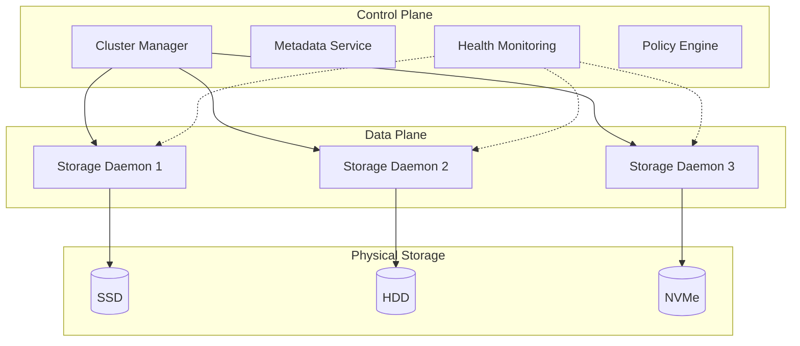

**Control Plane** je odgovoran za:
- Cluster membership i quorum
- Metadata management
- Placement decisions (gde idu podaci)
- Health monitoring i alerting

**Data Plane** obavlja:
- Read/Write operacije
- Replication između čvorova
- Erasure coding
- Data recovery

### SDS Slojevita Arhitektura

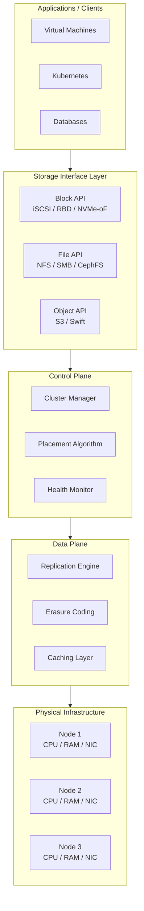

---

## 2. SDS Storage Modeli

SDS sistemi mogu da izlože storage na tri načina iz istog fizičkog pool-a.

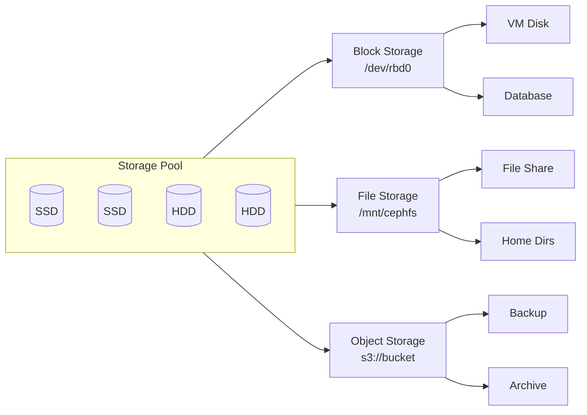

### Block Storage

Block storage prezentuje storage kao raw disk device. Host vidi LUN/volume kao lokalni disk.

**Protokoli:** iSCSI, Fibre Channel, NVMe-oF, RBD (Ceph)

**Use cases:**
- Virtual Machine disks
- Databases (MySQL, PostgreSQL, Oracle)
- Transakcioni sistemi

**Karakteristike:**
- Niska latencija
- Visok IOPS
- Host upravlja filesystem-om

### File Storage

File storage izlaže hijerarhijski filesystem preko mreže.

**Protokoli:** NFS, SMB/CIFS, CephFS

**Use cases:**
- Shared home directories
- Kolaboracija na dokumentima
- Application data

**Karakteristike:**
- Poznata struktura (folderi/fajlovi)
- File locking podrška
- Lako deljenje

### Object Storage

Object storage čuva podatke kao objekte sa metadata i unique ID-em.

**Protokoli:** S3 API, Swift API, REST/HTTP

**Use cases:**
- Backup i arhiviranje
- Big Data / Analytics
- Cloud-native aplikacije
- Media storage

**Karakteristike:**
- Ogromna skalabilnost (petabytes+)
- Rich metadata
- Eventual consistency (tipično)
- HTTP pristup

---

## 3. Ceph - Open Source SDS

**Ceph** je open-source, distribuirani storage sistem koji implementira Block, File i Object storage u jednoj platformi. Koriste ga CERN, Deutsche Telekom, Bloomberg i mnogi cloud provajderi.

### 3.1 Ceph Arhitektura

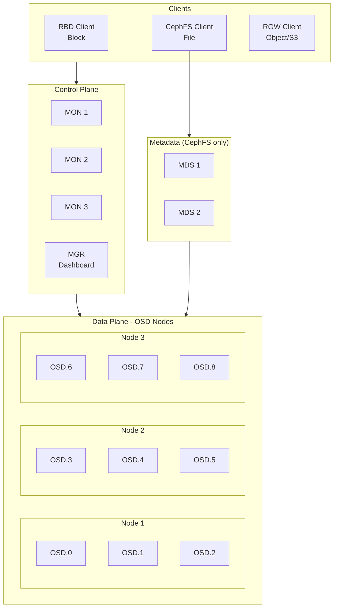

#### Ceph Servisi

| Servis | Funkcija | Minimum |
|--------|----------|---------|
| **MON** (Monitor) | Cluster state, quorum, CRUSH map | 3 (odd number) |
| **MGR** (Manager) | Monitoring, dashboard, alerts | 2 (HA) |
| **OSD** (Object Storage Daemon) | Čuva podatke, replication | 3+ |
| **MDS** (Metadata Server) | Metadata za CephFS | 2 (ako koristiš CephFS) |
| **RGW** (RADOS Gateway) | S3/Swift API | 2+ (load balanced) |

#### OSD - Srce Ceph sistema

Svaki disk u Ceph clusteru ima svoj OSD daemon:

```
Node 1
├── OSD.0 ← SSD 1
├── OSD.1 ← SSD 2
└── OSD.2 ← HDD 1

Node 2
├── OSD.3 ← SSD 1
├── OSD.4 ← HDD 1
└── OSD.5 ← HDD 2
```

OSD je odgovoran za:
- Čuvanje objekata (data + metadata)
- Replication ka drugim OSD-ovima
- Recovery kada OSD otkaže
- Scrubbing (provera integriteta)

### 3.2 CRUSH Algoritam

**CRUSH** (Controlled Replication Under Scalable Hashing) je algoritam koji određuje gde se podaci fizički čuvaju — bez centralnog metadata servera.

#### Zašto je CRUSH revolucionaran?

Tradicionalni pristup:
```
File → Metadata Server → "File je na Disk 47"
```
Problem: Metadata server je bottleneck i single point of failure.

CRUSH pristup:
```
File → hash(file_id) + CRUSH rules → Izračunaj lokaciju
```
Svaki klijent može izračunati gde su podaci!

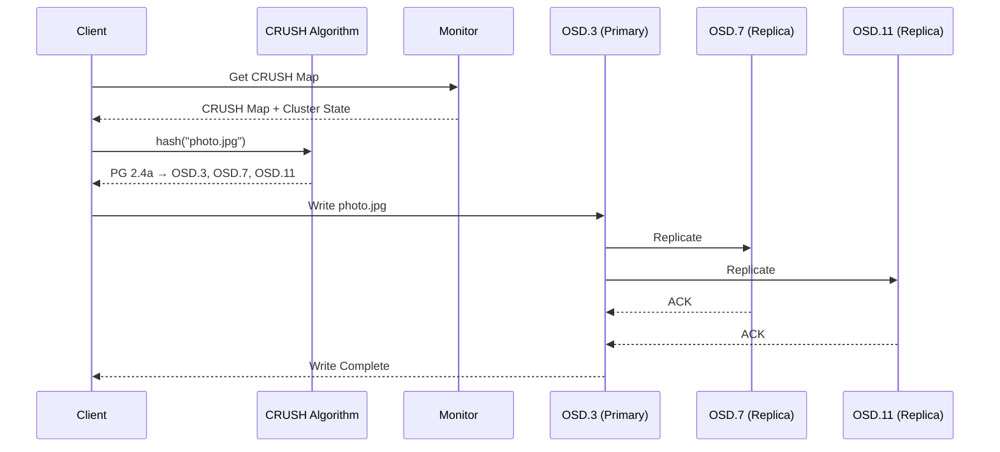

#### CRUSH Hijerarhija (Failure Domains)

CRUSH koristi hijerarhijsku mapu klastera za pametno raspoređivanje replika:

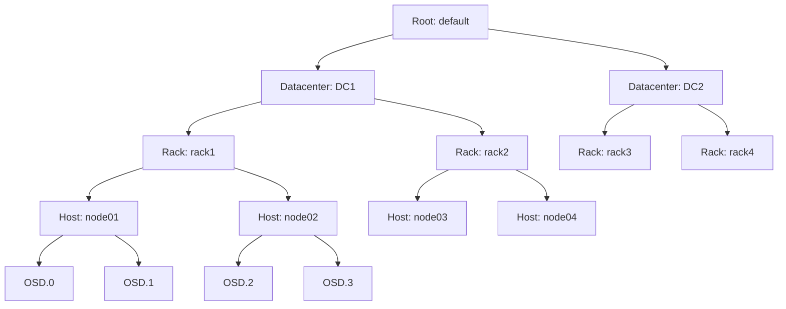

**CRUSH rule primer:**
```
Replike moraju biti na različitim RACK-ovima
```
Rezultat:
- Replica 1 → rack1/node01/OSD.0
- Replica 2 → rack2/node03/OSD.4
- Replica 3 → rack3/node05/OSD.8

Ako ceo rack izgubi struju — podaci su i dalje dostupni!

### 3.3 Data Protection

#### Replication

Najjednostavniji način zaštite podataka.

```
replication_factor = 3
```

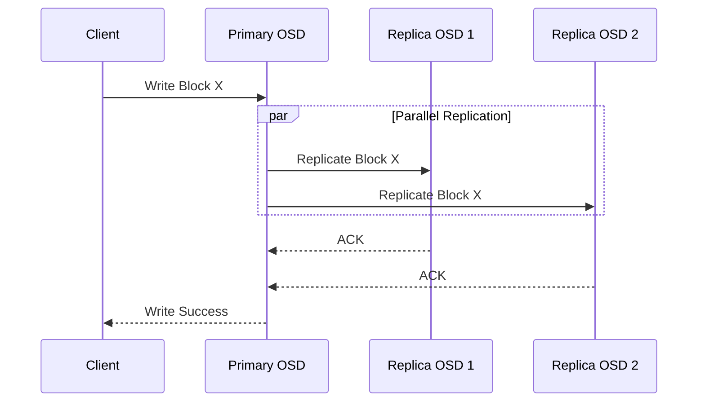

**Karakteristike:**
- Overhead: 3x storage za replication=3
- Performanse: Brži recovery
- Jednostavnost: Lako razumljiv

#### Erasure Coding

Napredniji način koji koristi manje prostora.

```
k = 4 (data chunks)
m = 2 (parity chunks)
```

```
Original: [D1] [D2] [D3] [D4]
Encoded:  [D1] [D2] [D3] [D4] [P1] [P2]
```

Može izgubiti bilo koja 2 chunk-a i rekonstruisati podatke.

**Karakteristike:**
- Overhead: 1.5x storage za k=4, m=2
- Performanse: Sporiji recovery (računanje)
- Kompleksnost: CPU intensive

| Metoda | Overhead | Recovery Speed | CPU Usage |
|--------|----------|----------------|-----------|
| Replication (3x) | 200% | Brz | Nizak |
| EC (4+2) | 50% | Srednji | Visok |
| EC (8+3) | 37.5% | Spor | Vrlo visok |

### 3.4 Failure Handling

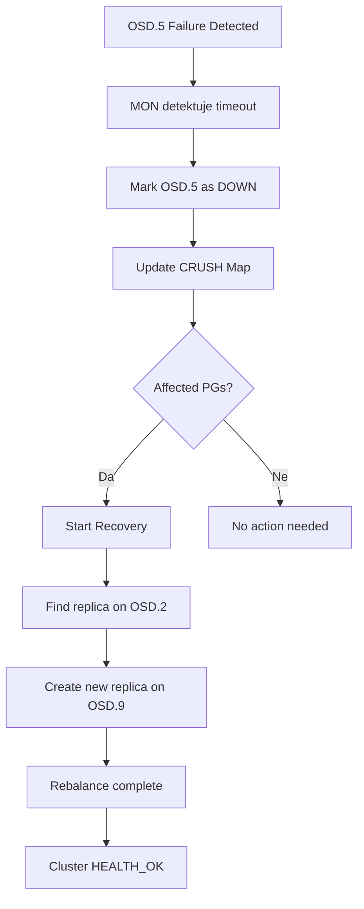

**Recovery proces:**

1. MON detektuje da OSD ne odgovara (timeout)
2. OSD se markira kao `DOWN`
3. CRUSH mapa se ažurira
4. Podaci koji su bili na tom OSD-u se rekonstruišu
5. Nove replike se kreiraju na drugim OSD-ovima

### 3.5 Ceph Praktični Primeri

#### Cluster Status

```bash
# Provera zdravlja klastera
ceph status

# Primer output-a
  cluster:
    id:     a1b2c3d4-5678-90ab-cdef-1234567890ab
    health: HEALTH_OK
  services:
    mon: 3 daemons, quorum node1,node2,node3
    mgr: node1(active), standbys: node2
    osd: 12 osds: 12 up, 12 in
  data:
    pools:   3 pools, 256 pgs
    objects: 10.5k objects, 40 GiB
    usage:   120 GiB used, 1.8 TiB avail
```

#### OSD Tree

```bash
# Prikaz OSD hijerarhije
ceph osd tree

# Output
ID  CLASS  WEIGHT   TYPE NAME        STATUS
-1         12.00000 root default
-3          4.00000     host node1
 0    ssd   1.00000         osd.0       up
 1    ssd   1.00000         osd.1       up
 2    hdd   2.00000         osd.2       up
-5          4.00000     host node2
 3    ssd   1.00000         osd.3       up
 4    hdd   2.00000         osd.4       up
 5    hdd   1.00000         osd.5       up
```

#### Pool Management

```bash
# Kreiranje pool-a sa replication=3
ceph osd pool create mypool 128 128 replicated
ceph osd pool set mypool size 3
ceph osd pool set mypool min_size 2

# Kreiranje EC pool-a
ceph osd pool create ec-pool 128 128 erasure

# Prikaz pool-ova
ceph osd pool ls detail
```

#### RBD (Block Storage)

```bash
# Kreiranje RBD image-a
rbd create mypool/myvolume --size 100G

# Mapiranje na host
rbd map mypool/myvolume
# Output: /dev/rbd0

# Formatiranje i mount
mkfs.xfs /dev/rbd0
mount /dev/rbd0 /mnt/ceph-block

# Snapshot
rbd snap create mypool/myvolume@snapshot1
rbd snap ls mypool/myvolume
```

#### CephFS (File Storage)

```bash
# Mount CephFS
mount -t ceph mon1,mon2,mon3:/ /mnt/cephfs \
  -o name=admin,secret=AQBxxxxxx

# Ili korišćenjem ceph-fuse
ceph-fuse /mnt/cephfs
```

#### S3 API (Object Storage)

```bash
# Kreiranje S3 korisnika
radosgw-admin user create --uid=myuser --display-name="My User"

# AWS CLI sa Ceph RGW
aws --endpoint-url=http://rgw.example.com:7480 \
    s3 mb s3://mybucket

aws --endpoint-url=http://rgw.example.com:7480 \
    s3 cp myfile.txt s3://mybucket/
```

---

## 4. VMware vSAN - Enterprise SDS

**VMware vSAN** je enterprise SDS rešenje integrisano sa vSphere platformom. Koristi lokalne diskove ESXi hostova za kreiranje distribuiranog storage-a.

### 4.1 vSAN Arhitektura

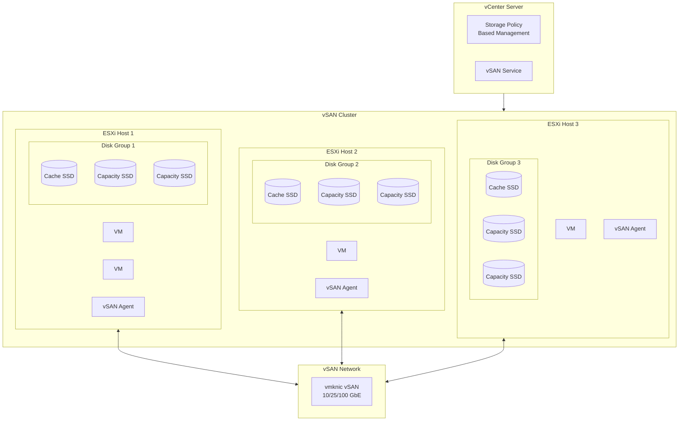

#### vSAN Komponente

| Komponenta | Opis |
|------------|------|
| **vSAN Cluster** | Grupa ESXi hostova koji dele storage |
| **Disk Group** | Cache disk + Capacity diskovi na jednom hostu |
| **vSAN Datastore** | Distribuirani datastore vidljiv svim hostovima |
| **vSAN Agent** | Proces na svakom ESXi koji upravlja lokalnim diskovima |
| **CLOM** (Cluster Level Object Manager) | Upravlja placement-om i health-om objekata |

#### Disk Groups

```
ESXi Host
├── Disk Group 1
│   ├── Cache Tier: 1x NVMe SSD (400GB)
│   └── Capacity Tier: 4x SSD (1.92TB each)
│
└── Disk Group 2
    ├── Cache Tier: 1x NVMe SSD (400GB)
    └── Capacity Tier: 4x SSD (1.92TB each)
```

**Cache Tier:**
- 70% za Read Cache
- 30% za Write Buffer
- Mora biti flash (SSD/NVMe)

**Capacity Tier:**
- Gde se podaci trajno čuvaju
- Može biti SSD ili HDD (all-flash vs hybrid)

### 4.2 Storage Policy Based Management (SPBM)

vSAN koristi polise za definisanje storage karakteristika.

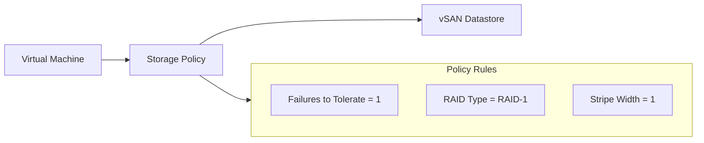

#### Ključni Policy Parametri

| Parametar | Opis | Vrednosti |
|-----------|------|-----------|
| **FTT** (Failures to Tolerate) | Koliko host/disk failure-a može preživeti | 0, 1, 2, 3 |
| **RAID Type** | Metoda zaštite | RAID-1 (mirror), RAID-5, RAID-6 |
| **Stripe Width** | Broj capacity diskova za striping | 1-12 |
| **Object Space Reservation** | Thin vs Thick provisioning | 0-100% |
| **Force Provisioning** | Ignoriši ako nema resursa | Yes/No |

#### FTT i Kapacitet

| FTT | RAID Type | Hosts Required | Capacity Overhead |
|-----|-----------|----------------|-------------------|
| 1 | RAID-1 | 3 | 2x |
| 1 | RAID-5 | 4 | 1.33x |
| 2 | RAID-1 | 5 | 3x |
| 2 | RAID-6 | 6 | 1.5x |

### 4.3 vSAN Object Structure

VM u vSAN-u se sastoji od više objekata:

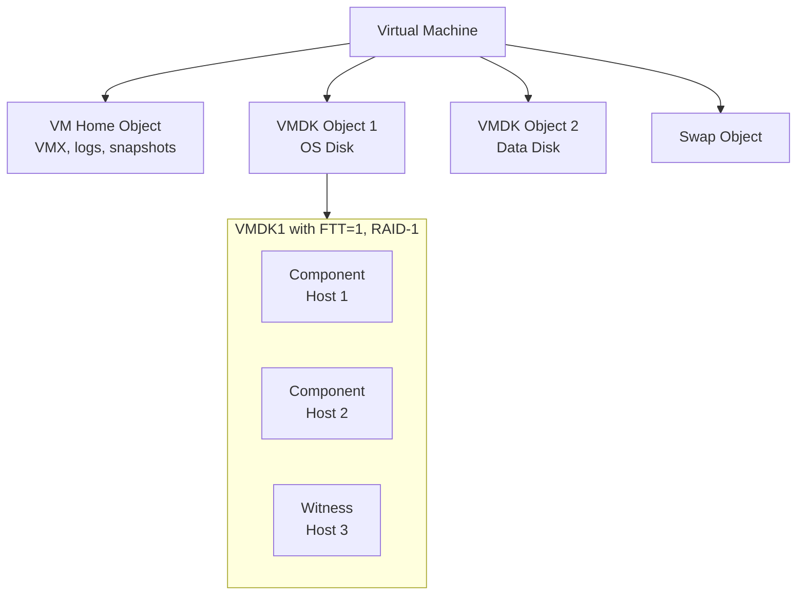

#### Components i Witnesses

- **Component** — deo objekta koji čuva podatke
- **Witness** — mali metadata objekt za quorum (ne čuva podatke)

Za FTT=1 sa RAID-1:
- 2 data componenta (mirrored)
- 1 witness (za tie-breaking)

### 4.4 vSAN ESA vs OSA

VMware je uveo novu arhitekturu optimizovanu za NVMe:

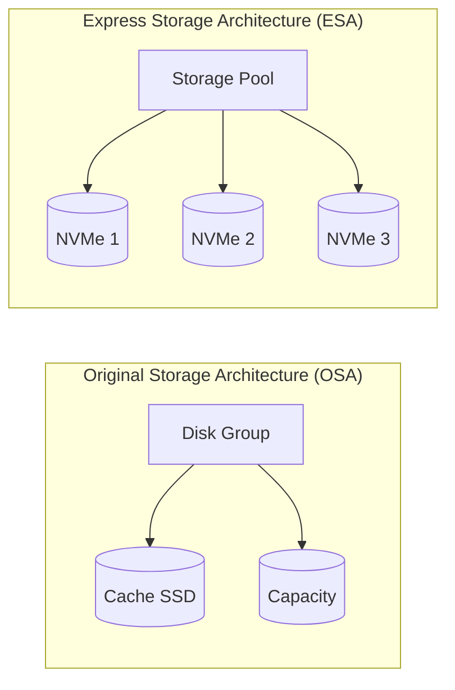

| Aspekt | OSA | ESA |
|--------|-----|-----|
| Disk Groups | Da (Cache + Capacity) | Ne (single tier) |
| Cache | Dedicated SSD | Softverski (RAM + NVMe) |
| Compression | Per-cluster | Per-object, real-time |
| RAID-5/6 | Standardno | Poboljšano (nested) |
| Minimum hosts | 3 | 3 |
| Diskovi | SSD + HDD ili All-Flash | NVMe only |

**ESA prednosti:**
- Jednostavnija arhitektura
- Bolje performanse sa NVMe
- Efikasnija kompresija
- Manji CPU overhead

### 4.5 vSAN Stretched Cluster

Za disaster recovery, vSAN podržava stretched cluster preko dva sajta:

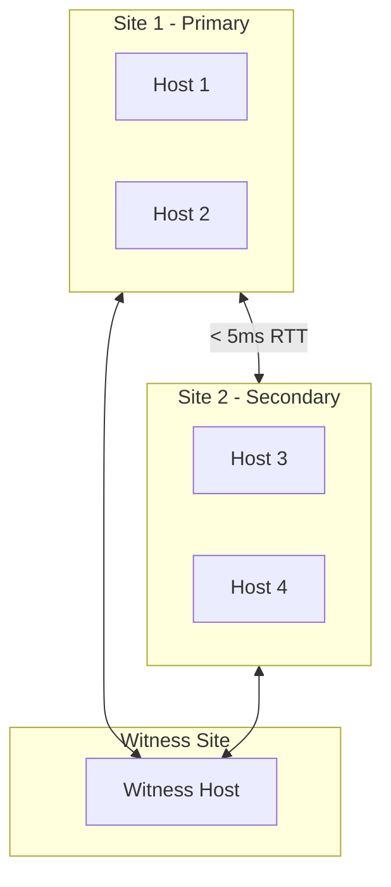

**Zahtevi:**
- Latencija između sajtova: < 5ms RTT
- Witness host na trećoj lokaciji
- Simetrična konfiguracija

### 4.6 vSAN Praktični Primeri

#### PowerCLI - Cluster Info

```powershell
# Povezivanje na vCenter
Connect-VIServer -Server vcenter.example.com

# vSAN Cluster konfiguracija
Get-Cluster "Production-Cluster" | Get-VsanClusterConfiguration

# Output:
# Cluster                  : Production-Cluster
# VsanEnabled              : True
# VsanDiskClaimMode        : Manual
# StretchedClusterEnabled  : False
# SpaceEfficiencyEnabled   : True
```

#### Disk Management

```powershell
# Prikaz vSAN diskova
Get-Cluster "Production-Cluster" | Get-VsanDisk

# Prikaz disk grupa
Get-Cluster "Production-Cluster" | Get-VsanDiskGroup

# Output:
# Name           DiskGroupType  Host          CacheDisk     CapacityDisks
# ----           -------------  ----          ---------     -------------
# DiskGroup-1    AllFlash       esxi-01       NVMe-Cache    {SSD1, SSD2}
# DiskGroup-2    AllFlash       esxi-01       NVMe-Cache    {SSD3, SSD4}
```

#### Storage Policy

```powershell
# Kreiranje storage polise
New-SpbmStoragePolicy -Name "FTT2-RAID1" -Description "2 failures, mirroring" `
  -AnyOfRuleSets (
    New-SpbmRuleSet -AllOfRules @(
      New-SpbmRule -Capability (Get-SpbmCapability -Name "VSAN.hostFailuresToTolerate") -Value 2,
      New-SpbmRule -Capability (Get-SpbmCapability -Name "VSAN.replicaPreference") -Value "RAID-1 (Mirroring)"
    )
  )

# Primena polise na VM
Get-VM "ImportantVM" | Set-SpbmEntityConfiguration -StoragePolicy "FTT2-RAID1"
```

#### Health Check

```powershell
# vSAN Health status
Get-VsanHealthSummary -Cluster "Production-Cluster"

# Detaljni health check
Get-VsanHealthTest -Cluster "Production-Cluster" |
    Where-Object { $_.TestHealth -ne "green" }
```

#### Capacity Monitoring

```powershell
# Kapacitet klastera
Get-VsanSpaceUsage -Cluster "Production-Cluster"

# Output:
# Cluster            : Production-Cluster
# TotalCapacityGB    : 15360
# FreeCapacityGB     : 8542
# UsedCapacityGB     : 6818
# DedupRatio         : 1.8
# CompressionRatio   : 2.1
```

#### esxcli komande (na ESXi hostu)

```bash
# vSAN status
esxcli vsan cluster get

# vSAN network info
esxcli vsan network list

# Disk info
esxcli vsan storage list
```

---

## 5. Ceph vs vSAN Poređenje

### Tabela Poređenja

| Aspekt | Ceph | vSAN |
|--------|------|------|
| **Licenca** | Open-source (LGPL) | Komercijalna (per-CPU) |
| **Vendor** | Community + Red Hat | VMware (Broadcom) |
| **Storage Types** | Block + File + Object | Block (+ vSAN File Services) |
| **Hypervisor** | Bilo koji (KVM, Xen, VMware) | Samo VMware ESXi |
| **Minimum Nodes** | 3 | 3 |
| **Max Nodes** | 1000+ | 64 |
| **Placement Algorithm** | CRUSH | CLOM |
| **Kubernetes Native** | Da (Rook-Ceph) | Kroz CSI driver |
| **Management** | CLI + Dashboard | vCenter GUI |
| **Learning Curve** | Strma | Umerena |
| **Support** | Community / Red Hat | VMware |

### Decision Tree

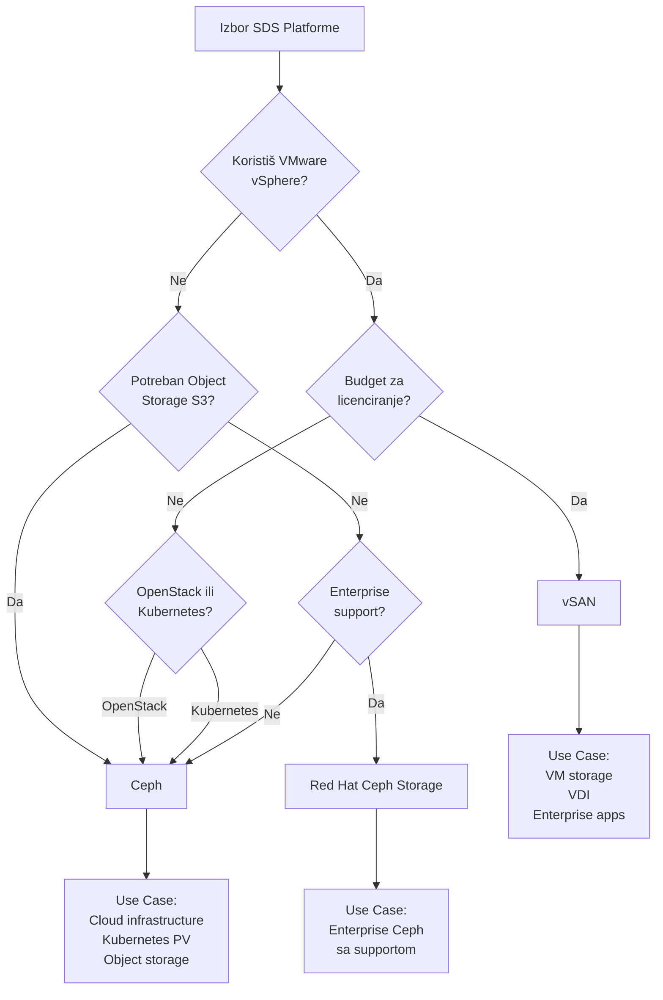

### Kada koristiti koji sistem?

#### Izaberi Ceph kada:
- Gradiš OpenStack ili Kubernetes infrastrukturu
- Treba ti S3-compatible object storage
- Želiš izbjeći vendor lock-in
- Imaš Linux expertise u timu
- Budget je ograničen
- Trebaš > 64 čvora

#### Izaberi vSAN kada:
- Već koristiš VMware vSphere
- Želiš integrisan management (vCenter)
- Prioritet je jednostavnost
- Imaš VMware licensing agreement
- Fokus je na VM workloads
- Potreban ti je enterprise support

---

## 6. SDS u Cloud Infrastrukturi

### 6.1 Private Cloud Deployment

#### OpenStack + Ceph

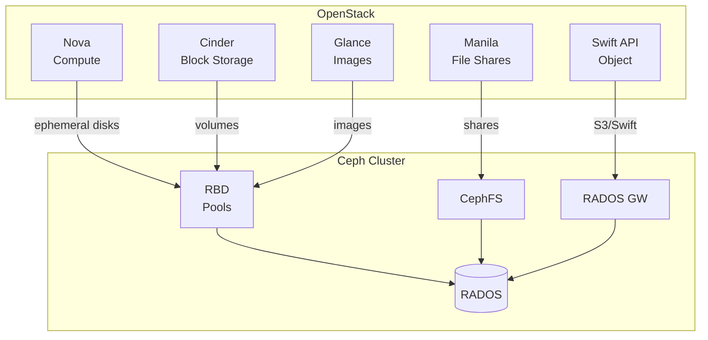

**Integracija:**

```ini
# /etc/cinder/cinder.conf
[DEFAULT]
enabled_backends = ceph

[ceph]
volume_driver = cinder.volume.drivers.rbd.RBDDriver
rbd_pool = volumes
rbd_ceph_conf = /etc/ceph/ceph.conf
rbd_user = cinder
```

#### VMware Cloud Foundation + vSAN

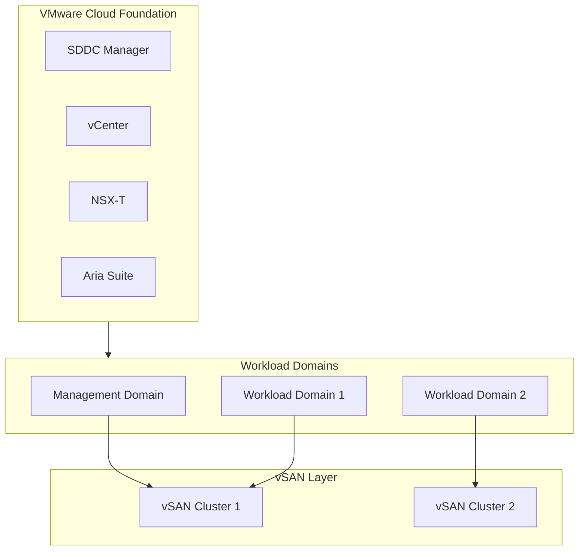

### 6.2 Kubernetes Integracija

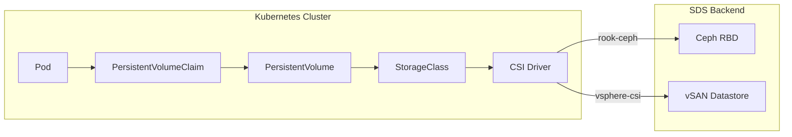

#### Rook-Ceph Operator

Rook je Kubernetes operator koji automatizuje deployment Ceph-a:

```yaml
# StorageClass za Ceph RBD
apiVersion: storage.k8s.io/v1
kind: StorageClass
metadata:
  name: rook-ceph-block
provisioner: rook-ceph.rbd.csi.ceph.com
parameters:
  clusterID: rook-ceph
  pool: replicapool
  imageFormat: "2"
  imageFeatures: layering
reclaimPolicy: Delete
allowVolumeExpansion: true
```

```yaml
# PVC primer
apiVersion: v1
kind: PersistentVolumeClaim
metadata:
  name: mysql-pvc
spec:
  accessModes:
    - ReadWriteOnce
  storageClassName: rook-ceph-block
  resources:
    requests:
      storage: 50Gi
```

#### vSphere CSI Driver

```yaml
# StorageClass za vSAN
apiVersion: storage.k8s.io/v1
kind: StorageClass
metadata:
  name: vsan-default
provisioner: csi.vsphere.vmware.com
parameters:
  storagepolicyname: "vSAN Default Storage Policy"
  datastoreurl: "ds:///vmfs/volumes/vsan:xxxxx/"
reclaimPolicy: Delete
allowVolumeExpansion: true
```

### 6.3 Hybrid / Multi-Cloud

#### Stretched Ceph Cluster

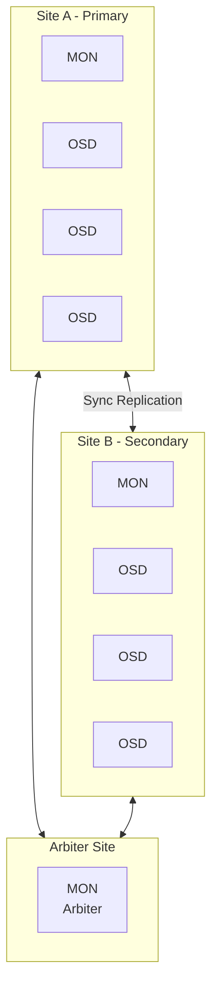

**CRUSH rule za stretch cluster:**

```
rule stretch_rule {
    id 1
    type replicated
    min_size 2
    max_size 4
    step take site_a
    step chooseleaf firstn 2 type host
    step emit
    step take site_b
    step chooseleaf firstn 2 type host
    step emit
}
```

---

## 7. Sizing i Best Practices

### 7.1 Kapacitet Kalkulacija

#### Raw vs Usable Capacity

```
Raw Capacity = Broj diskova × Kapacitet diska

Usable Capacity = Raw Capacity / Protection Overhead
```

**Primer za Ceph (replication=3):**
```
12 nodes × 10 disks × 4TB = 480TB raw
480TB / 3 = 160TB usable
```

**Primer za vSAN (FTT=1, RAID-1):**
```
8 hosts × 6 disks × 1.92TB = 92TB raw
92TB / 2 = 46TB usable
```

#### Ceph Sizing Formula

```
Usable = Raw × (1 - system_overhead) / replication_factor

system_overhead ≈ 0.1 (10% za metadata, journals, etc.)
```

Za erasure coding (k+m):
```
Usable = Raw × (1 - overhead) × k / (k + m)

Primer EC 4+2:
Usable = 480TB × 0.9 × 4/6 = 288TB
```

### 7.2 Network Requirements

| Workload | Minimum | Recommended |
|----------|---------|-------------|
| Small cluster (< 10 nodes) | 10 GbE | 25 GbE |
| Medium cluster (10-50) | 25 GbE | 100 GbE |
| Large cluster (50+) | 100 GbE | 100 GbE + RDMA |

**Dual network setup:**

```
Client Network:  Za frontend (VM, aplikacije)
Cluster Network: Za backend (replication, recovery)
```

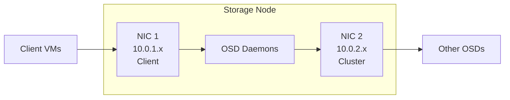

### 7.3 Minimum Node Count

| Scenario | Ceph | vSAN |
|----------|------|------|
| Lab/Test | 1 (single-node) | 1 (vSAN Express) |
| Minimum Production | 3 | 3 |
| Recommended Production | 5+ | 4+ |
| Stretched Cluster | 5 (2+2+1 arbiter) | 5 (2+2+1 witness) |

### 7.4 Best Practices

#### Ceph

1. **Koristi odvojene mreže** za client i cluster traffic
2. **SSD za journals/WAL/DB** ako koristiš HDD za capacity
3. **Minimum 3 MON-a** u produkciji (odd number za quorum)
4. **Planiraj za recovery** — ostavi 10-20% kapaciteta slobodno
5. **CRUSH rules** — postavi failure domains (rack awareness)
6. **Monitoring** — koristi Prometheus + Grafana

```bash
# Provera zdravlja pre maintenance-a
ceph health detail
ceph osd df tree
ceph pg stat
```

#### vSAN

1. **All-Flash za produkciju** — hybrid samo za test
2. **vSAN Network** — dedicated vmknic, nikad shared sa vMotion
3. **Disk Groups** — max 5 po hostu, 7 capacity diskova po grupi
4. **FTT=1 minimum** za produkciju
5. **Slack Space** — ostavi 25-30% slobodno za rebalancing
6. **Health Checks** — redovno proveravaj

```powershell
# Weekly health check
Get-VsanHealthSummary -Cluster "Prod" | Format-List
Test-VsanClusterHealth -Cluster "Prod"
```

### 7.5 Monitoring Checklist

| Metrika | Warning | Critical |
|---------|---------|----------|
| Capacity Used | > 70% | > 85% |
| OSD/Host Down | 1 | 2+ |
| Latency (read) | > 10ms | > 50ms |
| Latency (write) | > 20ms | > 100ms |
| Recovery Speed | < 100 MB/s | < 50 MB/s |
| Network Errors | > 0.1% | > 1% |

---

## Zaključak

**Software-Defined Storage** je fundamentalna tehnologija za moderne cloud infrastrukture. Bilo da birate **Ceph** za open-source fleksibilnost ili **vSAN** za VMware integraciju, ključni koncepti ostaju isti:

1. **Razdvajanje Control i Data Plane** omogućava skalabilnost
2. **Distributed placement algoritmi** (CRUSH, CLOM) eliminišu single points of failure
3. **Policy-based management** pojednostavljuje operacije
4. **Erasure coding** optimizuje iskorišćenje kapaciteta

Izbor platforme zavisi od vaših specifičnih potreba — postojeće infrastrukture, budgeta, tima i workload-a.

---

*Dokument pripremljen za predavanje na Računarskom fakultetu, Beograd*
